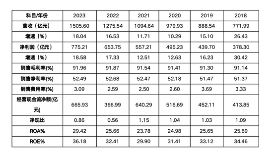

结合以往看的财报知识，分析下茅台2023年财报。

 
<!-- truncate -->

## 资料来源

* 巨潮资讯：http://www.cninfo.com.cn/
* 官网

## 公司和行业现状体感

首先，白酒行业的利润应该都不错，我记忆中（以前哪个采访说到）净利润率50%以上，可算得上暴利。

其次，茅台如何制作呢？茅台酒一般经过：制曲、制酒、贮存、勾兑、检验、包装。
九次蒸煮、八次发酵、七次取酒。每轮次基酒会有不同风味。

茅台年分红有上升，且对比同行业（五粮液）高。

茅台股价近3年处于阴跌状态。

## 综合阅读

自己的投资理念(principle)。
基于如下分析：保守，容忍度低，倾向于清算价值估算法（我一般算每股清算价值）。看重管理能力下的现金流情况。

分五步骤看看。

### 零、重要事项提示和董事会分析

第2页，会计事务所出具的“标准无保留意见”的审计。ok可以继续往下看。  
重要提示没啥毛病。

看董事会报告：

首先，我看眼期末库存量上升了6%，销售额也上涨了。对比起来去库存周期没什么变化。

然后我翻查了董事会的行业趋势分析，看看管理者如何看优劣势和机会的。
我认为有点过于积极了(两页乐观，最后说风险20字谈及了宏观经济风险等)，尤其我翻阅对比2014年的茅台财报，个人认为缺少审慎和危机意识。

### 一、先看三大表，各个科目有没异常

简单说我的理解：
* 资产负债表 反映企业财务状况。 看各类项目的漏洞：货币呀、经营资产、生产资产、投资资产等的情况。
* 利润表 反映企业近期的营业成果。 看收入、毛利率、净利率、费用率、营业利润率等情况。
* 现金流量表 反映展示企业筹资能力。反映一段时间内企业的偿还债务能力，反映是否能够健康经营。

一般都是各类目翻看，然后google查。

资产负债表看四个要点：（从三个角度看，结构、历史、同行）
* 生产资产/总资产
* 应收/总资产
* 货币资金/有息负债
* 非主业/总资产

一般资产负债表要重点看（因为复式记账下明细多且搞外账和搞经历多个部门的凭证单据，搞起来成本大），
而利润表容易造假。现金流量表一般ERP软件是自动生成。

现金流量表的“经营现金流净额” / 利润表的“净利润” = 0.923，这个比值越大越稳定越好。

### 二、财务指标的分析

安全性指标：
* 流动比率=流动资产/流动负债=4.6 > 2
* 速动比率=速动资产/流动负债=4.6 > 1
* 现金及现金等价物/有息负债=现金及现金等价物/(短期借款+一年内到期的非流动负债+长期借款+应付债券)=4463.24 > 1

可以看出比率比较高，流动资产没有充分使用。  
不得不说，茅台很少烧钱借钱。

营业能力指标：
* 营业利润率=（营业收入-营业成本-三费）/营业收入
  * （147,693,604,994.14-11,867,273,851.78-4,648,613,585.82-9,729,389,252.31-157,371,873.01）/147,693,604,994.14 = 0.821233637
* 净资产收益率=净利润/平均净资产= 64,786,396,951.58*2 /(171,584,366,864.08 + 161,880,997,981.23 - 14,681,509,236.35 - 13,214,280,942.48)
  * = 0.424
  * 对比隔壁五粮液 = 0.394

ROE是衡量企业盈利能力的非常重要指标。（巴菲特钟爱这个指标）

成长性分析
* 营业利润增长率=(本期营业利润-上期营业利润)/上期营业利润
  * = −0.0982
* 净资产增长率=(本期净资产-上期净资产)/上期净资产
  * = 2.055

利润率同比去年有所降低，然后看起来茅台也降本增效了

管理层能力分析
* 应收账款周转率=营业收入/平均应收账款 = 81,415,570,788.59/((17,178,545,925.65+20,670,923,010.62)/2) = 4.302
  * 平均应收账款=(期初应收账款总额+期末应收账款总额)/2
* 存货周转率=营业成本/存货平均余额 = 1.149
  * 存货平均余额=（期初存货总额+期末存货总额）/2
* 固定资产周转率=营业收入/固定资产净值 = 4.18

这几个指标都是越大，说明管理者运作能力越好。

### 三、比对利润和现金流的变化趋势

### 四、和竞争对手比一比

上面有对2023年五粮液财报的一些比对，这里略。

## 总结

总体来看，贵州茅台2023年财报显示，尽管面临市场价格波动和行业竞争压力，公司依然实现了稳健增长。
年营收达到1505.6亿元，净利润775.2亿元，增速均超过18%。
值得注意的是，直销渠道收入显著增长，达到672亿元，占比接近50%。尽管净现比低于1，主要受高税费影响，但公司保持强劲的现金流和高毛利率（91.96%）。
整体来看，茅台在高端市场的地位依旧稳固，未来潜力仍然可观。我认为茅台的经营策略算是太保受了。

本文结合《手把手教你读财报》和一些理解写下，权当炒股的方法论。
再深入的话，可结合一些财务书籍和杜邦体系去做分析。

## Reference

[1]茅台2023年、2014年财报  
[2][茅台酒制作|百度百科](https://baike.baidu.com/item/%E8%8C%85%E5%8F%B0%E9%85%92%E9%85%BF%E5%88%B6%E6%8A%80%E8%89%BA/3233042)  
[3]五粮液2023年财报  
[4]唐朝.手把手教你读财报.中国经济出版社

