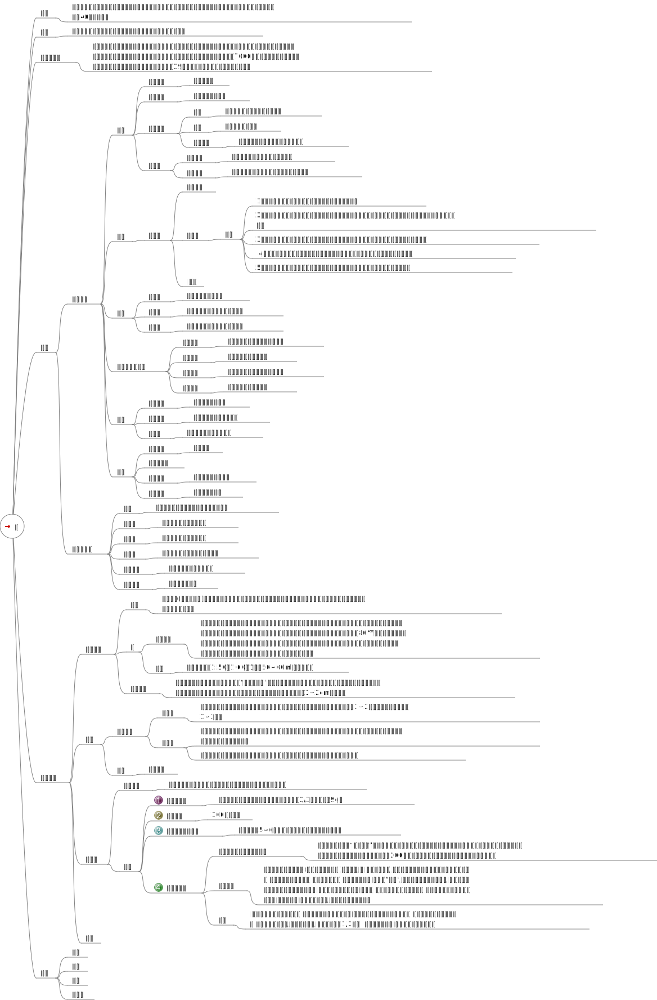
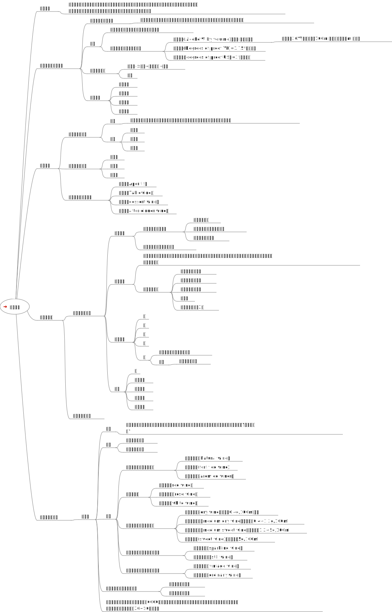

最近自己有时调点鸡尾酒喝，翻看以前文档，发现15年大学那会好奇做过茶和酒的分类，这里整理重新发出来。

 
<!-- truncate -->

## 茶饮

## 酒饮

## 鸡尾酒

自由古巴    
配方
* 2.5份 朗姆酒
* 0.5份 柠檬汁
* 6份 可乐
* 冰块

202311调，成品味道我挺喜欢。

莫吉托  
配方
* 2份 朗姆酒
* 2茶勺 糖浆
* 1.5份 柠檬汁
* 3份 苏打水
* 6片 薄荷叶
* 冰

202401调，成品可能是自榨汁的青柠檬汁的缘故，有点混浊，而且整体味道很酸。 

