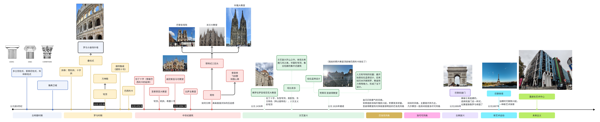

欧洲建筑及时代风格和筷子的历史欧洲建筑及时代风格和筷子的历史。

前阵子去了欧洲法瑞意，去之前整理了欧洲建筑史和途径的在建筑史留下名字的建筑和艺术风格。 
回来后也顺带探讨了有别于其他地区，筷子成为中国主流餐具这一困扰我的问题。
 
<!-- truncate -->

## 前言

该从哪个角度探讨欧洲建筑史呢？本人打算从时间线和时期去铺开。  
而对筷子的历史，我将从三个问题搜集资料，并从中试着回答为什么筷子最终登上舞台中央。
至于为何混搭两个不同的知识，后记我们再谈谈。

## 途径的代表性建筑

最终整理如图：

### 总结

我途径的法意算是涵盖了建筑史上很多的代表性作品，在图片有标注一些风格特点。
需要说明，建筑风格并不按图中时间如此分界明显， 图中是列举它们的出现和繁盛时间。

一般分为古希腊时期、罗马时期、中世纪（哥特式、拜占庭式）、文艺复兴、巴洛克和洛可可风格、
18世纪的古典复兴、新艺术风格、现年的未来主义。因为一些建筑我没有途径或者现实较常见，
所以在图中没有提及一些重要分支：工艺风格、现代主义等。

## 筷子成为主流的历史

搜集资料时，我重点关注回答这三个问题
1. 筷子餐具文化圈的分布范围
2. 筷子起源，据查最早出现时间。
3. 为何成为餐具中的主流。

首先当今三大饮食文化圈分别是：
1. 东亚的筷子取食圈 大致与儒家文化的影响范围相同。
2. 欧美的刀叉取食圈 基本代表了西方基督教文明。
3. 中东、南亚、东南亚的手指取食圈 主要受到伊斯兰教的影响。

那么筷子最早有什么历史？
距今7000年前，挖掘出来的新石器时代的骨箸。为发掘的最早的筷子原型。

中国古人用手指取食，这一习俗延续到公元前5世纪或4世纪，也就是孔子很可能是用手进食的。我们至今仍称呼一个手指为食指。  
在中国作为饮食工具，匕勺（类似于勺子，略尖且凹的浅些）比筷子更早，且一段时间作为主流。而在1世纪左右，筷子不断挑战匕勺的主流地位，直到7世纪取而代之。

注：韩国现在是勺加筷为主流。

锋利边缘的匕勺在唐代基本消失，取而代之是有弧度的勺箸。

筷子成为主流可以被看成是饮食变化的影响造成。  
古代中国人最初用勺来取用谷物食品，从上古到唐代，主要粮食是小米，小米更常煮成粥，吃粥用勺子更方便，相比之下，用筷子拾取汤里的菜肴。
但后来，用小麦粉制成的食物越发受欢迎，比如面条、饺子、煎饼。而南方因为食用稻米多些，所以这个转变据记载，应该更早些。

## 后记

以往外出玩了解过木构建筑和园林的一些历史，这一次也选择本人感兴趣的建筑相关。

为什么会混搭一个筷子的问题呢？看到国外的刀叉，除了思念起美味的中餐。更勾起我起一个以往的问题。
马东说过：“中国人还在用筷子和汉语，文化组成结构就不变”。想着那就了解下为什么咱们是用筷子而不是刀叉吧。
