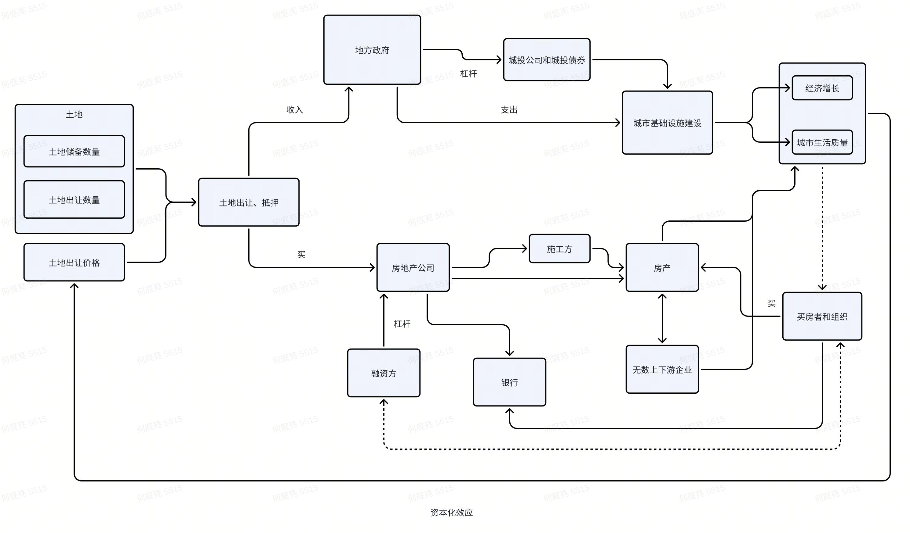

> 读《置身事内》总结

 
<!-- truncate -->

## 简介
看本书之前，我想探讨的问题是：中国的房子怎么来的？如何衡量房价高低？   
第一个问题可以凭理解和以往知识输出。而第二个问题，我查了查网上资料，发现世上顶尖的房地产投资者们没有准确答案（难怪曼昆老师不怎么写）。

## 中国房地产市场图解

按照我的理解，大致画了下。
- 从左往右看，这就是土地从收编、出让、走入百姓家和影响经济的全过程。
- 从上往下看，就是各权衡方的操作。
- 整体看，这就“土地财政”的 **资本闭环**。

## 房价
### 房地产市场特点

1. 刚需：人们的基本需求，比如稳定居住点、结婚、落户、孩子上学等。
2. 投资品
3. 信用：前两个因素共同决定了房产是一个占经济GDP比重高的一个产业，我国住房消费占居民消费支出比重长期维持在20%以上。那么其关联的借贷信用体系（见第一节图）可谓庞大。
4. 关联产业多：上中下游产业，“七通一平”，钢筋水泥，施工装备，软硬装，日常家具设施。

### 因素分析
1. 人口  从供需角度，人口影响着土地需求。
2. 经济（收入）经济好坏影响收入多少和人们购房期望。
3. 政策
   1. 利率
   2. 土地供应及建设准入

以上三点是我认为影响房产的因素，但只抛砖引玉，暂无法证伪。

## 额外后记
1、
这本书当然不仅说了土地财政。我认为重点有两个：
1. 中央政府与地方政府：汇报关系与权力划分、大小权衡、分税制。这是百年前钱穆先生放在首位分析的事情，钱穆的方法论是分析这几方面：政府组织，科举，赋税，经济，国防兵役。
2. 中国以往推动经济模式。经济结构重投资、重生产、轻**消费**。

2、
之前在网上看到一篇这样的博客文章https://houbb.github.io/2025/02/09/5min-read-books-014-zhishenshinei，发现有公众号作者通过一个统一的框架，生成了《置身事内》的总结。说实话有点小触动，倒不是为可能以上我写的都能够AI生成而感，而是发现如果不在乎输入，现在通过这种生成方式经营自媒体的成本确实低，估计只要每天15分钟（5分钟生成10分钟润饰）就能经营一个自媒体号了。

3、

查资料时想到deepseek这服务器资源问题都几周了，联想到一个有意思的事，服务可用性这一被研发工程师奉之圭臬的红线问题，某个时刻真的这么重要么？
每个时代每个时刻变量如牛毛，只能稍稍筛选以为重要的。或许到最后又只得出结论，但建好事，莫问前程了。

## reference

[1]兰小欢.置身事内[M].中国:上海人民出版社, 2021