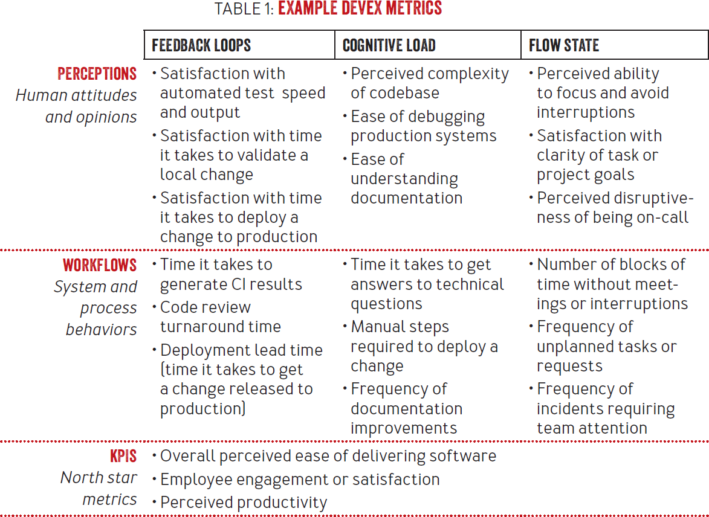

> 该篇是我在工作里的团队指标调研和方案

 
<!-- truncate --> 

## 背景

从业务研发团队又转到技术平台型团队（算法架构），在日常迭代和碰撞中，一个问题时不时在我脑海浮现。  
在业务团队，我们可以很轻松的将技术人员的开发优先级和效率，通过业务北极星指标等业务大盘指标和项目需求数去量化和理性判断。  
但是，技术平台型团队呢？（比如我们团队主业是提供技术组件、性能和稳定性解决方案给算法工程师等使用，其次是前沿探索）
1. 技术支撑
   如何判断**优先级**(双刃剑)？假设在满工作量运转下，大概根据大业务部门的业务目标和重点能够区分任务的优先程度。
   但另一个，怎么判断整体**效率**和**效益**呢？
   我的答案是指标量化。我会在实施方向一节谈谈。
2. 前沿探索
   不再本文谈论范围。一句话带过，我认为是需要发挥能动性，但要探索收敛 --- 1. 可输出的成果。（落地或者外界影响力）2. 将部门或者大部门的探索收编。
 
## 现状

据我了解目前有各项服务稳定性指标，但是工具和服务效率无机制。
所以我下面正篇讨论会围绕**工具和服务效**率展开。

## 实施方向
   
### 谈谈指标量化

在日常业务和工作中，我们每天面对一大堆的带有指标的图表和文档，各式各样玩出花的监控看板，同时我们总有一些被量化误导的经历，有时候我们对于量化会有抵触和迷思，因为大概想着量化会骗人和会失去自由度等等，我想回答两个问题。
1. 到底应不应该量化？
2. 如何量化？

**到底应不应该量化？** 首先我们是在商业世界的科技行业里，从商业角度，卖出了多少，这个月赚了多少，扣除成本、三费啥的剩多少。自上而下来说，天然就是有数字的。
从科技角度，简单来说，在创意阶段某些可能要些直觉和感性，但会越来越少。在实施阶段/实施团队中，比如我的一些方案，看似是直觉，但是很多回过头看不过是用脚投票的选择。
其次，有量化的团队，比起没有的团队，我认为容易把握范围、方向和成绩。  
最后，往底层聊，人除了不断用理性去“度量”事情，不断量化，没有其他方法能够推进一些事情。  
现阶段问题点：  
数据是会“骗人”，因为目前来说，我们不可能参数化所有变量。  
数据量化过多，过于重视数据量化，可能杀死创造空间。  
所以，我认为针对技术平台团队的量化只可发挥同环比指导意义，并且需要因应发展阶段不断改造和细化。

**如何量化呢，**
1. 基于团队服务目标去量化。
2. 用什么量化？数字/数据作为一个公平的，可细化到最小粒度去指代现实客体的手段，是最适合用来量化的。
3. 量化的尺度？基于团队服务目标，在迭代收口位置做好数据记录。

### 方向细化
这节对项目迭代中的技术支撑及其评估做了细化：

1. 工具、框架、平台支持   -> 工具覆盖范围的效率点指标 + 问卷
2. 人力支持 分两部分
   1. 涉及业务数据流的，如开发、测试、质量 -> 和业务指标绑定
   2. 不涉及业务流的，例如排查技术问题 -> 问卷

### 收益

通过实施本方案
1. 对于技术工具和支撑型团队，能够有一个正循环指标，指导迭代方案
2. 对于服务目标团队
   1. 能够评估工具给研发提高的效率
   2. 能够激发技术工具团队的积极性，有调研证明，当工作体验提升了也能激发业务研发的主观能动性[6]，间接为业务贡献
   3. 能够用于评估业务研发团队的技术需求效率，例如评估重构效率提升和引入静态代码平台等的效用。

### 愿景

希望在算法架构团队或者质量团队所负责的流程中实施，最后经过完善后，推广到整个互部的平台部门。

## 指标备选

业界有不少公司在做这个事情。比如，google有专门的[工程生产力团队](https://landing.google.com/engprod/)，很多公司也有用到一些指标去衡量平台化团队的生产力。

### DORA

> https://dora.dev/research/?view=summary

| 指标 |                              |
|----|-----|
| 部署频率 | 将服务更改部署到生产环境的频率 |
| 更改的前置时间| 从第一个提交到部署所需的时间 |
| 恢复服务的时间 | 由于生产事故、或者异常中断后重新部署的时间 |
| 更改失败率 | 导致失败或需要修复的生产部署的百分比 |

经典的**微服务设计**的度量指标，比较适合短平快的成熟团队去使用。目前Netflix公司的技术平台团队使用。
不足是，我认为更改度量时间，应该改为从分支创建到最终部署所需时间。

### DevEx
> [DevEx: What Actually Drives Productivity - ACM Queue](https://queue.acm.org/detail.cfm?id=3595878&utm_source=the+new+stack&utm_medium=referral&utm_content=inline-mention&utm_campaign=tns+platform)

DevEx指标称为开发者体验指标。作者是 Abi Noda、Margaret-Anne Storey 博士、Nicole Forsgren 博士、和 Michaela Greiler 博士。
**Spotify**公司会用到这个指标框架去改进技术团队。

DevEx重视这三点，反馈回路，流式状态，认知负载。
- 反馈回路：有研究表明，技术团队更频繁的交付效率，业务的脱颖而出可能性更高。
- 认知负载：软件开发本身是很复杂的，简单一个接口或页面功能下面可能依赖了一些服务。所以要想办法减少开发者上下游认知成本。
- 流式状态：研究表明，开发者处于热爱工作的状态，能够交付更高质量的产品。

基于上面，DevEx提出了这些衡量指标：

总结：DevEx会注重到人的体验，除了迭代，加入了开发者体验的选项。

### PMP metrics
> PMP项目管理指标

首先PMP涵盖很多东西，PMP涵盖的方面包括但不限于：
- 完成项目所需的章程、范围管理
- 如何交付及准时交付
- 成本控制-成本预算、过程中计算挣值和折旧
- 质量把控
- 团队配置和沟通

我认为呢，PMP是一套完整的项目管理方法论，但对于仅希望明确技术团队的效率和效益来说，显得太多了。

### 内部调研

调研了公司信息技术部的做法，这里不放出来。

## 指标决策

|  |  DORA | DevEx | PMP metric | 内部调研 | 汇总  |
|----|--|--|--|--|-----|
| 开发成本| 低| 中| 高| 低 | 1、4 |
| 可维护性| 偏高| 偏高| 低| 高| 1、2、3、4 | 
| 业务适配度| 高| 偏高| 低| 中| 1 | 
| 迁移成本| 低| 中| 巨大| 中| 1、4 |

看中业务适配度、迁移成本、开发成本。
方案考虑1、4。
可考虑融合1、4方案。

## 实施

基于Dora指标体系去做，按照每个Q去统计，并且同环比对比。数据记录在Iceberg，最终通过内部大数据看板展示。

### 指标的解释和完善

| 指标 | 阐释 | 
|----|----|
| 部署频率| 将服务更改部署到生产环境的频率| 
| 更改的前置时间| 从第一个提交到部署所需的时间| 
| 恢复服务的时间| 由于生产事故、或者异常中断后重新部署的时间| 
| 更改失败率| 导致失败或需要修复的生产部署的百分比 | 

**如何收集：**

1. 部署频率（次数）
   1. 收集服务的上下线的数据。（Matrix可能在数据工场有数据，部署平台需要看下）
2. 更改的前置时间
   1. 时间 = 通过merge request时间点 - git命令获取分支创建的时间
3. 服务恢复时间
   1. 收集事故复盘
   2. 收集回滚后，第二次上线的时间间隔
4. 更改失败率
   1. 收集回滚次数

One more thing：调研AI报告，生成AI监控看板（https://www.toolify.ai/zh/category/ai-monitor-report-builder）

## 问卷

这里不放出来。

## Referecne
[1]https://landing.google.com/engprod/ google工程生产力团队  
[2]https://dora.dev/research/?view=summary DORA模型  
[3]https://microservices.io/articles/glossary  
[4]Andrew Stellman.深入浅出PMP[M].中国:东南大学出版社 线上阅读  
[5]https://queue.acm.org/detail.cfm?id=3595878&utm_source=the+new+stack&utm_medium=referral&utm_content=inline-mention&utm_campaign=tns+platform  
[6]https://www.sciencedirect.com/science/article/pii/S0164121218300323?via%3Dihub  
