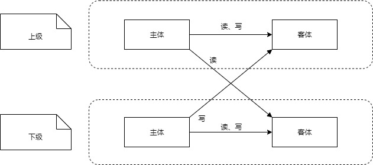
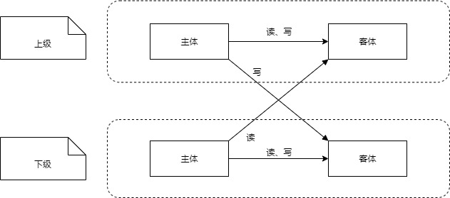
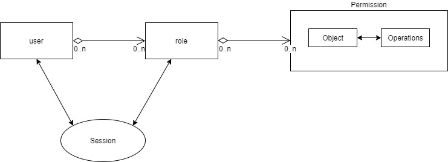
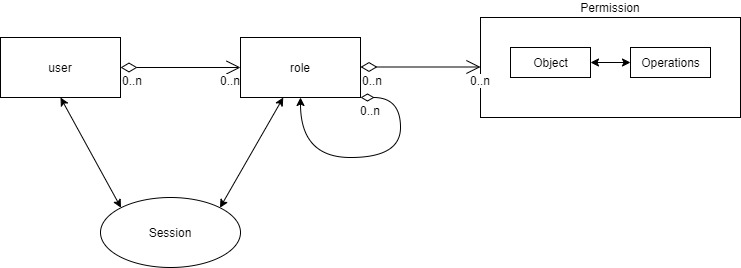
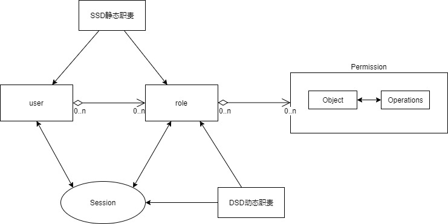
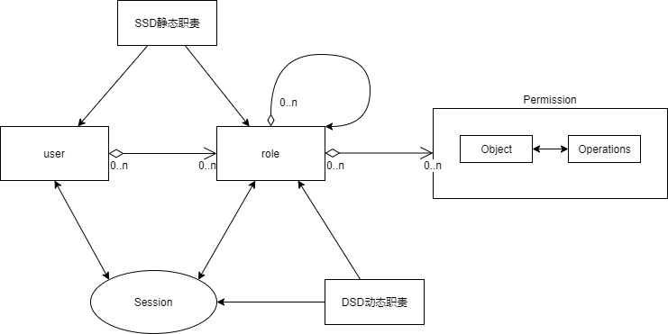
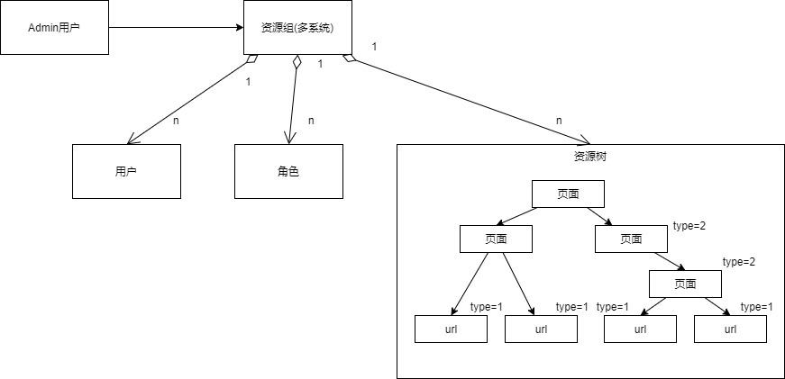

一个系统的权限模型调研和设计。  
记录下之前为团队设计一个权限功能对权限模型做的一些调研。
<!-- truncate -->

## 前言

之前为团队设计一个权限功能对权限模型做了些调研。

## ACL(Access Control list)
ACL是对一个对象附加一系列的权限（permission），比较常见。例如：Zookeeper的节点（Node）ACL属性

## BLP(Bell-LaPadula Model)
BLP是严密的信息安全模型。 定义： * 主体--人、对象 * 客体--数据

我认为BLP是缺乏灵活性的，该模型能满足军事组织（模型设计初衷）的由低到高的数据传递，但对于同级访问描述、自由授权等是比较僵化的。

## Biba模型
Biba模型的规则是类似于BLP模型。 

 就是将BLP上下级的读写互换。因为Biba模型主要针对外部威胁，所以模型中上级也即外部。

## DAC（Discretionary Access Control）
自主控制模型是通过维护访问控制矩阵和访问控制列表完成的。
模型如下：

| 用户subject\目标object |	1 |	2 |
| ----------- | ----------- | ----------- |
| a | Own、write、read	| |
| b | read  |	write、read |

自主访问控制通常假定所有客体都有属主，并且属主能够修改访问该客体的权限，这可能因为大部分系统的确通过属主的概念来实现的。 但是Evaluation Criteria中并没有关于属主的说明，所以技术上访问控制系统并非必须拥有属主。 基于这种实现下，用户（属主）能够修改安全属性。一个直接的例子是 Unix 的文件模式。

## MAC（Mandatory Access Control）强制访问控制
简单来说，系统将用户和文件赋予不同的访问级别，基于一些标记去决定访问模式。

> 强制访问控制（英语：mandatory access control，缩写MAC）在计算机安全领域指一种由操作系统约束的访问控制，目标是限制主体或发起者访问或对对象或目标执行某种操作的能力。 在实践中，主体通常是一个进程或线程，对象可能是文件、目录、TCP/UDP端口、共享内存段、I/O设备等。主体和对象各自具有一组安全属性。每当主体尝试访问对象时，都会由操作系统内核强制施行授权规则——检查安全属性并决定是否可进行访问。 任何主体对任何对象的任何操作都将根据一组授权规则（也称策略）进行测试，决定操作是否允许。在数据库管理系统中也存在访问控制机制，因而也可以应用强制访问控制；在此环境下，对象为表、视图、过程等。  
> 通过强制访问控制，安全策略由安全策略管理员集中控制；用户无权覆盖策略，例如不能给被否决而受到限制的文件授予访问权限。 相比而言，自主访问控制（DAC）也控制主体访问对象的能力，但允许用户进行策略决策和/或分配安全属性。（传统Unix系统的用户、组和读-写-执行就是一种DAC。）启用MAC的系统允许策略管理员实现组织范围的安全策略。 在MAC（不同于DAC）下，用户不能覆盖或修改策略，无论为意外或故意。这使安全管理员定义的中央策略得以在原则上保证向所有用户强制实施。

类似DAC,但是授权的比较强制。

## RBAC（Role Base Access Control）
以角色为基础的访问控制（英语：Role-based access control，RBAC），是资讯安全领域中， 一种较新且广为使用的访问控制机制，其不同于强制访问控制以及自由选定访问控制直接赋予使用者权限，而是将权限赋予角色。1996年，莱威·桑度（Ravi Sandhu）等人在前人的理论基础上，提出以角色为基础的访问控制模型，故该模型又被称为RBAC96。 之后，美国国家标准局重新定义了以角色为基础的访问控制模型，并将之纳为一种标准，称之为NIST RBAC。

以角色为基础的访问控制模型是一套较强制访问控制以及自由选定访问控制更为中性且更具灵活性的访问控制技术。

RBAC的发展过程中有几个： 
1. RBAC0  

2. RBAC1模型，基于RBAC0上增加了多层次角色，比如，有些系统增加子角色，子角色可以继承父角色的所有权限。  

3. RBAC2模型，基于RBAC0的基础上，增加了静态和动态职责，举例来说，静态职责可以是规定一个用户只能有3个以内的角色。动态职责可以是同一角色同一时间下只能有三个用户登录系统。  

4. RBAC3模型，基于RBAC0的基础上加上RBAC1和RBAC2的特性。   

## 最终设计
我们最终采用了RBAC0的模型，设计并开发了权限系统供内部系统使用。

结构图如下： 

注：其中，页面和API的权限分开治理，二者关联点在于多页面持有的相同API，多个页面的展示权限都没有了，才会关闭API权限。

## Reference
[1][CISSP Certification All-in-One Exam Guide|Chapter 5](https://media.techtarget.com/searchSecurity/downloads/29667C05.pdf)  
[2][有赞权限系统(SAM)](https://tech.youzan.com/sam/)  
[3][Department of Defense Trusted Computer System Evaluation Criteria](https://web.archive.org/web/20060527214348/http://www.radium.ncsc.mil/tpep/library/rainbow/5200.28-STD.html)  
[4][基于角色的访问控制](https://zh.wikipedia.org/wiki/%E4%BB%A5%E8%A7%92%E8%89%B2%E7%82%BA%E5%9F%BA%E7%A4%8E%E7%9A%84%E5%AD%98%E5%8F%96%E6%8E%A7%E5%88%B6)  