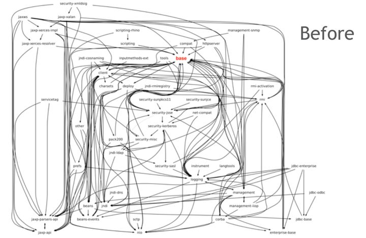
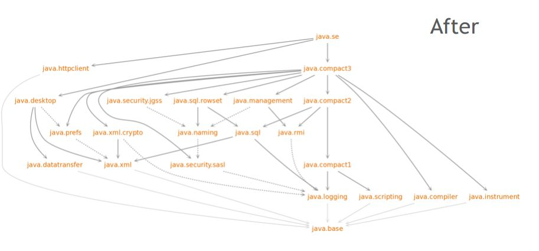

分析JEP 261: Module System(模块系统)。
<br/>
<!-- truncate -->


### 一个java文件的执行周期

在设计模块化时，JDK的开发者们为Java在编译期和运行期之间引入了一个新的phase--链接期。这是一个可选的phase。


### 模块化的使用

先跟随一个简单的模块化demo来直观感受一下模块化。

目录如下：
~~~

java9/module-system-demo$ tree 
.
├── moduleA
│   ├── moduleA.iml
│   ├── module-info.java
│   └── net
│       └── teaho
│           └── demo
│               └── java9
│                   └── modular
│                       └── a
│                           └── Invoker.java
├── moduleB
│   ├── moduleB.iml
│   ├── module-info.java
│   └── net
│       └── teaho
│           └── demo
│               └── java9
│                   └── modular
│                       └── b
│                           └── EchoService.java
├── build_module.sh
├── link_module.sh
├── package_module.sh
├── README.md
└── run_module.sh

~~~

#### 编译

~~~
rm -rf build
javac -d build --module-source-path . $(find . -name '*.java')
~~~

* `--module-source-path` 制定寻找模块源文件（.java）的目录。


#### 运行

~~~
java --module-path build -m moduleA/net.teaho.demo.java9.modular.a.Invoker


output:
echo: Invoke from module A

~~~

#### 打包

~~~

bash ./build_module.sh
mkdir build/jar
jar --create --file=build/jar/moduleB.jar --module-version=1.0 -C build/moduleB .
jar --create --file=build/jar/moduleA.jar --module-version=1.0 --main-class=net.teaho.demo.java9.modular.a.Invoker -C build/moduleA .
mkdir build/jmod
jmod create --class-path build/moduleB build/jmod/moduleB.jmod
jmod create --class-path build/moduleA build/jmod/moduleA.jmod

~~~

上面命令分别打了jar包和jmod包。分别打了如下包：

~~~
├── build
│   ├── jar
│   │   ├── moduleA.jar
│   │   └── moduleB.jar
│   ├── jmod
│   │   ├── moduleA.jmod
│   │   └── moduleB.jmod

~~~

jmod包的特点：
* 新的jmod文件格式是在jar文件格式之上，囊括上native代码，配置文件和其他数据文件等一些不适合放在先有JAR文件格式的资源。
* jmod文件可用在编译期、链接期，但不能用于运行时。

#### 链接

~~~

jlink --verbose --module-path build --add-modules moduleB,java.base --output build/moduleApp

~~~

我们执行jlink命令，输出了如下文件：
~~~
│   ├── moduleApp
│   │   ├── bin
│   │   │   ├── java
│   │   │   └── keytool
│   │   ├── conf
│   │   │   ├── net.properties
│   │   │   └── security
│   │   │       ├── java.policy
│   │   │       ├── java.security
│   │   │       └── policy
│   │   │           ├── limited
│   │   │           │   ├── default_local.policy
│   │   │           │   ├── default_US_export.policy
│   │   │           │   └── exempt_local.policy
│   │   │           ├── README.txt
│   │   │           └── unlimited
│   │   │               ├── default_local.policy
│   │   │               └── default_US_export.policy
│   │   ├── include
│   │   │   ├── classfile_constants.h
│   │   │   ├── jni.h
│   │   │   ├── jvmticmlr.h
│   │   │   ├── jvmti.h
│   │   │   └── linux
│   │   │       └── jni_md.h
│   │   ├── legal
│   │   │   └── java.base
│   │   │       ├── ADDITIONAL_LICENSE_INFO
│   │   │       ├── aes.md
│   │   │       ├── asm.md
│   │   │       ├── ASSEMBLY_EXCEPTION
│   │   │       ├── cldr.md
│   │   │       ├── c-libutl.md
│   │   │       ├── icu.md
│   │   │       ├── LICENSE
│   │   │       ├── public_suffix.md
│   │   │       └── unicode.md
│   │   ├── lib
│   │   │   ├── classlist
│   │   │   ├── jexec
│   │   │   ├── jli
│   │   │   │   └── libjli.so
│   │   │   ├── jrt-fs.jar
│   │   │   ├── jvm.cfg
│   │   │   ├── libjava.so
│   │   │   ├── libjimage.so
│   │   │   ├── libjsig.so
│   │   │   ├── libnet.so
│   │   │   ├── libnio.so
│   │   │   ├── libverify.so
│   │   │   ├── libzip.so
│   │   │   ├── modules
│   │   │   ├── security
│   │   │   │   ├── blacklisted.certs
│   │   │   │   ├── cacerts
│   │   │   │   ├── default.policy
│   │   │   │   └── public_suffix_list.dat
│   │   │   ├── server
│   │   │   │   ├── libjsig.so
│   │   │   │   ├── libjvm.so
│   │   │   │   └── Xusage.txt
│   │   │   └── tzdb.dat
│   │   └── release

~~~

输出了一个小型jre（Java Runtime Environment）。
我们来看看这个jre有什么特别。  
1. 大小
  ~~~
  $ du -sh moduleApp/
  48M     moduleApp/
  
  $ du -sh ~/Env/jdk-11/
  297M    /home/teaho/Env/jdk-11/
  
  $ du -sh /usr/lib/jvm/java-8-openjdk-amd64/jre/
  119M    /usr/lib/jvm/java-8-openjdk-amd64/jre/
  
  ~~~

  我们打包出来的jre才48M而一般jre有119M，更别说jdk了。  
  我们看看有哪些模块：
  
  ~~~
  $ ./build/moduleApp/bin/java --list-modules
  java.base@11
  moduleB
  ~~~
  
  有Java11的java.base和我们编写的moduleB。

2. 只有java、keytool两个工具，我们用这个小型jre运行下代码
  ~~~
  $ ./build/moduleApp/bin/java --module-path build -m moduleA/net.teaho.demo.java9.modular.a.Invoker
  echo: Invoke from module A
  ~~~


### 作用及应用场景

Java的百兆级JDK和JRE一直以来受人诟病。当时外界猜测跳票了这么多年的模块化特性是为了抢占嵌入式和物联网（IOT）的市场，
我个人觉得目的确实是这样的，当然它带来的好处不仅在IOT。

因为以前Java的lib的依赖关系是杂乱无章的。  


而Java9引入模块化后，它的依赖关系清晰了很多。  


这是因为它通过module-info.java文件来强制控制了模块中类的访问能力，这有别于以往只要是public的类都能访问的机制。

#### 应用场景

* 有助于嵌入式、物联网开发
* 为基础平台（框架层面）的开发提供便利

对于一般的应用来说，帮助没有想象中大。
当然目前Java也是支持原来的非模块化的开发方式的。（就是我们可以选择无视module-info.java文件）


### module-info.java文件

Java语言规范（The Java Language Specification）有如下例子：
~~~
open module com.example.foo {
 requires com.example.foo.http;
 requires java.logging;
 requires transitive com.example.foo.network;
 exports com.example.foo.bar;
 exports com.example.foo.internal to com.example.foo.probe;
 uses com.example.foo.spi.Intf;
 provides com.example.foo.spi.Intf with com.example.foo.Impl;
}

~~~

各个关键字的意思如下：

* module名
> Module names, like package names, must not conflict. The recommended way to name a module is to use the reverse-domain-name pattern that has long been recommended for naming packages.
* open关键字  
  声明在`module`前，说明该模块导出的功能可见度是最高的。
* exports关键字  
  语法：  
  * 导出某块`exports <package>;`  
  * 导出某块到某些模块`exports <package> to <module1>, <module2>...;`
* opens关键字  
  opens类似于open
  ````
  module N {
    exports com.jdojo.claim.model;
    opens com.jdojo.claim.model;
  }
  ````
* requires关键字  
  表示当前模块依赖那些模块。
````
requires <module>;
requires transitive <module>;  //加了transitive的作用：https://stackoverflow.com/questions/46502453/whats-the-difference-between-requires-and-requires-transitive-statements-in-jav
requires static <module>;   //加了static的作用：https://stackoverflow.com/questions/46537294/whats-the-difference-between-requires-and-requires-static-in-module-declaration
requires transitive static <module>; 
requires public <module>; //https://openjdk.java.net/projects/jigsaw/spec/sotms/#defining-modules 第2.2点
````
* uses与provider关键字  
  Java允许使用服务提供者和服务使用者分离的服务提供者机制。 JDK 9允许使用语句（uses statement）和提供语句（provides statement）实现其服务。  
  使用语句可以指定服务接口的名字，当前模块就会发现它，使用 java.util.ServiceLoader类进行加载。  
  例子如下：
  ````
  java base的module-info有如下语句：
      uses sun.util.spi.CalendarProvider;
      provides java.nio.file.spi.FileSystemProvider with jdk.internal.jrtfs.JrtFileSystemProvider;
  
  //可以这样使用
  ServiceLoader<FileSystemProvider> service = ServiceLoader.load(FileSystemProvider.class);
  service.xxxxx
  ````


### 其他特点简单罗列

1. 关于不加上版本控制的原因：
>It is not a goal of the module system to solve the version-selection problem, which is best left to build tools and container applications.
2. 一个模块化jar文件能够被识别为模块，同时也能被放置在以往的class path（此时module-info文件会被忽略）。
3. module-info文件中的信息能够在编译和运行时通过模块的反射机制被读取、探测到。
4. 将模块声明文件（module-info.java）编译成类文件（.class）的一个优点是类文件已经具有精确定义和可扩展的格式。
5. 将从类路径加载的类型视为未命名模块的成员，这允许我们以增量、自底向上的方式将现有应用程序的组件从 JAR 文件迁移到模块。
   例如，假设上面显示的应用程序最初是为 Java SE 8 构建的，作为放置在类路径上的一组名称相似的 JAR 文件。 如果我们在 Java SE 9 上按原样运行它，那么 JAR 文件中的类型将在未命名模块中定义。


## reference

[1][Java Platform, Standard Edition Tools Reference](https://docs.oracle.com/javase/9/tools/tools-and-command-reference.htm#JSWOR596)  
[2][Java9 模块化|darian1996](https://darian1996.github.io/2020/05/27/Java9-%E6%A8%A1%E5%9D%97%E5%8C%96/)  
[3][The Java® Language Specification|Java SE 9 Edition](http://cr.openjdk.java.net/~mr/jigsaw/spec/java-se-9-jls-diffs.pdf)  
[4][JEP 261: Module System](https://openjdk.java.net/jeps/261)  
[5][why-did-java-9-introduce-the-jmod-file-format|stackoverflow.com](https://stackoverflow.com/questions/44732915/why-did-java-9-introduce-the-jmod-file-format)  


其他参考：

[真棒：使用Java 11实现应用的模块化|banq](https://www.jdon.com/49683)  

