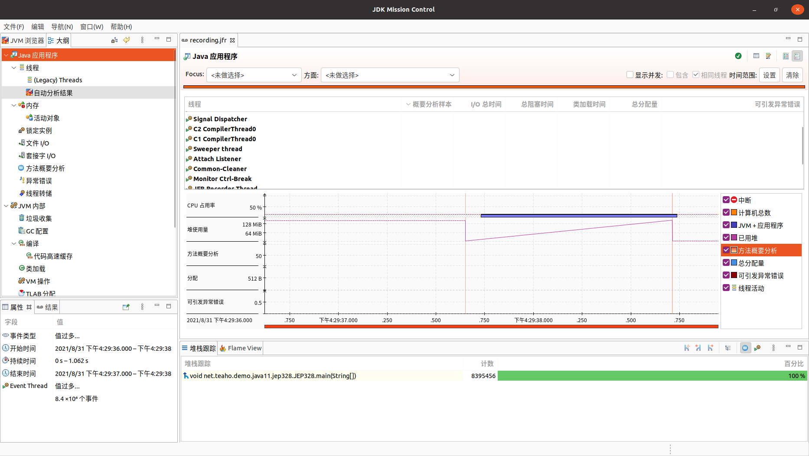
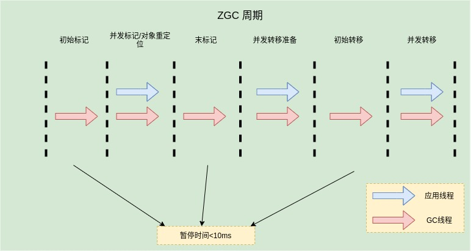

自Java11起，Oracle JDK将不再免费提供商业用途。

Java11是Java8后的第一个LTS版本，我们对OpenJDK的特性列表做一些分析。

 
<!-- truncate -->

## 简介

以下是Java11的特性清单：
1. 181: Nest-Based Access Control（基于嵌套的访问控制）
2. 309: Dynamic Class-File Constants（动态的类文件常量）
3. 315: Improve Aarch64 Intrinsics（优化Aarch64内在函数）
4. 318: Epsilon: A No-Op Garbage Collector（一个无操作垃圾收集器）
5. 320: Remove the Java EE and CORBA Modules（移除Java EE和CORBA模块）
6. 321: HTTP Client (Standard) （HTTP Client API）
7. 323: Local-Variable Syntax for Lambda Parameters (lambda参数的局部变量语法)
8. 324: Key Agreement with Curve25519 and Curve448
9. 327: Unicode 10 (对unicode10的支持)
10. 328: Flight Recorder(飞行记录器)
11. 329: ChaCha20 and Poly1305 Cryptographic Algorithms
12. 330: Launch Single-File Source-Code Programs （运行单文件程序）
13. 331: Low-Overhead Heap Profiling
14. 332: Transport Layer Security (TLS) 1.3
15. 333: ZGC: A Scalable Low-Latency Garbage Collector (Experimental) 
16. 335: Deprecate the Nashorn JavaScript Engine (弃用Nashron)
17. 336: Deprecate the Pack200 Tools and API

提出问题：
1. 那些是日常会用到的？重点是？

代码及完整文件地址：  
https://github.com/teaho2015-blog/java11-feature-learning

## 181: Nest-Based Access Control（基于嵌套的访问控制）

我们先看一个例子：
~~~

public class JEP181 {

    public static class Nest1 {
        private int varNest1;
        public void f() throws Exception {
            final Nest2 nest2 = new Nest2();
            //这里没问题
            nest2.varNest2 = 2;
            final Field f2 = Nest2.class.getDeclaredField("varNest2");
           //这里在java8环境下会报错，在java11中是没问题的
            f2.setInt(nest2, 2);
            System.out.println(nest2.varNest2);
        }
    }

    public static class Nest2 {
        private int varNest2;
    }

    public static void main(String[] args) throws Exception {
        new Nest1().f();
    }
}

~~~

该改动要解决的问题：  
1. Java语言规范允许在同一个源文件中编写多个类。对于用户的角度来说，在同一个类文件里的class应该共享同样的访问控制体系。
为了达到目的，编译器需要经常需要通过附加的access bridge扩大private成员的访问权限到package。
这种bridge和封装相违背，并且轻微的增加程序的大小，会干扰用户和工具。

2. 还有一个问题是反射与源码调用不一致。当使用java.lang.reflect.Method.invoke从一个nestmate调用另一个nestmate私有方法时会报IllegalAccessError错误。
这个是让人不能理解的，因为反射应该和源码级访问拥有相同权限。

现有情况：  
现有的类文件格式定义了 InnerClasses 和 EnclosureMethod 属性（JVMS 4.7.6 和 4.7.7），以允许 Java 源代码编译器（如 javac）具体化源级嵌套关系。 
每个嵌套类型都编译为它自己的类文件，不同的类文件通过这些属性的值“链接”。   
虽然这些属性足以让 JVM 确定嵌套关系，但它们并不直接适用于访问控制，并且本质上与单个 Java 语言概念相关联。
 

### JVM对嵌套成员的访问控制改动

为了允许更广泛、更通用的嵌套概念，而不是简单的 Java 语言嵌套类型，并且为了有效的访问控制检查，建议修改类文件格式以定义两个新属性。
一个嵌套成员（通常是顶级类）被指定为嵌套主机，并包含一个属性 (NestMembers) 来标识其他静态已知的嵌套成员。 每个其他嵌套成员都有一个属性 (NestHost) 来标识其嵌套主机。

我们调整了JVM访问规则，增加了如下条目（to JVMS 5.4.4）：  
一个field或method R可以被class或interface D访问，当且仅当如下任一条件为真：
* ……
* R是私有的，并且声明在另一个class或interface C中，并且C和D是nestmates

### 嵌套成员反射API

正因Java引入了新的类文件属性，那么惯常地Java会提供新的反射机制来检查或查询这些属性。

引入了三个方法java.lang.Class: getNestHost, getNestMembers, and isNestmateOf。

## 309: Dynamic Class-File Constants（动态的类文件常量）

扩展 Java 类文件格式以支持新的常量池形式 CONSTANT_Dynamic。   
Loading a CONSTANT_Dynamic will delegate creation to a bootstrap method, just as linking an invokedynamic call site delegates linkage to a bootstrap method.

invokedynamic的协议设计者（例如 Java 8 中添加的 LambdaMetafactory）经常需要根据现有常量集对行为进行编码，
这反过来又需要在引导程序本身中进行额外的容易出错的验证和提取逻辑。
更丰富、更灵活、更高度类型化的常量消除了invokedynamic协议开发中的挣扎，并促进和简化了编译器逻辑。

CONSTANT_Dynamic还在发展，未来还有一些工作需要做。

## 315: Improve Aarch64 Intrinsics（优化Aarch64内在函数）

改进现有的字符串和数组内在函数，并在 AArch64 处理器上为 java.lang.Math 包下的 sin，cos 和 log 函数实现新的内在函数。

## 318: Epsilon: A No-Op Garbage Collector（一个无操作垃圾收集器）

Epsilon是一个不收集垃圾的垃圾收集器，开启参数-XX:+UseEpsilonGC。
他的工作是在已分配内存的单个连续块中实现线性分配来工作。
System.gc()对Epsilon是不起作用的。

应用场景：
* 性能测试
* 内存压力测试
* VM interface测试。
* 寿命极短的工作
* Last-drop latency improvements（最后一滴延迟改进）
* Last-drop throughput improvements（最后一滴吞吐量改进）

## 320: Remove the Java EE and CORBA Modules（移除Java EE和CORBA模块）

在Java se 9，如下Java EE和CORBA相关模块被标记为deprecated，在Java11如何模块被正式移除
* java.xml.ws (JAX-WS, plus the related technologies SAAJ and Web Services Metadata)
* java.xml.bind (JAXB)
* java.activation (JAF)
* java.xml.ws.annotation (Common Annotations)
* java.corba (CORBA)
* java.transaction (JTA)

### 移除原因

Java se 6包含了一个完整的Web Service技术栈，为Java开发者提供便利。不过随着发展：
* 这些技术块获得了和Java SE本身并不相关的特性。
* 这些技术由上游java.net维护。由于必须将 OpenJDK 存储库中的 Java SE 版本与上游存储库中的 Java EE 版本同步，这使得维护存在问题。
* 开发者可以从上游Java EE自行获取独立版本并通过Endorsed Standards Override Mechanism 部署它们。

## 321: HTTP Client (Standard) （HTTP Client API）

该特性在Java9（jEP110）中是处于孵化状态，Java11正式标准化。

该特性支持HTTP/1.1和HTTP/2。

如下是Http client同步、异步、http2调用的简单demo。

~~~

    /**
     * 同步调用 GET
     * @param uri
     * @throws Exception
     */
    public static void syncGet(String uri) throws Exception {
        HttpClient client = HttpClient.newHttpClient();
        HttpRequest request = HttpRequest.newBuilder()
            .uri(URI.create(uri))
            .build();

        HttpResponse<String> response =
            client.send(request, HttpResponse.BodyHandlers.ofString());

        System.out.println(response.statusCode());
        System.out.println(response.body());
    }

    /**
     * 异步调用 GET
     * @param uri
     * @throws Exception
     */
    public static void asyncGet(String uri) throws Exception {
        HttpClient client = HttpClient.newHttpClient();
        HttpRequest request = HttpRequest.newBuilder()
            .uri(URI.create(uri))
            .build();

        CompletableFuture<HttpResponse<String>> responseCompletableFuture = client.sendAsync(request, HttpResponse.BodyHandlers.ofString());
        responseCompletableFuture.whenComplete((resp, t) -> {
            if (t != null) {
                t.printStackTrace();
            } else {
                System.out.println(resp.body());
                System.out.println(resp.statusCode());
            }
        }).join();
    }

    /**
     * 访问 HTTP2 网址
     * @throws Exception
     */
    public static void http2() throws Exception {
        HttpClient.newBuilder()
            .followRedirects(HttpClient.Redirect.NORMAL)
            .version(HttpClient.Version.HTTP_2)
            .build()
            .sendAsync(HttpRequest.newBuilder()
                    .uri(new URI("https://http2.akamai.com/demo"))
                    .GET()
                    .build(),
                HttpResponse.BodyHandlers.ofString())
            .whenComplete((resp, t) -> {
                if (t != null) {
                    t.printStackTrace();
                } else {
                    System.out.println(resp.body());
                    System.out.println(resp.statusCode());
                }
            }).join();
    }

~~~

## 323: Local-Variable Syntax for Lambda Parameters (lambda参数的局部变量语法)

这是Java11唯一的语言改动。

这里搭配Java10的新特性JEP 286: Local-Variable Type Inference（局部变量类型推断）一起食用。

请看代码 java11目录->jep323.class 中的demo。

[局部变量推断：使用指引|jdk.java.net](https://openjdk.java.net/projects/amber/LVTIstyle.html)

Java11增加了一点，允许在声明lambda表达式时在表达式的参数使用var。
~~~

(var x) -> System.out.println(x);

~~~

作用是什么呢？  
为了统一并为了支持lambda参数使用注解

~~~~
(@NotNull var x) -> System.out.println(x);

(@Number var x) -> System.out.println(x);
~~~~

## 324: Key Agreement with Curve25519 and Curve448

实现RFC 7748 [[link]](https://datatracker.ietf.org/doc/html/rfc7748#page-14)中所述，使用 Curve25519 和 Curve448 实现密钥协议。

这是一个密码学相关（ECDH密钥合意协议）的变更，更改是java.security包。

## 327: Unicode 10 (对unicode10的支持)

Java11实现了9.0，增加了7500字符和六个脚本(Unicode文本集合)，实现了Unicode10因此增加了8518个字符和四个脚本（Unicode文本集合）。

## 328: Flight Recorder(飞行记录器)

JDK Flight Recorder 是一个用于收集有关正在运行的 Java 应用程序的诊断和分析数据的系统。  
它本身对运行期系统的侵入性很小，同时又能提供相对准确和丰富的运行期信息，以极低的性能开销集成到 Java 虚拟机 (JVM) 中，专为分析重负载的生产环境而设计。

在Java11前Flight Recorder和Java mission Control（JMC）都是商业产品，仅在Oracle JDK可用。那时候可以这样开启：
~~~
java -XX:+UnlockCommercialFeatures -XX:+FlightRecorder MyHelloWorldApp
~~~

现在，JFR在OpenJDK 11中是开源的，并且在OpenJDK11/bin文件夹中可用。

指标测量：
* 只有最多1%的性能损耗
* 未启用时没有可衡量的性能开销

### 功能使用

相关模块：
* jdk.jfr：相关API
* jdk.management.jfr： for JMX管理

飞行记录器在Java11的启动方式：`` java -XX:StartFlightRecording ...``
或通过jcmd的JFR命令来按需产生profiling。

#### jmc分析jfr文件

我们能够通过jcmd来生成.jfr文件，并通过JMC分析。
现在Java11不提供JMC了，可以自行安装：[jmc release|java.net](https://jdk.java.net/jmc/8/)

#### 自定义事件及分析

我们可以通过API记录和消费自定义事件：

~~~
//继承并定义事件
@Label("Hello World")
@Description("Helps the programmer getting started")
class HelloWorld extends Event {
    @Label("Message")
    String message;
}

//提交事件
HelloWorld event = new HelloWorld();
event.message = "hello, world!";
event.commit();

//消费并输出
Path p = Paths.get("/home/teaho/IdeaProjects/java11-feature-learning/java11/recording.jfr");
for (RecordedEvent e : RecordingFile.readAllEvents(p)) {
    try {
        System.out.println(e.getStartTime() + " : " + e.getValue("message"));
    } catch (Exception ex) {
        //do nothing
    }
}

> 2021-08-31T08:29:38.948915253Z : hello, world!

~~~

## 330: Launch Single-File Source-Code Programs （运行单文件程序）

对于如下该代码，

~~~~
public class Main {

    public static void main(String[] args) {
        System.out.println("hey yo! This is JEP 330 represented.");
    }
}
~~~~

以往我们需要如此执行该文件
~~~~

javac Main.java
java Main

~~~~

现在如此即可执行：

btw,通过shebang执行：
~~~~

#!/home/teaho/Env/jdk-11/bin/java --source 11
public class SheBang {

    public static void main(String[] args) {

        System.out.println("hey yo! This is JEP 330 represented.");

    }
}

~~~~

## 329: ChaCha20 and Poly1305 Cryptographic Algorithms

Java 11 提供了 ChaCha20 和 ChaCha20-Poly1305 加密实现。

## 331: Low-Overhead Heap Profiling（低开销的堆profiling）

提供一种低开销的Java堆分配采样(Profiling)方式，可通过JVMTI(Java Tool Interface)访问。

用户非常需要了解其堆的内容。所以有很多工具被开发出来，比如JFR，jmap，VisualVM Tool。  
但大多数现有工具都缺少的一种信息是对于特定或指定内存分配的调用路径（call site）。堆dump是没有携带这一类信息的。
这种信息对于开发者来说有为重要，尤其是在定位在一个糟糕的分配在代码中的指定位置。

现在我们可以这样获取到这些信息：
1. 您可以使用字节码重写器（例如 [Allocation Instrumenter|github](https://github.com/google/allocation-instrumenter) ）来检测应用程序中的所有分配。
2. 通过Java飞行收集器。

## 333: ZGC: A Scalable Low-Latency Garbage Collector (Experimental)

万众期待的ZGC出来了～当然目前是实验性特性，Java15才最终为生产就绪。

ZGC是一个低延迟可拓展垃圾收集器。

设计目标：
* GC暂停时间不超过10ms
* 处理从相对较小（几百兆字节）到非常大（许多 TB）(8mb~16TB)的堆
* 与使用 G1 相比，应用程序吞吐量降低不超过 15%
* 利用colored pointers和load barriers为未来的 GC 功能和优化奠定基础

咋一看，ZGC是一个并发、单代、基于区域（region-base）、NUMA感知的压缩收集器。STW仅限于跟扫描，
因此GC暂停时间不会随着堆或live set的大小而增加。

### 功能使用

通过如下JVM参数启用：
~~~
-XX:+UnlockExperimentalVMOptions -XX:+UseZGC
~~~

### 性能表现

这是JDK项目组使用SPECjbb® 2015做的性能测试，用的128G堆。

第一个是吞吐量测试数据，max jops为纯吞吐量量，critical jops为限制响应时间下的吞吐量量。

* ZGC  
max-jOPS: 100%  
critical-jOPS: 76.1%
* G1  
max-jOPS: 91.2%  
critical-jOPS: 54.7%  

下面是延时测试

* ZGC  
avg: 1.091ms (+/-0.215ms)  
95th percentile: 1.380ms  
99th percentile: 1.512ms  
99.9th percentile: 1.663ms  
99.99th percentile: 1.681ms  
max: 1.681ms
* G1  
avg: 156.806ms (+/-71.126ms)  
95th percentile: 316.672ms  
99th percentile: 428.095ms  
99.9th percentile: 543.846ms  
99.99th percentile: 543.846ms  
max: 543.846ms  

### 缺点（局限性）

* 目前ZGC为实验版本，该版本不支持类卸载。
* 不支持JVMCI（Java-Level JVM Compiler Interface）  

这些将在后续版本的开发中支持。

### 运行原理

ZGC只有三个STW阶段：初始标记，再标记，初始转移。其中，初始标记和初始转移分别都只需要扫描所有GC Roots，其处理时间和GC Roots的数量成正比，一般情况耗时非常短；  
再标记阶段STW时间很短，最多1ms，超过1ms则再次进入并发标记阶段。即，ZGC几乎所有暂停都只依赖于GC Roots集合大小，停顿时间不会随着堆的大小或者活跃对象的大小而增加。
与ZGC对比，G1的转移阶段完全STW的，且停顿时间随存活对象的大小增加而增加。

解决转移期间对象访问的两个核心技术：
* 着色指针  
    
  对于 64bit 的系统，高位 bit 中拿出 4 个 bit 来指示不同的处理状态，两个 Mark 位表明该对象指针是否已经被标记，采用两个 Mark bit 可以在前后不同的 GC 时使用不同的 Mark bit；
  Remapped 位表示当前对象指针是否已经调整为搬移之后的对象指针；Finalizable 位主要是为 Finalizable 对象服务，用来表示该对象指针是否仅经 Finalize 对象标记，主要供 Mark 阶段和弱引用处理阶段使用。
* 读屏障  
读屏障是JVM向应用代码插入一小段代码的技术。当应用线程从堆中读取对象引用时，就会执行这段代码。需要注意的是，仅“从堆中读取对象引用”才会触发这段代码。  
~~~
Object o = obj.FieldA   // 从堆中读取引用，需要加入屏障
<Load barrier>
Object p = o  // 无需加入屏障，因为不是从堆中读取引用
~~~

### 配置参数

~~~
重要参数配置样例：
-Xms10G -Xmx10G 
-XX:ReservedCodeCacheSize=256m -XX:InitialCodeCacheSize=256m 
-XX:+UnlockExperimentalVMOptions -XX:+UseZGC 
-XX:ConcGCThreads=2 -XX:ParallelGCThreads=6 
-XX:ZCollectionInterval=120 -XX:ZAllocationSpikeTolerance=5 
-XX:+UnlockDiagnosticVMOptions -XX:-ZProactive 
-Xlog:safepoint,classhisto*=trace,age*,gc*=info:file=/opt/logs/logs/gc-%t.log:time,tid,tags:filecount=5,filesize=50m 
~~~

* -Xms -Xmx：堆的最大内存和最小内存，这里都设置为10G，程序的堆内存将保持10G不变。 
* -XX:ReservedCodeCacheSize -XX:InitialCodeCacheSize：设置CodeCache的大小， JIT编译的代码都放在CodeCache中，一般服务64m或128m就已经足够。
* -XX:+UnlockExperimentalVMOptions -XX:+UseZGC：启用ZGC的配置。 
* -XX:ConcGCThreads：并发回收垃圾的线程。默认是总核数的12.5%，8核CPU默认是1。调大后GC变快，但会占用程序运行时的CPU资源，吞吐会受到影响。 
* -XX:ParallelGCThreads：STW阶段使用线程数，默认是总核数的60%。 
* -XX:ZCollectionInterval：ZGC发生的最小时间间隔，单位秒。 
* -XX:ZAllocationSpikeTolerance：ZGC触发自适应算法的修正系数，默认2，数值越大，越早的触发ZGC。 
* -XX:+UnlockDiagnosticVMOptions -XX:-ZProactive：是否启用主动回收，默认开启，这里的配置表示关闭。 
* -Xlog：设置GC日志中的内容、格式、位置以及每个日志的大小。

## 332: Transport Layer Security (TLS) 1.3

实现传输层安全 (TLS) 协议 RFC 8446 的 1.3 版。

## 335: Deprecate the Nashorn JavaScript Engine

Nashorn是Java引入的JavaScript引擎。  
由于ECMAScript的语言结构和APi快速发展，使得该引擎难以维护。

## 336: Deprecate the Pack200 Tools and API

一个打包压缩工具，因为各种历史原因和发展原因弃用。

## API变更

Java11的API弃用和移除清单可以在这里看到:
[API removed|Java SE 11 Final Release Spec](https://cr.openjdk.java.net/~iris/se/11/latestSpec/#APIs-removed)

Java11的API变动（更改、增加、删除）：
[Diff between Java 10 and Java11 API|Java.net](https://cr.openjdk.java.net/~iris/se/11/latestSpec/apidiffs/overview-summary.html)

下面看看一些常用更改。

### java.lang.String

~~~
    /**
     * for java.lang.String
     */
    @Test
    public void testStringNewAPI() {

        assertThat("".isBlank(), equalTo(true));
        assertThat("   ".isBlank(), equalTo(true));
        assertThat("11".isBlank(), equalTo(false));

        assertThat(("abc\n" + "abc\n")
            .lines()
            .count(), equalTo(2L));

        assertThat("abc".repeat(2), equalTo("abcabc"));
        assertThat("  a b c  ".strip(), equalTo("a b c"));
        assertThat("  a b c  ".stripLeading(), equalTo("a b c  "));
        assertThat("  a b c  ".stripTrailing(), equalTo("  a b c"));

    }

~~~

### 简单的文件读取

~~~
    @Test
    public void testFilesIOString() throws IOException {
        String content = "Hey this is tmp file!";
        Path path = Files.writeString(Files.createTempFile("tmp" + LocalTime.now(), ".txt"), content);
        String fileContent = Files.readString(path);
        assertThat("Str not eq!", fileContent, equalTo(content));

    }
~~~

## JAVA10同场加映

* 286: Local-Variable Type Inference（本地变量类型推断）

### 286: Local-Variable Type Inference（本地变量类型推断）

在上面JEP323一节已对该特性做了陈述。

### API变更

~~~

    /**
     * java.util.List、java.util.Map 和 java.util.Set 都有了一个新的静态方法 copyOf(Collection)。
     *
     * copyOf
     */
    @Test
    public void testCopyOf() {

        {
            var list = new ArrayList<Item>();
            list.add(new Item(1));
            list.add(new Item(2));
            var copyList = List.copyOf(list);
            assertThat(copyList.get(0), equalTo(list.get(0)));
            assertThat(copyList.get(1), equalTo(list.get(1)));
            assertThat(Utils.exceptionOf(() -> copyList.add(new Item(3))), instanceOf(UnsupportedOperationException.class));

        }

        {
            var list = new ArrayList<Item>();
            list.add(new Item(1));
            list.add(new Item(2));
            List copyList = List.copyOf(list);
            assertThat(copyList.get(0), equalTo(list.get(0)));
            assertThat(copyList.get(1), equalTo(list.get(1)));
        }

        {
            var map = Map.of(new Item(1), 1, new Item(2), 2, new Item(3), 3);
            var copyMap = Map.copyOf(map);
            assertThat(map.equals(copyMap), equalTo(true));
            assertThat(Utils.exceptionOf(()-> copyMap.put(new Item(Integer.MAX_VALUE), Integer.MAX_VALUE)), instanceOf(UnsupportedOperationException.class));
        }

        {
            var set = Set.of(new Item(1), new Item(2), new Item(3));
            var copySet = Set.copyOf(set);
            assertThat(set.equals(copySet), equalTo(true));
            assertThat(Utils.exceptionOf(()-> copySet.add(new Item(4))), instanceOf(UnsupportedOperationException.class));
        }

    }

    /**
     * Collectors加了一个转换为不可变列表的API
     *
     * stream toUnmodifiableList
     */
    @Test(expected = UnsupportedOperationException.class)
    public void whenModifyToUnmodifiableList_thenThrowsException() {
        List<Integer> list = Stream.of(1, 2, 3)
            .filter(i -> i % 2 == 0)
            .collect(Collectors.toUnmodifiableList());
    }

    /**
     * optional 增加了 空的orElseThrow 方法
     */
    @Test
    public void testOptional_orElseThrow() {

        Optional.of(1).orElseThrow();
        assertThat(Utils.exceptionOf(() -> Optional.empty().orElseThrow()), instanceOf(NoSuchElementException.class));

    }

~~~

## JAVA9同场加映(未完成)

* 222: jshell: The Java Shell (Read-Eval-Print Loop)
* 261: Module System(模块系统)

### 222: jshell: The Java Shell (Read-Eval-Print Loop)

Java9提供交互式工具来评估使用Java编程语言的声明、语句和表达式，  
以及提供了JShell API以便其他应用程序可以利用此功能。

[JShell Tutorial](https://cr.openjdk.java.net/~rfield/tutorial/JShellTutorial.html)  
[jshell|Java Platform, Standard Edition Tools Reference](https://docs.oracle.com/javase/9/tools/jshell.htm#JSWOR-GUID-C337353B-074A-431C-993F-60C226163F00)

#### 一般使用

~~~

jshell> /list

   2 : a instanceof java.lang.String
   3 : a instanceof java.lang.String
   5 : String getStr() {
       return "abc";
       }
   6 : String a = "abc";

jshell> /imports
|    import java.io.*
|    import java.math.*
|    import java.net.*
|    import java.nio.file.*
|    import java.util.*
|    import java.util.concurrent.*
|    import java.util.function.*
|    import java.util.prefs.*
|    import java.util.regex.*
|    import java.util.stream.*

jshell> /vars
|    boolean $2 = true
|    boolean $3 = true
|    String a = "abc"

jshell> String getStr() {
   ...> return "a";
   ...> }
|  已修改 方法 getStr()

jshell> System.out.println(getStr());
a

~~~

#### API使用

~~~
JShell shell = JShell.create();
shell.onShutdown(jShell -> System.out.println("bye bye"));

BufferedReader reader = new BufferedReader(new InputStreamReader(System.in));
while (true) {
    System.out.print("\n> ");
    try {
        String cmd = reader.readLine();
        List<SnippetEvent> results = shell.eval(cmd);
        for (SnippetEvent e : results) {
            if (!e.status().isActive() && !e.status().isDefined()) {
                shell.diagnostics(e.snippet()).forEach(diag -> System.out.println(diag.getMessage(Locale.CHINA)));
                System.out.println(e.status());
            } else if (e.exception() != null) {
                System.out.println("< " + e.exception());
            } else {
                System.out.println(e.value());
            }
        }
    } catch (IOException e) {
        e.printStackTrace();
    }
}

~~~

输出：

~~~

> String s = "abc";
"abc"

> var a = "a";
找不到符号
  符号:   类 var
  位置: 类 
REJECTED

> System.out.println(s);
abc

~~~

### 其他变更

#### Flow  API

以前有写过一篇Project Reactor的原理剖析[24]，原理上二者是相通的。

## reference

[1][JDK 11|java.net](https://openjdk.java.net/projects/jdk/11/)  
[2][【是时候升级java11了】 jdk11优势和jdk选择](https://cloud.tencent.com/developer/article/1590566)  
[3][JAVA11到底有多强，不看你就out了|zhihu](https://zhuanlan.zhihu.com/p/94459000)  
[4][unicode10|unicode.org](http://unicode.org/versions/Unicode10.0.0/)  
[5][Proposed Update Unicode® Technical Standard #51](http://unicode.org/reports/tr51/proposed.html)  
[6][Script(Unicode)|wikipedia](https://en.wikipedia.org/wiki/Script_(Unicode))  
[7][Java11版本特性详解](https://www.wmyskxz.com/2020/08/22/java11-ban-ben-te-xing-xiang-jie/)  
[8][JDK 11 Documentation|oracle](https://docs.oracle.com/en/java/javase/11/index.html)  
[9][Java9版本特性详解](https://www.wmyskxz.com/2020/08/20/java9-ban-ben-te-xing-xiang-jie/)  
[10][java11新特性---Nest-Based Access Control(嵌套访问控制)|宋兵甲](https://juejin.cn/post/6844903685617614855)  
[11][JDK11 - Introduction to JDK Flight Recorder|Java Community and Oracle|youtube](https://www.youtube.com/watch?v=7z_R2Aq-Fl8)  
[12][ZGC: The Next Generation Low-Latency Garbage Collector|Java Community and Oracle|youtube](https://www.youtube.com/watch?v=88E86quLmQA)  
[13][JVMTI 参考|javase8 jvmti文档翻译](https://blog.caoxudong.info/blog/2017/12/07/jvmti_reference#1.6)  
[14][JVMTM Tool Interface|oracle](https://docs.oracle.com/javase/8/docs/platform/jvmti/jvmti.html)  
[15][新一代垃圾回收器ZGC的探索与实践|美团技术团队](https://tech.meituan.com/2020/08/06/new-zgc-practice-in-meituan.html)  
[16][The Design of ZGC|Per Lidén (@perliden)Consulting Member of Technical Staff,Java Platform Group, Oracle](http://cr.openjdk.java.net/~pliden/slides/ZGC-PLMeetup-2019.pdf)  
[17][openjdk wiki](https://wiki.openjdk.java.net/)  
[18][ZGC-OracleDevLive-2020.pdf|Java Platform Group](https://cr.openjdk.java.net/~pliden/slides/ZGC-OracleDevLive-2020.pdf)  
[19][Tencent Kona JDK11 无暂停内存管理 -ZGC 生产实践|InfoQ](https://www.infoq.cn/article/suthxzwaoeijigdp11bj)  
[20][JDK 9|java.net](https://openjdk.java.net/projects/jdk9/)  
[21][Java 9 新特性之核心库（上）|darian1996](https://darian1996.github.io/2020/05/28/Java9-%E6%96%B0%E7%89%B9%E6%80%A7%E4%B9%8B%E6%A0%B8%E5%BF%83%E5%BA%93/)  
[22][Java9 模块化|darian1996](https://darian1996.github.io/2020/05/27/Java9-%E6%A8%A1%E5%9D%97%E5%8C%96/)  
[23][The Java® Language Specification|Java SE 9 Edition](http://cr.openjdk.java.net/~mr/jigsaw/spec/java-se-9-jls-diffs.pdf)  
[24][Project Reactor原理|teaho.net](https://spring-source-code-learning.gitbook.teaho.net/webflux/project-reactor%E5%8E%9F%E7%90%86.html)  

其他参考：

[真棒：使用Java 11实现应用的模块化|banq](https://www.jdon.com/49683)  
[本文将帮助你如何将应用程序从Java 8迁移到java11（纯干货分享）|程序猿阿洐](https://juejin.cn/post/6844904002727968782)  
[JDK8升级JDK11过程记录|cdmana.com](https://cdmana.com/2021/06/20210610210415763m.html)  

