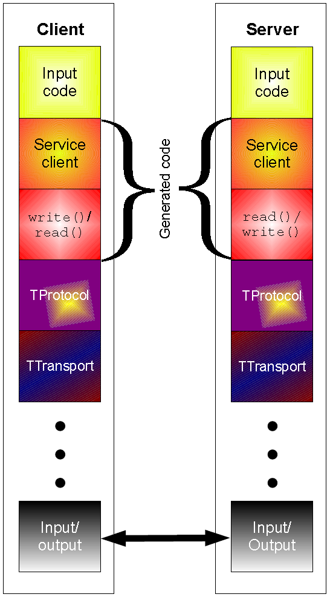
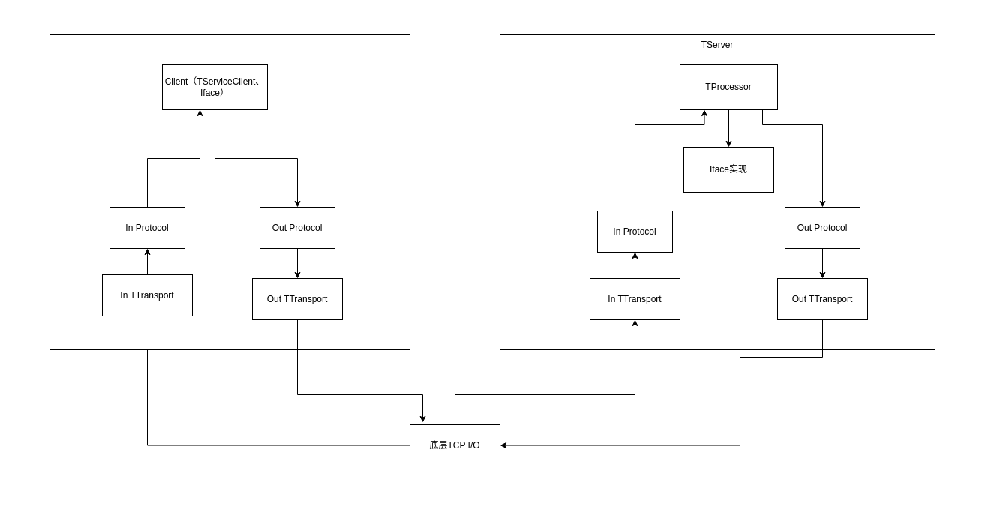
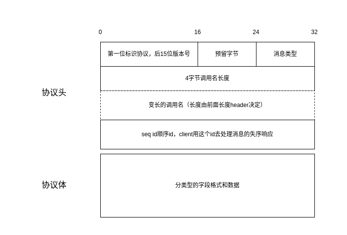
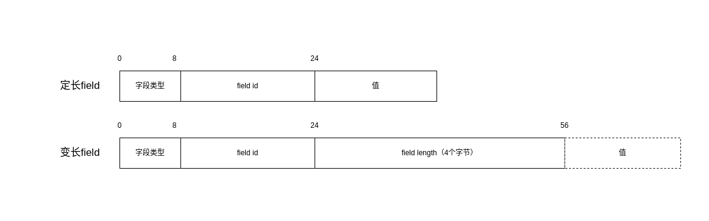
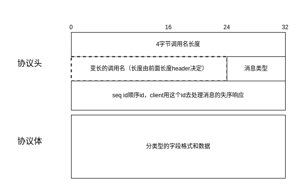
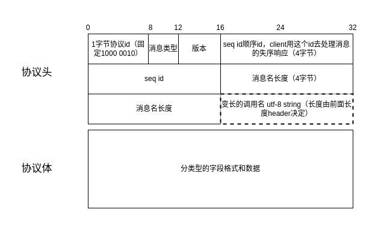
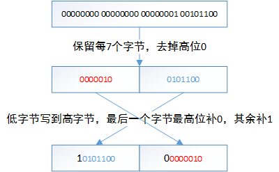

Thrift算是一种常见的RPC框架，我工作中也常常接触到。

<br/>
<!-- truncate -->

> 基于0.5.0版本
> 

## 简介
Thrift作为一种接口定义语言（IDL）和二进制通信协议被应用在程序设计的服务创建和定义中，我们更常见称呼Thrift为RPC框架。
在使用Thrift中，我认为Thrift有如下特点：
1. 支持语言众多。拥有自成一体的IDL，各种语言C++、Java、Python等都有实现。
2. 传输性能优秀。RPC性能对比不错，很多大公司，还有组件（Hadoop、Hive等）都使用它。




### 目标

Thrift在互部有大量的使用，而互部搜推也是大面积使用。本文对Thrift进行分析，为之后多语言测试的类泛化调用，字段质量保障加消息头提供基础。

## 组件职责和传输

Thrift官网有介绍Thrift Server的网络层和各组件作用，我们跟着顺藤摸瓜：
````
+-------------------------------------------+
| Server                                    |
| (single-threaded, event-driven etc)       |
+-------------------------------------------+
| Processor                                 |
| (compiler generated)                      |
+-------------------------------------------+
| Protocol                                  |
| (JSON, compact etc)                       |
+-------------------------------------------+
| Transport                                 |
| (raw TCP, HTTP etc)                       |
+-------------------------------------------+
````


上图给出整体流程图，我这里一一说下：
- **Transport** 网络传输封装，TCP、HTTP之类。最终传输层协议实现有在类中生成socket，也有会抽象一层TSocket去做。
  - TFramedTransport
  - TNonblockingTransport
  - THttpClient
- **Protocol** 传输序列化协议
  - TBinaryProtocol
  - TCompactProtocol
  - TJSONProtocol
- **TProcessor** thrift代码生成，传输及序列化流程处理
- **TServer** 处理网络流程执行，数据处理整个流程
  - TSimpleServer
  - TThreadPoolServer
  - TNonblockingCompleteServer
- **Client和TServiceClient** thrift生成的代码，client端调用使用

## 协议分析
### Strict Binary协议
调用示例
````Thrift
enum TypeEnum {
UNKNOWN = 0;
ADMIN = 1;
NORMAL = 2;
}

struct Req {
1:i32 id;
2:TypeEnum type;
3:string name;
4:map<string, string> parameters;
5:bool fill_info;
}

struct UserInfo {
1:i32 id;
2:TypeEnum type;
3:string name;
4:map<string, string> parameters;
5:bool status;
}

service SimpleThriftService {
string knock(1:string msg);
UserInfo getUserInfo(1:Req req);
}
````

````Java
TTransport transport = new TSocket("localhost", 9090);
TProtocol protocol = new TBinaryProtocol(transport);
SimpleThriftService.Client client = new SimpleThriftService.Client(protocol);
transport.open();
Req req = new Req(1, TypeEnum.NORMAL, "test", new HashMap<String, String>() {{put("k", "v");}}, false);
UserInfo userInfo = client.getUserInfo(req);
````

#### 分析字节码

以使用最广的`strict Binary`协议为例，基于上面示例调用，进行了抓包，结合文档对字节码进行直观分析。
注：wireshark抓包的话自带了一些方便的标注。
这里只标注了client请求协议体，**server reply返回的消息格式相同**。

````
//Message
80 01// 10000000 00000001 首位1标识为strict binary protocol, 其余15位标识版本号
00 // 无用字节
01 // message type消息类型 1：CALL
00 00 00 0b // 方法名长度 11
67 65 74 55 73 65 72 49 6e 66 6f // 方法名：getUserInfo
00 00 00 01 // seq id顺序id，client用这个号去处理消息的失序响应

//Struct
0c // field类型：T_STRUCT
00 00// field id: 0
00 // 类型: T_STOP
0c // field类型：T_STRUCT
00 01 // field id: 1
08 // field类型：I32
00 01 // field id: 1
00 00 00 01 // int32值=1
08 // field类型：I32
00 02 // field id: 2
00 00 00 02 // int32值=2
0b // field类型：BINARY
00 03 // field id: 3
00 00 00 04 // BINARY field会带length，为4
74 65 73 74 //string值为test
0d // field类型：MAP
00 04 //field id: 4
0b //key type: BINARY
0b //value type: BINARY
00 00 00 01 //map的item数，该例子为1
00 00 00 01 //length：1
6b //值为 k
00 00 00 01 //value length：1
76 // 值为 v
02 // field类型：BOOL
00 05 //field id: 5
00 //值为FALSE
00 //T_STOP 标识STRUCT结束
00 //T_STOP 标识整体数据结束
````

#### 协议格式



##### 1. 协议头
   分为这四种消息类型
- _Call_: 1 client发送的消息类型，指代需要响应的消息。
- _Reply_: 2  server回复响应的消息。
- _Exception_: 3 server异常消息。
- _Oneway_: 4  client发送的单向消息，不需要返回。

##### 2. 协议体

- 一般定长数据：i32、i64、BOOL等，采用TV模式，字段类型（1字节）+ field id（2字节）+ 值
- 变长数据：STRUCT、BINARY、MAP、LIST、SET等，采用TLV模式，字段类型（1字节）+ field id（2字节）+ field length (4字节) + 值

定长数据类型

| 数据类型 | 字段类型（1个字节） | 类型尺寸（单位：字节） |
| :----: | :----: | :----: |
| bool |	2 |	1 |
| byte |	3	| 1 |
| double |	4	| 8 |
| i16 |	6	| 2 |
| i32 |	8	| 4 |
| i64	| 10	| 8 |

变长数据类型


|                       数据类型                        |            字段类型（1个字节）             |               	类型尺寸（长度 + 值）                |
|:-------------------------------------------------:|:---------------------------------:|:------------------------------------------:|    
|                      string	                      |                11                 |                   	4 + N                   |
|                      struct                       |                	12                |          	嵌套数据 + 1个字节停止符STOP（00）           |
| map |                	13                | 	1 + 1 + 4 + n*(k+v)  |
|       set	| 14 |       	1 + 4 + N 【val类型 + item数 + 值】       |
|   list	|                15	                |    1 + 4 + N 【val类型 + item数 + 值】    |

### 老（non-strict）Binary协议


字段分析同上。


### Compact协议

#### 协议格式



##### 1. 协议头
   对比Binary协议，将消息类型和版本做了压缩，头字段排列做了优化。

##### 2. 协议体
   协议体的压缩主要是通过`zigzag`和`var int`（protobuf也用到这两算法去做压缩），对**数字类型**和变长字段的**length头**做压缩。

**Zigzag**  

作用：能够将有符号数压缩为无符号整数。从而减少存储和传输空间。  
int32算法：`(n << 1) ^ (n >> 31)`  
举例：处理整数 1和-1。  
````
原始：00000000 00000000 00000000 00000001
左移位n << 1：00000000 00000000 00000000 00000010
右移位n >> 31：00000000 00000000 00000000 00000000
异或：00000000 00000000 00000000 00000010

原始：11111111 11111111 11111111 11111111
左移位n << 1: 11111111 11111111 11111111 11111110
右移位n >> 31：11111111 11111111 11111111 11111111
异或：00000000 00000000 00000000 00000001
````
经过编码后，-1转换为无符号整数，方便压缩。

**Var int**   
作用：能够将正整数压缩字节数，结合zigzag能够减少存储和传输空间。  
例子：转换数字123456 -> 结果10111001 01100000  
````
//算法：复制自TCompactProtocol
public static byte[] toVarint32(int n) {
byte[] i32buf = new byte[5];
int idx = 0;
while (true) {
if ((n & ~0x7F) == 0) {
i32buf[idx++] = (byte)n;
// writeByteDirect((byte)n);
break;
// return;
} else {
i32buf[idx++] = (byte)((n & 0x7F) | 0x80);
// writeByteDirect((byte)((n & 0x7F) | 0x80));
n >>>= 7;
}
}

    return i32buf;
}

数字123456：00000000 00000000 00110000 00111001
1次循环:10111001  
2次循环:10111001 01100000
````


**需要注意**：compact协议的对小数值数字，压缩能力好，但是对于大数，压缩能力有限。

### JSON协议

json协议编码在Thrift不常用且不建议用，这里不打算说。

## Reference
[1]https://en.wikipedia.org/wiki/Apache_Thrift  
[2]https://thrift.apache.org/docs/concepts.html  
[3]https://developer.aliyun.com/article/643859  
[4]Thrift spec https://github.com/apache/thrift/blob/master/doc/specs/thrift-rpc.md  
[5]https://github.com/apache/thrift/blob/master/doc/specs/thrift-binary-protocol.md  
[6]https://zhuanlan.zhihu.com/p/476213759  
[7]https://www.linux88.com/zigzag/  
