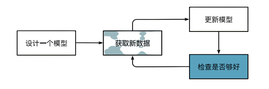
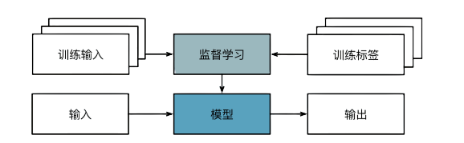
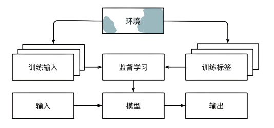
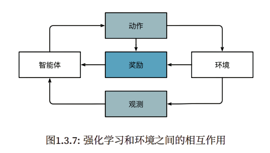
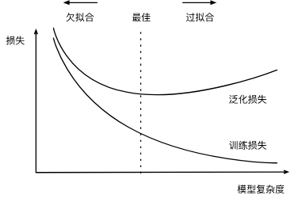
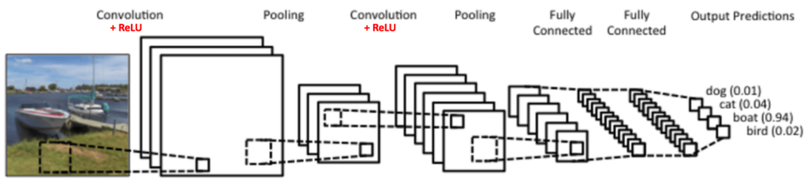
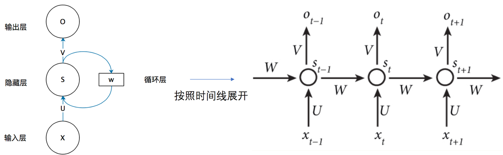
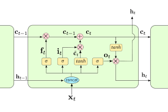

> 学习书籍和网络资料的自录和代码手搓。

## 边界划分

典型训练流程：


## 机器学习中的关键组件

无论什么类型的机器学习问题，都会遇到这些组件：
1. 可以用来学习的数据（data）
   1. 每个数据集由一个个样本(sample)组成，通常每个样本由一组称为特征（features）的属性组成。
   2. 当每个样本的特征类别数量都是相同的时候，其特征向量是固定长度的，这个长度被称为数据的维数（di‐mensionality）。
2. 如何转换数据的模型（model）
3. 一个目标函数（objective function），用来量化模型的有效性
- 因为是要看距离目标差距多少，所以也称为，损失函数（loss function）
4. 调整模型参数以优化目标函数的算法（algorithm）
- 大多流行的优化算法通常基于一种基本方法-梯度下降（gradient descent）。

## 监督学习

监督学习（supervised learning）擅长在“给定输入特征”的情况下预测标签。每个“特征‐标签”对都称为一个样本（example）。有时，即使标签是未知的，样本也可以指代输入特征。我们的目标是生成一个模型， 能够将任何输入特征映射到标签（即预测）。  
监督学习三个步骤：

1. 从已知数据算出一个子集，为每个样本获取真实标签。这些输入和相应的标签一起构成了训练数据集。
2. 选择有监督的学习算法，将训练数据作为输入，输出一个“已完成学习的模型”
3. 将之前没有见过的样本特征放到这个“已完成学习的模型”中，使用模型输出作为相应标签的预测。
   
经典监督学习应用：
1. 回归
2. 分类
3. 标记问题
4. 搜索
5. 推荐系统
6. 序列学习

## 无监督学习

1. 聚类（clustering），经典实现：Faiss的K-means算法实现。
2. 主成分分析
3. 因果关系
4. 生成对抗性网络

## 与环境互动


   
## 强化学习

如果你对使用机器学习开发与环境交互并采取行动感兴趣，那么最终可能会专注于强化学习（reinforcement learning）。


## 历史

### 起源

1. 最初的起源，其实几个世纪前已有痕迹，自然科学的应用手段--分析数据。
2. 香农的信息论和图灵的计算理论
3. 神经网络得名源于生物灵感，而我们可从当今看到延续的两个原则 • 线性和非线性处理单元的交替，通常称为层（layers）； • 使用链式规则（也称为反向传播（backpropagation））一次性调整网络中的全部参数。

### 深度学习的发展

最近十年，在统计模型、应用和算法方面的进展可谓大爆发。列举一些：
- 新的容量控制方法，如dropout
- 注意力机制：解决了困扰统计学一个多世纪的问题：如何在不增加可学习参数的情况下增加系统的记忆 和复杂性。
- 多阶段设计，例如，存储器网络 (Sukhbaatar et al., 2015) 和神经编程器‐解释器 (Reed and De Freitas, 2015)。
- 生成对抗网络
- 并性和分布式训练的能力提升。
- 深度学习框架的发展

无可否认，现在我们生活中遍布了人工智能应用，但我们离一个能够控制人类创造者的有知觉的人工智能系统还很远。
首先，人工智能系统是以一种特定的、面向目标的方式设计、训练和部署的。虽然他们的行为可能会给人一种通用智能的错觉，但设计的 基础是规则、启发式和统计模型的结合。其次，目前还不存在能够自我改进、自我推理、能够在试图解决一 般任务的同时，修改、扩展和改进自己的架构的“人工通用智能”工具。

### 特点
深度学习是深度的，模型学习了很多层的转换。
深度学习的一个关键优势是它不仅取代了传统学习管道末端的浅层模型，而且还取代了劳动密集型的 特征工程过程。此外，通过取代大部分特定领域的预处理，深度学习消除了以前分隔计算机视觉、语音识别、 自然语言处理、医学信息学和其他应用领域的许多界限，为解决各种问题提供了一套统一的工具。
发展趋势从参数统计描述到非参数模型。


## 数理知识
python的dirs和help可以查看包里有哪些方法和用法。

### 线代、微分
张量：张量表示一个由数值组成的数组，这个数组可能有多个维度。 具有一个轴的张量对应数学上的向量（vector）； 具有两个轴的张量对应数学上的矩阵（matrix）； 具有两个轴以上的张量没有特殊的数学名称。
> 通常定义张量的物理学或传统数学方法，是把张量看成一个多维数组，当变换坐标或变换基底时，其分量会按照一定变换的规则
> https://zh.wikipedia.org/wiki/%E5%BC%B5%E9%87%8F

````
# 四维张量例子
import tensorflow as tf
four_d_tensor = tf.constant([
    [
        [[1, 2], [3, 4], [5, 6], [7, 8]],
        [[11, 12], [13, 14], [15, 16], [17, 18]],
        [[21, 22], [23, 24], [25, 26], [27, 28]]
    ],
    [
        [[31, 32], [33, 34], [35, 36], [37, 38]],
        [[41, 42], [43, 44], [45, 46], [47, 48]],
        [[51, 52], [53, 54], [55, 56], [57, 58]]
    ]
], dtype=tf.float16)
print(four_d_tensor)
````

深度学习存储和操作数据的主要接口是张量（nn维数组）。
点积（Dot Product）： 给定两个向量$$\mathbf{x},\mathbf{y}\in\mathbb{R}^d$$， 它们的点积（dot product）$$\mathbf{x}^\top\mathbf{y}$$ （或$$\langle\mathbf{x},\mathbf{y}\rangle$$ ） 是相同位置的按元素乘积的和：   $$\mathbf{x}^\top \mathbf{y} = \sum_{i=1}^{d} x_i y_i$$

范数：
$$L_1$$范数
$$L_2$$范数
Frobenius范数

范数作用：
在深度学习中，我们经常试图解决优化问题：
最大化分配给观测数据的概率;最小化预测和真实观测之间的距离。  
用向量表示物品（如单词、产品或新闻文章），以便最小化相似项目之间的距离，最大化不同项目之间的距离。  
目标，或许是深度学习算法最重要的组成部分（除了数据），通常被表达为范数。


微积分：

我们可以将拟合模型的任务分解为两个关键问题：
- 优化(optimization)：拟合观察数据的过程。
- 泛化(generalization)：有效性超出已有训练数据集的能力。

偏导数：

梯度：
我们链接一个多元函数对其所有变量的偏导数，以得到该函数的梯度(gradient)向量。
梯度是一个向量，其分量是多变量函数相对于其所有变量的偏导数。

链式法则：
链式法则可以用来微分复合函数。

自动微分： 深度学习框架可以自动计算导数：我们首先将梯度附加到想要对其计算偏导数的变量上，然后记录目标值的计算，执行它的反向传播函数，并访问得到的梯度。

例如：对函数 $$y=2\mathbf{x}^{\top}\mathbf{x}$$ 关于列向量 $$\mathbf{x}$$ 求导。
````
import tensorflow as tf
x = tf.range(4, dtype=tf.float32)
x
// 存储梯度
x = tf.Variable(x)

# 把所有计算记录在磁带上
with tf.GradientTape() as t:
    y = 2 * tf.tensordot(x, x, axes=1)
//通过调用反向传播函数来自动计算`y`关于`x`每个分量的梯度，x_grad为梯度
x_grad = t.gradient(y, x)
//验证梯度
x_grad == 4 * x
````

### 概率

从概率分布中抽取样本的过程称为抽样（sampling）。

概率论公理：

概率（probability）可以被认为是将集合映射到真实值的函数。
在给定的样本空间$$\mathcal{S}$$中，事件$$\mathcal{A}$$的概率，
表示为$$P(\mathcal{A})$$，满足以下属性：

- 对于任意事件$$\mathcal{A}$$，其概率从不会是负数，即$$P(\mathcal{A}) \geq 0$$；
- 整个样本空间的概率为$$1$$，即$$P(\mathcal{S}) = 1$$；
- 对于*互斥*（mutually exclusive）事件（对于所有$$i \neq j$$都有$$\mathcal{A}_i \cap \mathcal{A}_j = \emptyset$$）的任意一个可数序列$$\mathcal{A}_1, \mathcal{A}_2, \ldots$$，序列中任意一个事件发生的概率等于它们各自发生的概率之和，即$$P(\bigcup_{i=1}^{\infty} \mathcal{A}_i) = \sum_{i=1}^{\infty} P(\mathcal{A}_i)$$。

以上也是概率论的公理，由科尔莫戈罗夫于1933年提出。  
有了这个公理系统，我们可以避免任何关于随机性的哲学争论；相反，我们可以用数学语言严格地推理。  
例如，假设事件$$\mathcal{A}_1$$为整个样本空间，且当所有$$i > 1$$时的$$\mathcal{A}_i = \emptyset$$，  
那么我们可以证明$$P(\emptyset) = 0$$，即不可能发生事件的概率是$0$。


### 总结

- 从概率分布中找样本
- 从联合分布、Bayes定理等来分析多个随机变量。
- 期望和方差为概率分布的概括和特征描述提供了度量方式。
- `<{感觉概率论还了，跳过，不懂再翻书}>`


## 线性神经网络

线性回归：

线性假设是指目标（房屋价格）可以表示为特征（面积和房龄）的加权和：
$$\mathrm{price} = w_{\mathrm{area}} \cdot \mathrm{area} + w_{\mathrm{age}} \cdot \mathrm{age} + b.$$

数据行是样本，试图预测的目标称为标签或者目标，自变量称为特征。

可用点积简洁表达模型。
$$\hat{y} = \mathbf{w}^\top \mathbf{x} + b.$$

损失函数--模型质量度量方法

回归问题中最常用的损失函数是平方误差函数。
$$l^{(i)}(\mathbf{w}, b) = \frac{1}{2} \left(\hat{y}^{(i)} - y^{(i)}\right)^2.$$

梯度下降（gradient descent）这种方法几乎可以优化所有深度学习模型。 它通过不断地在损失函数递减的方向上更新参数来降低误差。  
梯度下降最简单的用法是计算损失函数（数据集中所有样本的损失均值） 关于模型参数的导数（在这里也可以称为梯度）。   

随机梯度下降


### tensorflow实现线性回归
````
import random
import tensorflow as tf
from d2l import tensorflow as d2l
from numpy import number


# generate data
def synthetic_data(w, b, num_examples):
    X = tf.zeros((num_examples, w.shape[0]))
    X += tf.random.normal(shape=X.shape)
    # y = tf.matmul(X, w) + b
    y = tf.matmul(X, tf.reshape(w, (-1, 1))) + b
    y += tf.random.normal(shape=y.shape, stddev=0.1)
    y = tf.reshape(y, (-1, 1))
    return X, y


true_w = tf.constant([2, -3.4])
true_b = 4.2
features, labels = synthetic_data(true_w, true_b, 1000)

print('features:', features[0],'\nlabel:', labels[0])

d2l.set_figsize()
d2l.plt.scatter(features[:, 1].numpy(), labels.numpy(), 1);

def data_iter(batch_size, features, labels):
    num_examples = len(features)
    indices = list(range(num_examples))
    # 样本随机
    random.shuffle(indices)
    for start_idx in range(0, num_examples, batch_size):
        j = tf.constant(indices[start_idx: min(start_idx + batch_size, num_examples)])
        print(j)
        yield tf.gather(features, j), tf.gather(labels, j)

batch_size = 10

for X, y in data_iter(batch_size, features, labels):
    print(X, '\n', y)
    break

# 模型参数
w = tf.Variable(tf.random.normal(shape=(2, 1), mean=0, stddev=0.01),
                trainable=True)
b = tf.Variable(tf.zeros(1), trainable=True)
# 模型
def linreg(X, w, b):
    return tf.matmul(X, w) + b

def squared_loss(y_hat, y):  #@save
    """均方损失"""
    return (y_hat - tf.reshape(y, y_hat.shape)) ** 2 / 2

def sgd(params, grads, lr, batch_size):  #@save
    """小批量随机梯度下降"""
    for param, grad in zip(params, grads):
        param.assign_sub(lr*grad/batch_size)

lr = 0.03
num_epochs = 3
net = linreg
loss = squared_loss


for epoch in range(num_epochs):
    for X, y in data_iter(batch_size, features, labels):
        with tf.GradientTape() as g:
            l = loss(net(X, w, b), y)  # X和y的小批量损失
        # 计算l关于[w,b]的梯度
        dw, db = g.gradient(l, [w, b])
        # 使用参数的梯度更新参数
        sgd([w, b], [dw, db], lr, batch_size)
    train_l = loss(net(features, w, b), labels)
    print(f'epoch {epoch + 1}, loss {float(tf.reduce_mean(train_l)):f}')


print(f'w的估计误差: {true_w - tf.reshape(w, true_w.shape)}')
print(f'b的估计误差: {true_b - b}')
````


## 多层感知机MLP


### 模型选择、欠拟合和过拟合


如何发现可以泛化的模式是机器学习的根本问题。

训练误差（training error）是指， 模型在训练数据集上计算得到的误差。  
泛化误差（generalization error）是指， 模型应用在同样从原始样本的分布中抽取的无限多数据样本时，模型误差的期望。

欠拟合和过拟合：（以这样一个多项式举例：$$\hat{y}= \sum_{i=0}^d x^i w_i$$）


### 权重衰减

权重衰减通过限制模型权重的增长，有效平衡了模型的拟合能力和泛化能力，是训练多层感知机等神经网络时的重要技巧。

### dropout

核心思想是在训练过程中随机“关闭”网络中的一部分神经元，从而减少神经元之间的复杂共适应关系，增强模型的泛化能力。

### 前向传播、反向传播和计算图

前向传播（forward propagation或forward pass） 指的是：按顺序（从输入层到输出层）计算和存储神经网络中每层的结果。  
反向传播（backward propagation或backpropagation）指的是计算神经网络参数梯度的方法。

### 预测房价 手搓

kaggle的预测房价照着《动手学深度学习》手搓一遍。
````
import hashlib
import os
import tarfile
import zipfile
import requests
import numpy as np
import pandas as pd
import tensorflow as tf
from d2l import tensorflow as d2l


DATA_HUB = dict()
DATA_URL = 'http://d2l-data.s3-accelerate.amazonaws.com/'

def download(name, cache_dir=os.path.join('..', 'data')):  #@save
    assert name in DATA_HUB, f"{name} not in -> {DATA_HUB}"
    url, sha1_hash = DATA_HUB[name]
    os.makedirs(cache_dir, exist_ok=True)
    fname = os.path.join(cache_dir, url.split('/')[-1])
    if os.path.exists(fname):
        sha1 = hashlib.sha1()
        with open(fname, 'rb') as f:
            while True:
                data = f.read(1048576)
                if not data:
                    break
                sha1.update(data)
        if sha1.hexdigest() == sha1_hash:
            return fname  # 命中缓存
    print(f'downloading{url} -- {fname}...')
    r = requests.get(url, stream=True, verify=True)
    with open(fname, 'wb') as f:
        f.write(r.content)
    return fname


def download_extract(name, folder=None):
    fname = download(name)
    base_dir = os.path.dirname(fname)
    data_dir, ext = os.path.splitext(fname)
    if ext == '.zip':
        fp = zipfile.ZipFile(fname, 'r')
    elif ext in ('.tar', '.gz'):
        fp = tarfile.open(fname, 'r')
    else:
        assert False, '只有zip/tar文件可以被解压缩'
    fp.extractall(base_dir)
    return os.path.join(base_dir, folder) if folder else data_dir

def download_all():
    for name in DATA_HUB:
        download(name)


DATA_HUB['kaggle_house_train'] = (  #@save
    DATA_URL + 'kaggle_house_pred_train.csv',
    '585e9cc93e70b39160e7921475f9bcd7d31219ce')

DATA_HUB['kaggle_house_test'] = (  #@save
    DATA_URL + 'kaggle_house_pred_test.csv',
    'fa19780a7b011d9b009e8bff8e99922a8ee2eb90')

train_data = pd.read_csv(download('kaggle_house_train'))
test_data = pd.read_csv(download('kaggle_house_test'))

print(train_data.shape)
print(test_data.shape)

print(train_data.iloc[0:4, [0, 1, 2, 3, -3, -2, -1]])

all_features = pd.concat((train_data.iloc[:, 1:-1], test_data.iloc[:, 1:]))

# 若无法获得测试数据，则可根据训练数据计算均值和标准差
numeric_features = all_features.dtypes[all_features.dtypes != 'object'].index
all_features[numeric_features] = all_features[numeric_features].apply(
    lambda x: (x - x.mean()) / (x.std()))
# 在标准化数据之后，所有均值消失，因此我们可以将缺失值设置为0
all_features[numeric_features] = all_features[numeric_features].fillna(0)


all_features = pd.get_dummies(all_features, dummy_na=True)
all_features.shape


n_train = train_data.shape[0]
train_features = tf.constant(all_features[:n_train].values, dtype=tf.float32)
test_features = tf.constant(all_features[n_train:].values, dtype=tf.float32)
train_labels = tf.constant(
    train_data.SalePrice.values.reshape(-1, 1), dtype=tf.float32)


loss = tf.keras.losses.MeanSquaredError()

def get_net():
    net = tf.keras.models.Sequential()
    net.add(tf.keras.layers.Dense(
        1, kernel_regularizer=tf.keras.regularizers.l2(weight_decay)))
    return net


def log_rmse(y_true, y_pred):
    # 为了在取对数时进一步稳定该值，将小于1的值设置为1
    clipped_preds = tf.clip_by_value(y_pred, 1, float('inf'))
    return tf.sqrt(tf.reduce_mean(loss(
        tf.math.log(y_true), tf.math.log(clipped_preds))))


def train(net, train_features, train_labels, test_features, test_labels,
          num_epochs, learning_rate, weight_decay, batch_size):
    train_ls, test_ls = [], []
    train_iter = d2l.load_array((train_features, train_labels), batch_size)
    # 这里使用的是Adam优化算法
    optimizer = tf.keras.optimizers.Adam(learning_rate)
    net.compile(loss=loss, optimizer=optimizer)
    for epoch in range(num_epochs):
        for X, y in train_iter:
            with tf.GradientTape() as tape:
                y_hat = net(X)
                l = loss(y, y_hat)
            params = net.trainable_variables
            grads = tape.gradient(l, params)
            optimizer.apply_gradients(zip(grads, params))
        train_ls.append(log_rmse(train_labels, net(train_features)))
        if test_labels is not None:
            test_ls.append(log_rmse(test_labels, net(test_features)))
    return train_ls, test_ls


# k 折交叉炎症
def get_k_fold_data(k, i, X, y):
    assert k > 1
    fold_size = X.shape[0] // k
    X_train, y_train = None, None
    for j in range(k):
        idx = slice(j * fold_size, (j + 1) * fold_size)
        X_part, y_part = X[idx, :], y[idx]
        if j == i:
            X_valid, y_valid = X_part, y_part
        elif X_train is None:
            X_train, y_train = X_part, y_part
        else:
            X_train = tf.concat([X_train, X_part], 0)
            y_train = tf.concat([y_train, y_part], 0)
    return X_train, y_train, X_valid, y_valid

def k_fold(k, X_train, y_train, num_epochs, learning_rate, weight_decay,
           batch_size):
    train_l_sum, valid_l_sum = 0, 0
    for i in range(k):
        data = get_k_fold_data(k, i, X_train, y_train)
        net = get_net()
        train_ls, valid_ls = train(net, *data, num_epochs, learning_rate,
                                   weight_decay, batch_size)
        train_l_sum += train_ls[-1]
        valid_l_sum += valid_ls[-1]
        if i == 0:
            d2l.plot(list(range(1, num_epochs + 1)), [train_ls, valid_ls],
                     xlabel='epoch', ylabel='rmse', xlim=[1, num_epochs],
                     legend=['train', 'valid'], yscale='log')
        print(f'折{i + 1}，训练log rmse{float(train_ls[-1]):f}, '
              f'验证log rmse{float(valid_ls[-1]):f}')
    return train_l_sum / k, valid_l_sum / k

k, num_epochs, lr, weight_decay, batch_size = 5, 100, 5, 0, 64
train_l, valid_l = k_fold(k, train_features, train_labels, num_epochs, lr,
                          weight_decay, batch_size)
print(f'{k}-折验证: 平均训练log rmse: {float(train_l):f}, '
      f'平均验证log rmse: {float(valid_l):f}')


def train_and_pred(train_features, test_features, train_labels, test_data,
                   num_epochs, lr, weight_decay, batch_size):
    net = get_net()
    train_ls, _ = train(net, train_features, train_labels, None, None,
                        num_epochs, lr, weight_decay, batch_size)
    d2l.plot(np.arange(1, num_epochs + 1), [train_ls], xlabel='epoch',
             ylabel='log rmse', xlim=[1, num_epochs], yscale='log')
    print(f'训练log rmse：{float(train_ls[-1]):f}')
    # 将网络应用于测试集。
    preds = net(test_features).numpy()
    # 将其重新格式化以导出到Kaggle
    test_data['SalePrice'] = pd.Series(preds.reshape(1, -1)[0])
    submission = pd.concat([test_data['Id'], test_data['SalePrice']], axis=1)
    submission.to_csv('submission.csv', index=False)

train_and_pred(train_features, test_features, train_labels, test_data, num_epochs, lr, weight_decay, batch_size)

````

## CNN（卷积神经网络）
> 图来自google



CNN的理解重点是
1. 卷积核 卷积层，我理解作用是想方法降低处理的数据量，ps一般用relu激活函数
2. 池化层 进一步降低数据维度

两个历史节点：
1. LeNet 杨立昆
2. AlexNet 性顿

## RNN（循环神经网络）
> 图来自知乎


RNN理解重点：
1. 将上一次隐藏层的值作为下一次的权重输入，这样隐层就在不同时刻建立了关系（也就是有了"记忆"）。

### LSTM

> 图片来自google



LSTM理解重点：
1. 增加了长期记忆线 C作为输入


