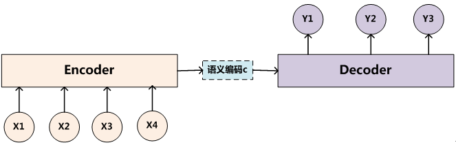
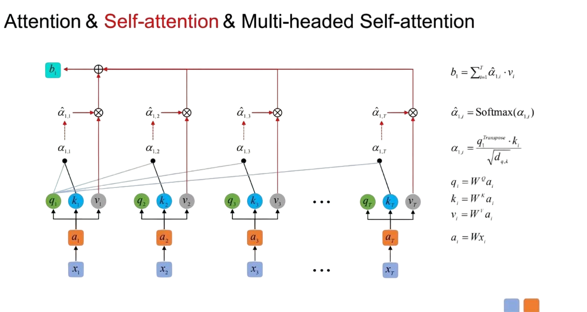
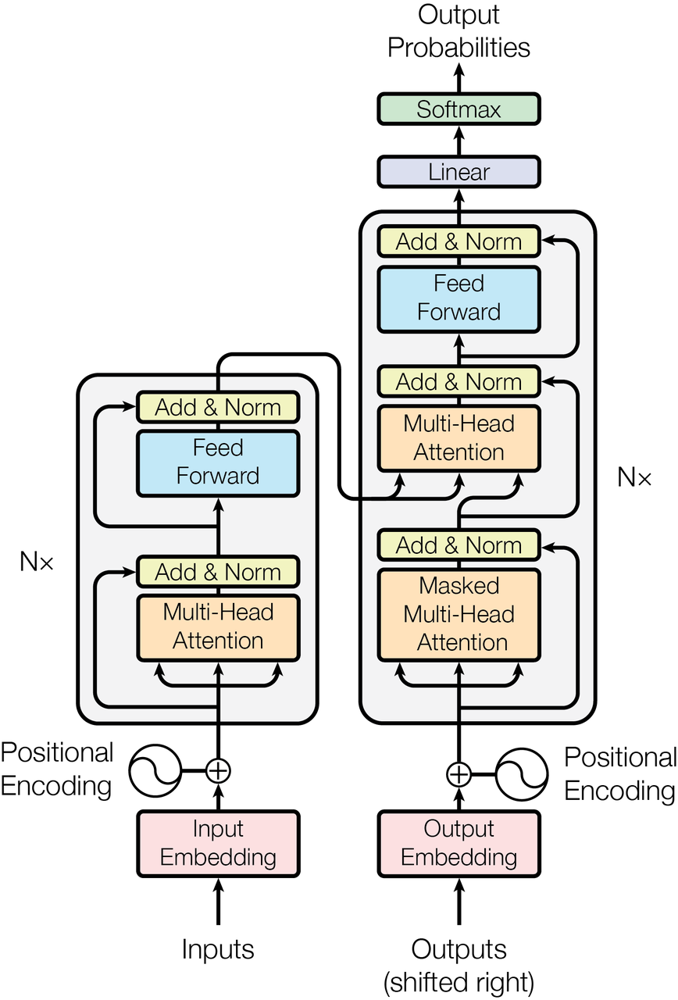
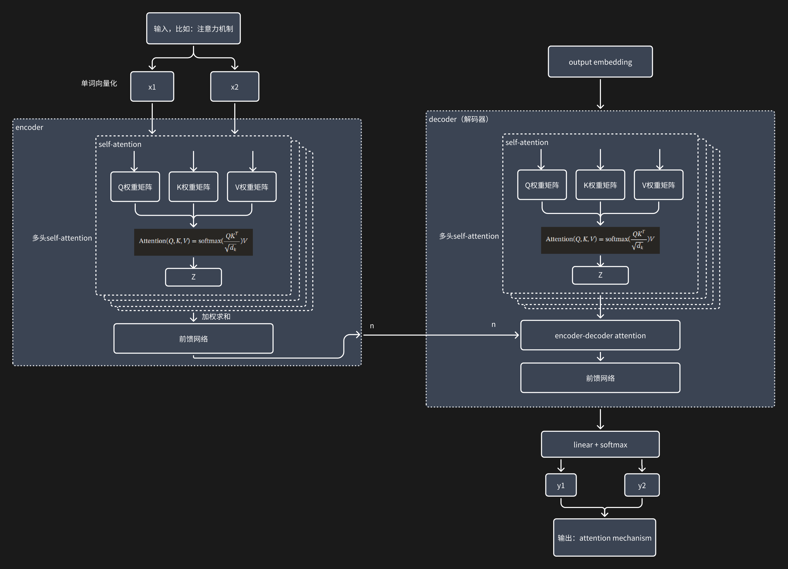

## 注意力机制（Attention）

1. encoder与decoder框架

这种框架描述一种输入输出的关系。
比如将 我(x1)是(x2)超(x3)人(x4)输入，输出是 i(y1) am(y2) superman(y3)
常见的应用场景是，比如google翻译。

2. Self attention

在上面的c上做工夫。

简单来说，通过同一输入生成 Q/K/V，计算每个位置对其他位置的权重，捕捉长距离依赖。
多头注意力其实就是多个self-atention（权重矩阵不同）组装起来。

每层复杂度对比（摘录自论文）：

| Layer Type | 	Complexity per Layer            | 	Sequential Operations | 	Maximum Path Length |
|---|----------------------------------|------------------------|----------------------|
| Self-Attention	| O⁢(n2⋅d)                         | 	O⁢(1)                 | 	O⁢(1)               |
| Recurrent| 	O⁢(n⋅d2)	                       | O⁢(n)	                 | O⁢(n)                |
| Convolutional| 	O⁢(k⋅n⋅d2)| 	O⁢(1)                 | 	O⁢(l⁢o⁢gk⁢(n))      |
| Self-Attention (restricted)| 	O⁢(r⋅n⋅d)	| O⁢(1) | 	O⁢(n/r)             |

## Transformer模型结构

这是论文的结构图片：

这里根据我整体的理解画一下transformer模型干了什么：

## 思考

经过LLM的实践，大概transformer已经证明了其模型结构的价值。和人比起来，很多时候真的”真假难辨“。说不定它还有那么几分像人的认知模型。那么他有没优化的地方呢？  
在我看来，除了技术上怎么优化KV缓存、怎么解决online learning等，类比起人，个人觉得结构依然有这些问题需要处理：
1. 不是真的具有逻辑推演能力。
2. 基于长期记忆的灵光一现（直觉）。

## Reference
[5]https://arxiv.org/html/1706.03762v7/#S2
[6]https://zhuanlan.zhihu.com/p/379722366
[7]CoThttps://www.zhihu.com/tardis/zm/art/629087587?source_id=1003

