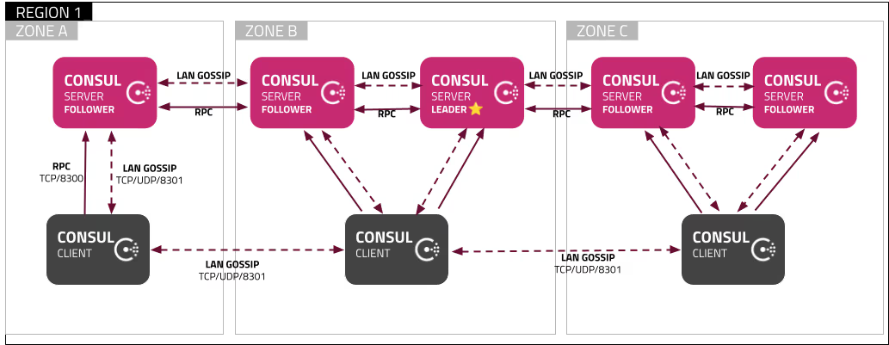

## 简介

> 基于consul 1.5.1

上一篇我们部署完Consul。
但是究竟Consul有什么功能，我们能把它因应我们的业务技术架构做一个怎样的迭代， 还是未知数。
这一篇我们对Consul的能力进行罗列，并比对同类型中间件的能力。

单集群架构：

## 核心功能

### 文档代码

Consul的官方文档https://developer.hashicorp.com/consul/docs

我写的C++和Java的Demo，基于ppconsul和Spring cloud consul库。  
https://github.com/teaho-infra/consul-demo

### 注册发现和销毁

这是一个注册和销毁的例子。
~~~
agent.registerService(
        ppconsul::agent::kw::name = serviceId,
        ppconsul::agent::kw::address = "127.0.0.1",
        ppconsul::agent::kw::id = serviceId,
        ppconsul::agent::kw::port = port,
        ppconsul::agent::kw::tags = {"cpp-consul-demo", "v1"},
        ppconsul::agent::kw::meta = {{"meta1", "cpp-consul-demo"}},
        ppconsul::agent::kw::check = ppconsul::agent::TcpCheck{ "127.0.0.1:" + std::to_string(port), std::chrono::seconds(10)} // 只做模拟操作，用的consul本身的地址
        );
        
agent.deregisterService(serviceId);
~~~
consul支持设置service name和id，注册发现时候通过name去找service。同时能够配置一些标签和简单的元数据。  
Consul提供多种健康检查（health check）机制。
- Script check 脚本检查
- Http check 向指定地址发送http请求的检查
- Tcp check 向指定地址建立tcp连接检查
- Ttl check 被动等待client上传状态的检查
- ……

服务发现
Consul client通过services API获取所有服务或者指定服务状态信息（c++的ppconsul不支持指定服务），完成注册发现。
~~~
auto services = std::make_shared<std::map<std::string, ppconsul::ServiceInfo>>(agent.services());

if (services) {
    std::cout << "Registered Services:" << std::endl;
    for (const auto& service : *services) {
        std::cout << "Service ID: " << service.second.id << std::endl;
        std::cout << "Service Name: " << service.second.name << std::endl;
        std::cout << "Service Address: " << service.second.address << std::endl;
        std::cout << "Service Port: " << service.second.port << std::endl;
        std::cout << "-------------------------" << std::endl;
    }
} else {
    std::cerr << "Failed to retrieve services." << std::endl;
}
~~~

### 配置中心

Consul支持kv配置。一般可通过该项做到配置中心等能力。比如例子里，从指定路径（apps/kvMain::dev/configuration）获取YAML信息。
~~~
ppconsul::Consul consul("127.0.0.1:8500",ppconsul::kw::dc = "dc1");
// We need the 'kv' endpoint
ppconsul::kv::Kv kv(consul);

// Read the value of a key from the storage
std::string configuration = kv.get("apps/kvMain::dev/configuration", "default-value");

// Erase a key from the storage
kv.erase("apps/kvMain::dev/configuration2");

// Set the value of a key
kv.set("apps/kvMain::dev/configuration2", "new-value");
~~~

### Session
Consul提供了一个叫做 Session的功能，我们可以创建并持有一个session，通过这个session去创建并抢占kv，或者监听kv变化，能够实现如分布式锁、集群选主等功能。
如下是一个分布式锁实现：
~~~
    ppconsul::sessions::Sessions sessions(consul);
    ppconsul::kv::Kv kv(consul);

//    kw::groups::put, kw::name, kw::node, kw::lock_delay, kw::behavior, kw::ttl
    auto sessionId = sessions.create(name = checkId, ttl = std::chrono::seconds(600));
    std::cout << "Session created!" << std::endl;

    // 获取当前时间
    time_t now = time(0);
    char* dt = ctime(&now);
    kv.lock(lockKey, sessionId, dt);

    getchar();

    sessions.destroy(sessionId);
~~~

### Acl

acl功能，可以允许我们调用consul server、proxy等增加基于access token、role等去控制节点访问。

### Intention

从文档和代码看出Consul在设计时就面向了ServiceMesh，有一些比较方便的能力（服务间的Intention等）。

## 同类型中间件对比

我们列举下主流的注册中心中间件：
- Consul , github stars: 28k，项目框架中使用
- Zookeeper, github stars: 12.3k，我司统一使用
- Etcd, github stars: 47k，作为K8s的kv数据库，间接使用频率高
- Nacos, github stars: 30k，较少使用
- Eureka, github stars: 12k，没有

我会选择目前工作中直接接触到：Consul、zookeeper、nacos 作对比。
对比将分为 **三大类**：
1. 作为注册中心的关键能力：什么是关键能力？就是基于CAP原则考察一致性、存活检查能力、更新通知即时性、多语言或协议适配性。
2. 丰富的核心功能和适配能力：事务控制、kv能力、多数据中心。
3. 性能和安全性：能够存储多少数据、能够支持多少服务注册、是否支持服务流量安全传输和鉴权模型。

| ​能力 | Consul | Zookeeper | Nacos | 备注                                                                        |
|----|--------|---------|-----|---------------------------------------------------------------------------|
|CAP和一致性协议 | CP（raft协议） | CP（Paxos协议） | AP（Distro协议）+ CP(raft协议 用的JRaft实现) |                                                                           |
| 存活检测| 支持自定义脚本、ttl、http、tcp端口检测| Client tcp定期发送心跳包| sdk集成，http定时心跳接口|                                                                           | 
| 更新通知即时性| 通过阻塞查询| 一次性watch机制，轻便设计| 数据发生更改，udp通知服务节点更新情况|                                                                           |  
| 通信协议| http/dns| tcp| Http api| 三者常见语言都有sdk                                                               |
| kv数据| 支持| 支持| 支持| 说明都具备一定的配置能力                                                              |
| 事务控制| kv+session机制，可以对某一kv键启动session并加锁| 通过临时节点+watch机制，对某一path加锁| -| nacos可参考去年glcc自实现https://github.com/alibaba/nacos/issues/10378            |
| 多数据中心管理| 支持| 支持，我司自实现| 支持|                                                                           |
| 数据存储性能| GB级数据存储| GB级数据存储| GB级数据存储| 数据取自网络，三者皆为分布式中间件，能随扩容承担更多流量。不同业务和服务属性所存储的数据量和使用功能不一而足，这两块性能最终根据服务属性优化为佳。 |
| 请求处理性能| 3节点万级tps| 3节点万级tps| 3节点万级tps | 同上                                                                        |
| 鉴权| Acl| Acl| RBAC|                                                                           |  

## Reference
[1][Spring Cloud Consul文档|spring.io](https://cloud.spring.io/spring-cloud-consul/reference/html/#spring-cloud-consul-install)    
[2][Nacos分析 · Spring Learning|teaho.net](https://spring-source-code-learning.gitbook.teaho.net/cloud/nacos)  
[3][ZooKeeper doc](https://zookeeper.apache.org/doc/current/zookeeperOver.html)  
[4]https://nacos.io/zh-cn/docs/nacos-config-benchmark.html  
[5]https://cloud.tencent.com/developer/article/1491107  

