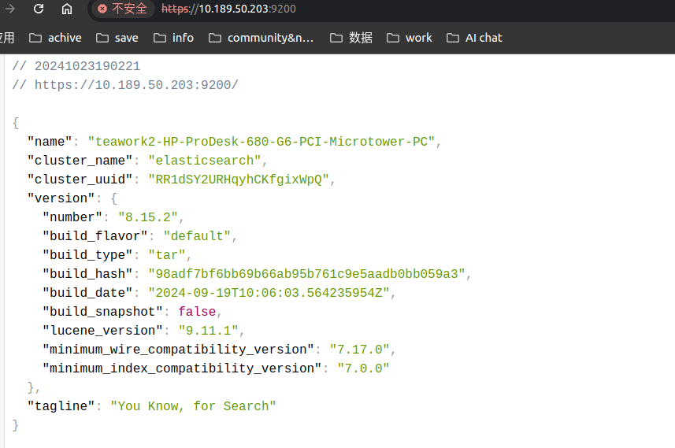
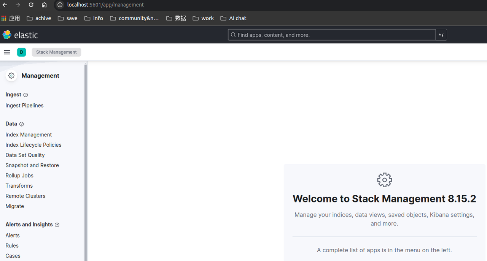

> Version: 8.15.2

## 本地单节点搭建(通过Docker)

简单的做法是，先安装好docker然后本地运行这个脚本。  
github地址：https://github.com/elastic/start-local?tab=readme-ov-file#-try-elasticsearch-and-kibana-locally  
`curl -fsSL https://elastic.co/start-local | sh`

运行成功会生成如下信息：
~~~~
🌐 Open your browser at http://localhost:5601
Username: elastic
Password: FdSDFkf4
🔌 Elasticsearch API endpoint: http://localhost:9200
🔑 API key: dUJnWnI1SUJyT29jc0oxS3BET1E6Tk5lRXhqRDJRMXkwWWxUSXdiU201Zw==
~~~~

## 本地节点搭建
### elasticsearch安装
1. 下载elasticsearch-8.15.2，修改config目录的elasticsearch.yml。
   ~~~
    # 设置端口号：

    # 外网访问地址
    network.host: 0.0.0.0
    
    # 修改日志目录
    path.logs: /home/teawork2/soft/es/elasticsearch-8.15.2/logs
   ~~~
2. 使用-d后台启动
   `./bin/elasticsearch -d`
3. 如何启动启动报错，mmap内存配置不足，修改vm.max_map_count参数。
   再次启动，启动成功。
4. 修改密码： ./bin/elasticsearch-reset-password -i -uelastic。
5. 访问localhost:9200访问成功。
   

### kibana安装
下载kibana-8.15.2。

1. 重置kibana账号密码：
   ./bin/elasticsearch-reset-password -u kibana_system --auto
   自动生成密码：gkNYDSc-*Of3*KnddXw5

2. 修改config目录的kibana.yml。
   ~~~
    server.port: 5601
    server.host: "0.0.0.0"
    elasticsearch.hosts: ["https://localhost:9200"]
    
    elasticsearch.ssl.verificationMode: none
    elasticsearch.username: "kibana_system"
    elasticsearch.password: "gkNYDSc-*Of3*KnddXw5"
   ~~~
3. 启动kibana
   `./bin/kibana`
   一键点亮。
   

## 源码构建

方法一：gradle
在elasticsearch的根目录执行：
~~~
./gradlew run -Dxpack.security.enabled=true -Dxpack.security.authc.api_key.enabled=true
~~~

## Reference

官方文档：  
https://www.elastic.co/guide/en/elasticsearch/reference/current/targz.html#install-macos
本地docker安装：  
https://www.elastic.co/guide/en/elasticsearch/reference/current/run-elasticsearch-locally.html

