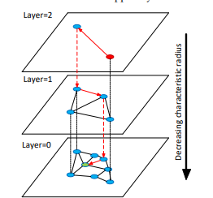
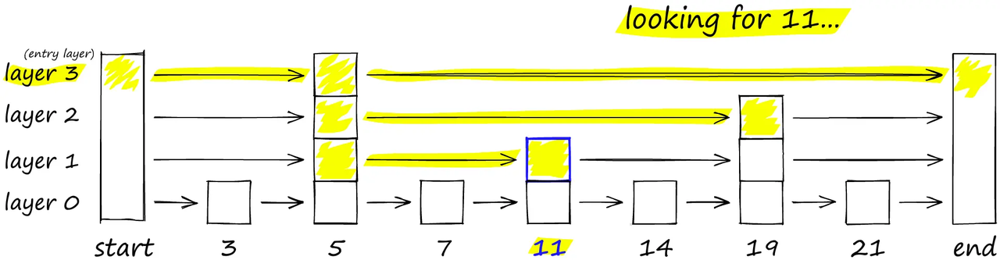
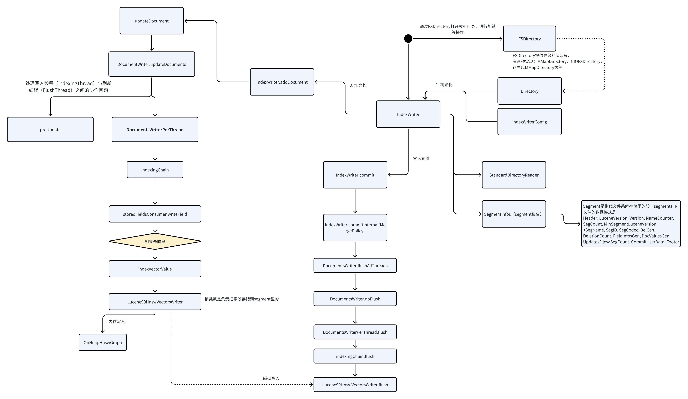
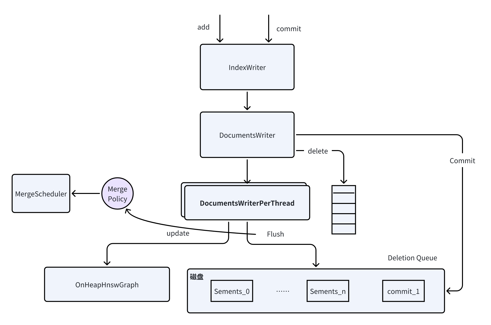

## 简介

2019年Elasticsearch 7.0 版本发布，正式开始增加对向量字段的支持，字段类型新增了 dense_vector 类型。  
2022年Elasticsearch发布8.0版本，增加knn_search接口和KNN搜索功能。  
Elasticsearch 8.7版本后将该查询方式融入_search里，key为knn。

k近邻查找三要素：距离度量、k值的选择和分类决策规则。
在ES的knn搜索中，我们可以控制前两项。那么我们看一下ES向量检索有什么能力，以及它是怎么做的。

## 创建向量索引
我们通过在ES索引中增加dense_vector类型字段，支持向量的存储和查询。

我们看下dense_vector字段的重要属性：
- element_type：float（每维度4字节），byte（每维度1字节），bit（每维度1位，维数必须8的倍数）
- Dims 维度
- similarity 距离度量，默认为cosine，有这几个选项l2_norm、dot_product、cosine、max_inner_product。
- index_options.type 有几种选择：hnsw、int8_hnsw、int4_hnsw、bbq_hnsw、flat、int8_flat、int4_flat、bbq_flat。
  - 分为hnsw(层次化可导航小世界)和flat（暴力查找）两种索引类型。
  - int8相当于把向量每一维度压缩到1字节，int4压缩到半个字节，bbq压缩到1位精度。
- index_options.m，HNSW 图中每个节点将连接到的邻居数量。默认16。
- index_options.ef_construction，组装每个新节点的近邻列表时要trace的候选者数量。

如下是一个创建ES向量字段的方式。
~~~~http request
PUT test-vector-index
{
  "mappings": {
      "properties": {
        "content": {
          "type": "text",
          "fields": {
            "keyword": {
              "type": "keyword",
              "ignore_above": 256
            }
          }
        },
        "embedding": {
          "type": "dense_vector",
          "dims": 3,
          "index": true,
          "similarity": "cosine",
          "index_options": {
            "type": "int8_hnsw",
            "m": 16,
            "ef_construction": 100
          }
        },
        "id": {
          "type": "text",
          "fields": {
            "keyword": {
              "type": "keyword",
              "ignore_above": 256
            }
          }
        }
    }
  }
}
~~~~

## 执行搜索

~~~~
// 插入测试数据
POST test-vector-index/_bulk?refresh=true
{ "index": { "_id": "1" } }
{ "embedding": [1, 5, -20], "content": "moose family", "id": "1" }
{ "index": { "_id": "2" } }
{ "embedding": [42, 8, -15], "content": "alpine lake", "id": "2" }
{ "index": { "_id": "3" } }
{ "embedding": [15, 11, 23], "content": "full moon", "id": "3" }

~~~~

es支持两种knn搜索方式：
1. 使用knn选项，进行ANN近似近邻搜索。
2. 用带了向量函数的script_score查询，进行精确KNN查询。

### knn选项查询
Elasticsearch在_search API的knn项中支持Approxiate knn搜索。
重要属性：
- filter： 过滤匹配文档，语法同一般query.filter。
- k：topk，返回多少个近邻。
- num_candidates：每个分片的候选数。
- query_vector：查询向量。
- similarity: 距离度量的方法，l2_norm（欧几里德距离）、cosine余弦相似、dot_product点积、max_inner_product。
  ~~~
  POST test-vector-index/_search
  {
    "knn": {
    "field": "embedding",
    "query_vector": [-5, 9, -12],
    "k": 1,
    "num_candidates": 100
    }
  }

  ~~~
注：ES将knn搜索放在_search下，其实我们可以进行knn搜索同时通过query搜索去做交集搜索。

### script_score进行精确查询
> https://www.elastic.co/guide/en/elasticsearch/reference/current/query-dsl-script-score-query.html#vector-functions

~~~~http request

GET test-vector-index/_search
{
  "query": {
    "script_score": {
      "query" : {
        "match_all": {}
      },
      "script": {
        "source": "cosineSimilarity(params.query_vector, 'embedding') + 1.0", 
        "params": {
          "query_vector": [4, 3.4, -0.2]  
        }
      }
    }
  }
}

~~~~

## 能力总结

ES作为搜索引擎，密锣紧鼓的网罗了业界各类流行搜索能力。比如除了knn搜索能力，我发现ES还支持Time Serial的索引。
我们谈谈ES的Knn能力，首先在其公布的官博上。他们只支持HNSW相似搜索索引算法(层次化可导航小世界)和暴力搜索。
1. 首先，HNSW在ANN-Benchmarks中展示了优秀的基准测试能力。
2. HNSW在工业界广泛使用。

同时它，支持了一些调节参数，使我们可以在内存压缩、性能和相似度中做权衡。
但要说的是，8.0只支持HNSW和暴力精确搜索，我认为是有待加强的。因为LSH、IVF等都有其优势。

## 执行源码分析

### HNSW

ANN 方法常见数据结构实现有：1. 倒排数组，例如IVF 2. 树 3. 哈希，比如LSH，4. 图，例如HNSW。

说说它的结构定义和寻找方式。HNSW--分层的可导航小世界（Hierarchical Navigable Small World），是一种基于图的结构，
将点分成多层，然后贪婪地遍历局部最近似值，切换到下一层，以上一层的局部点为始发点开始遍历，直到遍历完最低层。

网上很多资料提到了跳表（1990s），没错看着像跳表。

HNSW论文（2016）也提到这一点：
> Hierarchical NSW algorithm can be seen as an extension of the probabilistic skip list structure [27] with proximity graphs instead of the linked lists.

HNSW算法是一种跳表的拓展，它采用了类似跳表的分层实现，但是分层使用的不是链表而是相似图。

### Lucene源码解读
> Lucene 10.x分支版本

拉https://github.com/apache/lucene/tree/main的lucene/demo文件夹里的demo跑一下：
~~~
public class TestKnnVectorDict extends LuceneTestCase {

  public void testBuild() throws IOException {
    Path testVectors = getDataPath("../test-files/knn-dict").resolve("knn-token-vectors");
    
    try (Directory directory = newDirectory()) {
      KnnVectorDict.build(testVectors, directory, "dict");
      //lucene的实现：KnnVectorDict
      try (KnnVectorDict dict = new KnnVectorDict(directory, "dict")) {
        assertEquals(50, dict.getDimension());
        byte[] vector = new byte[dict.getDimension() * Float.BYTES];

        // not found token has zero vector
        dict.get(new BytesRef("never saw this token"), vector);
        assertArrayEquals(new byte[200], vector);

        // found token has nonzero vector
        dict.get(new BytesRef("the"), vector);
        assertFalse(Arrays.equals(new byte[200], vector));

        // incorrect dimension for output buffer
        expectThrows(
            IllegalArgumentException.class, () -> dict.get(new BytesRef("the"), new byte[10]));
      }
    }
  }
}
~~~

#### 写流程分析

从我的代码可看出，索引写入一般分三步：
1. 初始化
2. 添加文档
3. 写入索引

##### IndexWriterConfig
IndexWriterConfig囊括了IndexWriter的所有配置。
- Analyzer 分词器 一般我们根据使用场景，在索引上会定义不同的分词器。
- Similarity 搜索很重要的一点就是计算搜到的数据的相关度。Similarity是相关度算法的抽象接口，Lucene默认实现了TF-IDF和BM25算法。
  > Similarity defines the components of Lucene scoring.
- maxBufferedDocs
- ramBufferSizeMB
- IndexReaderWarmer
- IndexDeletionPolicy
- IndexCommit
- OpenMode
- createdVersionMajor
- MergeScheduler
- Codec
- InfoStream
- MergePolicy
- readerPooling
- FlushPolicy
- perThreadHardLimitMB
- useCompoundFile
- commitOnClose
- indexSort
- leafSorter
- indexSortFields
- parentField
- checkPendingFlushOnUpdate
- softDeletesField
- maxFullFlushMergeWaitMillis
- IndexWriterEventListener

##### 总结

一张图总结下写入流程：

#### 数据存储分析

内存存储：
~~~~
// 省略了其他一些字段
public final class OnHeapHnswGraph extends HnswGraph implements Accountable {

  // ...
  private final AtomicReference<EntryNode> entryNode; // 表示了HNSW中整个索引的entryPoint

   // the internal graph representation where the first dimension is node id and second dimension is
  // level
  // e.g. graph[1][2] is all the neighbours of node 1 at level 2
  // 索引中节点的邻接信息
  private NeighborArray[][] graph;

  OnHeapHnswGraph(int M, int numNodes) {
    this.entryNode = new AtomicReference<>(new EntryNode(-1, 1));
    // Neighbours' size on upper levels (nsize) and level 0 (nsize0)
    // We allocate extra space for neighbours, but then prune them to keep allowed maximum
    this.nsize = M + 1;
    this.nsize0 = (M * 2 + 1);
    noGrowth = numNodes != -1;
    if (noGrowth == false) {
      numNodes = INIT_SIZE;
    }
    this.graph = new NeighborArray[numNodes][];
  }
}
~~~~

文件存储：  
相关数据存储在segments_N（N：int数字）文件里。  
向量相关的索引文件涉及四种: 
- *.vec 存储原始向量
- *.vemf 原始向量的meta文件
- *.vex 向量索引文件, Lucene中目前用的HNSW索引
- *.vem 向量索引文件的meta文件

向量相关的文件写入（flush）是由`Lucene99HnswVectorsWriter.flush`实现的

## Reference

[1]dense-vector：https://www.elastic.co/guide/en/elasticsearch/reference/current/dense-vector.html  
[2]knn-search：https://www.elastic.co/guide/en/elasticsearch/reference/current/knn-search.html  
[3]Introducing approximate nearest neighbor search in Elasticsearch 8.0  
[4]HNSW论文：https://arxiv.org/abs/1603.09320  
[5][Faiss: The Missing Manual | HNSW](https://www.pinecone.io/learn/series/faiss/hnsw/)  
[6][向量数据库|guanzhengli](https://guangzhengli.com/blog/zh/vector-database/?continueFlag=97da1d8cf844333ce468d7478355837e#%E7%9B%B8%E4%BC%BC%E6%80%A7%E6%90%9C%E7%B4%A2-similarity-search)

