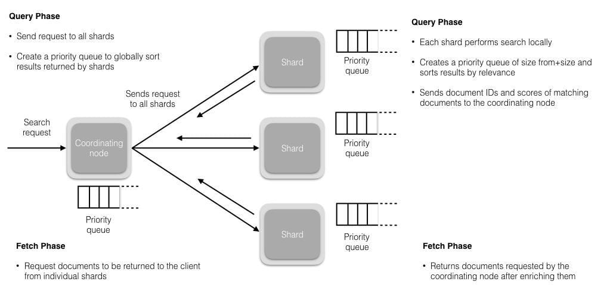
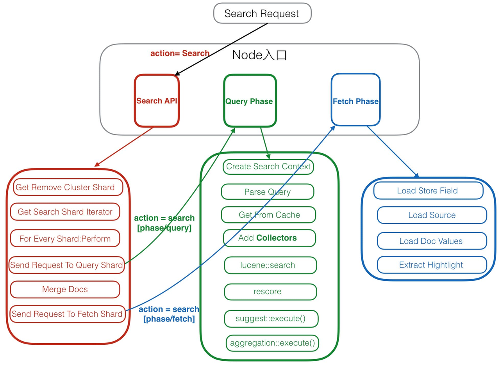

## es集群查询流程

## search处理流程

1. Get Remote Cluster Shard 判断是否需要集群访问
2. Get Search Shard Iterator 获取要访问的shard
3. For Every Shard:Perform 判断shard情况，执行后面流程
4. Send Request To Query Shard 将query阶段的查询发给shard
5. merge doc 合并策略是维护一个Top N大小的优先级队列，每当收到一个shard的返回，就把结果放入优先级队列做一次排序，直到所有的Shard都返回后做翻页逻辑。
6. Send Request To Fetch Shard 执行fetch阶段

query阶段
1. Create Search Context
2. Parse Query 解析query
3. Get From Cache 查询缓存
4. Add Collectors 组装collector，collectors是收集查询结果，实现排序，对自定义结果集过滤和收集等
5. lucene::search 执行lucene查询
6. rescore
7. suggest::execute()
8. aggregation::execute()

fetch阶段
1. 通过docid获取完成的doc文档。
   一般搜索系统都有query和fetch两阶段。

## Reference

读源码：
https://blog.csdn.net/qq_42801937/article/details/140446384
https://lanffy.github.io/2019/04/08/Elasticsearch-Compile-Source-And-Debug
https://www.itshujia.com/read/elasticsearch/368.html

