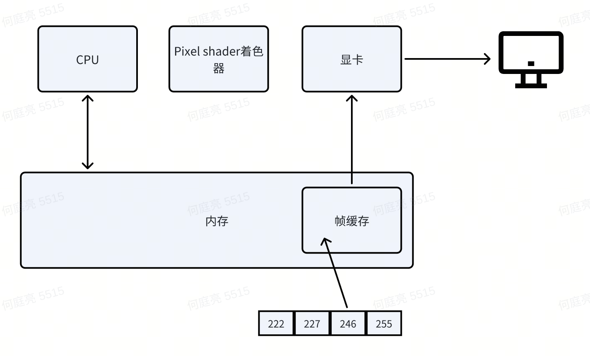
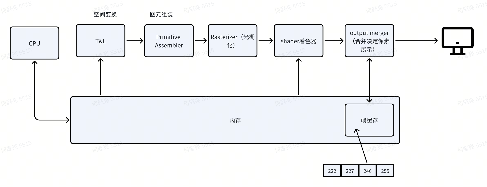
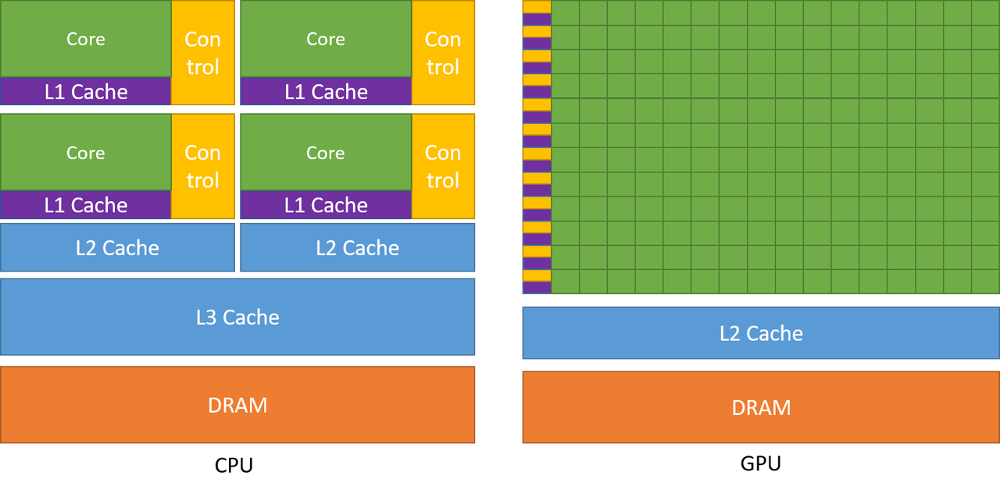
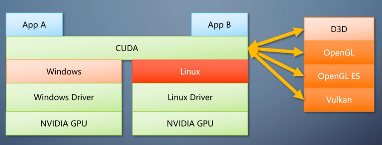
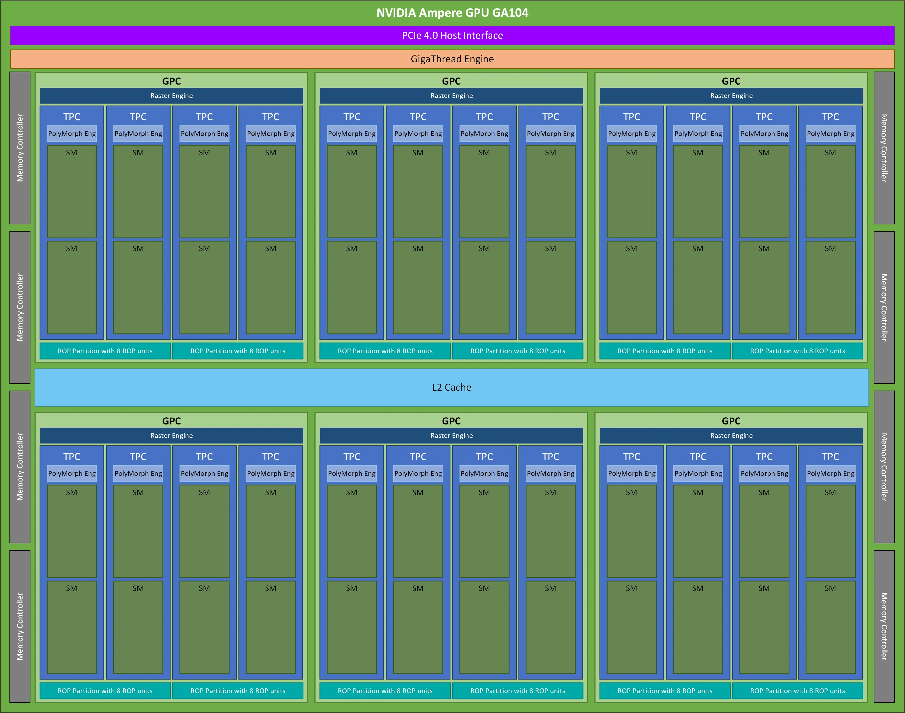
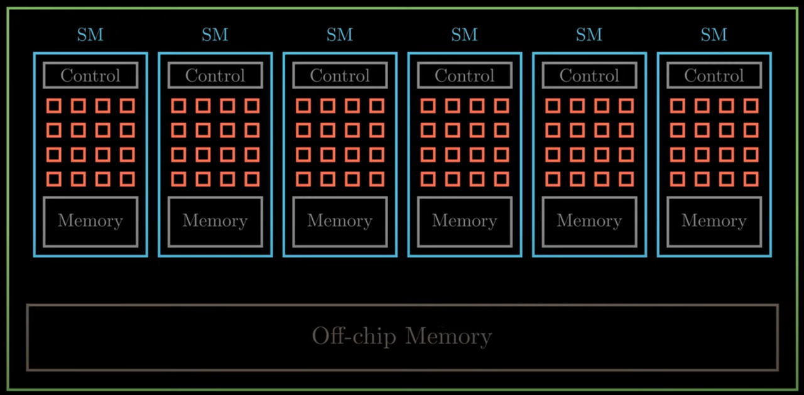
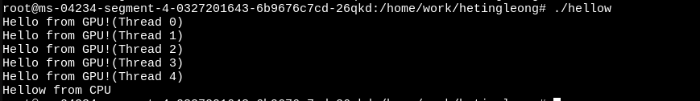
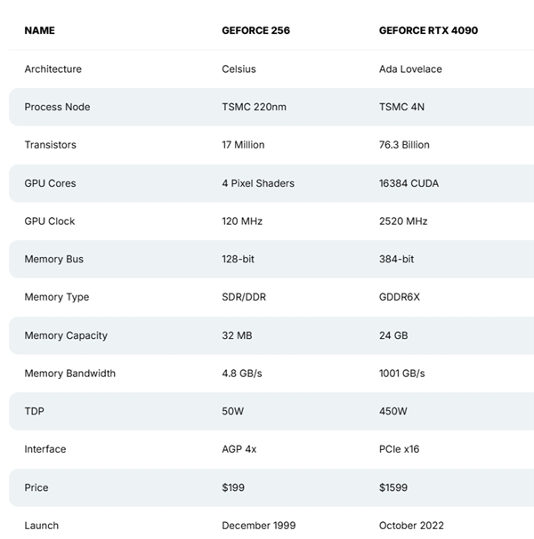

## 简介
本文更关注Nivida GPU做讨论。

## GPU的历史

说说历史，从历史看，不仅知道GPU的前世今生，还能看到有哪些组件有历史的影子。

| ​时间| 	事件                                      | 	​影响             |
|----------------------|------------------------|------------------|
| 1999	| NVIDIA GeForce 256（首款GPU）	| 定义GPU概念，硬件T&L加速  |
| 2006	| CUDA发布	| 	GPU通用计算时代开启     |
| 2012		| GPU加速AlexNet训练		| 推动深度学习革命         |
| 2018		| NVIDIA RTX 20系列（光追）	| 	游戏画质进入实时光追时代    |
| 2022		| ChatGPT引爆AI需求	| 	GPU成为AI基础设施核心   |

上面是GPU关键里程碑，我会在下面章节说说发展，可自行对应这些里程碑看分别革新了哪些流程。

## 从图形流水线看GPU发展

### 红白机PPU

最初级的图像处理单元，只能将一张图的所有像素做一个处理，这就是任天堂红白机的PPU的结构。

### 首款GPU

1999年8月Nvidia推出的GeoForce256，是第一款问世的GPU。我们从它的结构能了解2000s年代的图形流水线。

### 现今图形流水线雏形和GPGPU

随着GPU的强大计算能力逐步被带到市面（举例现在RTX4090是16384个CUDA core），研发和科研人员就像能否把GPU的计算能力使用在非图形计算上呢？还真有人琢磨出来了：通过Compute Shader去做并行计算。这是一条和图形流水线不相干的路线，整个流水线只有计算Shader。（也衍生出只有计算流水线的GPU）

这里说到计算流水线，GPU在后来的发展会有一些相互独立的流水线：
1. 图形流水线
2. 计算
3. 光线追踪
4. 视频解码

## 硬软件层看CUDA
### CPU和GPU

> 在CUDA C++ Programming Guide里有这样一张图，我用这张图来说说CPU和GPU为什么不一样

简单来说，Nvidia这张图展示了两种处理单元的芯片资源分配差异。
1. CPU每个core分配控制器
2. CPU有更多级缓存  

这些差异，是为了这些功能特性开路：
1. CPU擅长在小数据量的复杂运算，GPU擅长大数据量下的简单计算
   > 正如CUDA guice里说的，将更多的晶体管用于数据处理，有利于高度并行计算。具有高并行度的应用程序可以利用 GPU 的这种大规模并行特性来实现比 CPU 更高的性能。

### CUDA调用链
CUDA是跨平台兼容，但不是开放接口（跨平台不跨厂商）。
调用链：APP -> CUDA API -> CUDA Runtime -> 硬件

### CUDA的SIMT架构

从上图中可以看到 CUDA GPU 有许许多多的 SM 组成，SM 全称为 Streaming Multiprocessor 流式多处理器，是 NVIDIA GPU 架构中的重要组成部分，也是 GPU 的基本计算单元。每个 SM 由多个 CUDA 核心、纹理单元、Tensor Core、流控制器和存储器等辅助单元组成，可以同时执行多个计算任务，并具有高度的灵活性和性能。
多处理器以 32 个并行线程（称为 warp）为一组创建、管理、调度和执行线程。
当一个多处理器被赋予一个或多个线程block来执行时，它会将它们划分为 warp（CUDA软件术语），每个 warp 都由warp调度器调度执行。
在warp的整个生命周期，由multiprocessor处理的每个 warp 的执行上下文（程序计数器、寄存器等）都保留在芯片上。因此执行上下文的切换没有成本。
每个Multiprocessor有最大常驻block数和最大常驻warp数限制。

## 写个CUDA Hello world程序

程序结构：  
CUDA 程序一般使用 `.cu` 后缀，编译 CUDA 程序则使用nvcc编译器。一般而言，一个CUDA程序的结构如下：
~~~c++
int main() {
    主机代码;
    核函数调用;
    主机代码;
    核函数调用;
    ......
    return 0;  
}

__global__ void 核函数1(parameters) {
......
}
__global__ void 核函数2(parameters) {
......
}
~~~

来个Helloworld
> 找元宝拉了个helloworld，自己手敲下

~~~c++
#include <stdio.h>
// GPU 内核函数：每个线程打印 "Hello World from GPU!"
__global__ void helloFromGPU() {
    printf("Hello World from GPU! (Thread %d)\n", threadIdx.x);
}
int main() {
    // 调用 GPU 内核：启动 1 个 Block，包含 5 个线程
    helloFromGPU<<<1, 5>>>();
    // 等待 GPU 执行完成（同步）
    cudaError_t cudaerr = cudaDeviceSynchronize();
    if (cudaerr != cudaSuccess)
        printf("kernel launch failed with error \"%s\".\n", cudaGetErrorString(cudaerr));
    // 主机端打印
    printf("Hello World from CPU!\n");
    return 0;
}

~~~

编译和运行：
~~~
nvcc hellow.cu -o hellow
./hellow
~~~

运行输出：

## 附录

Geoforce256 vs RTX 4090

### Reference
[1][龚敏敏-从上帝视角看GPU](https://www.bilibili.com/video/BV1bi421k7eR?spm_id_from=333.788.videopod.sections&vd_source=7a652b1f157c8aa8d3d38a64532b2236)  
[2][zhihu|浅谈 NES 图像技术](https://zhuanlan.zhihu.com/p/34144965)  
[3][youtube|Understanding NVIDIA GPU Hardware as a CUDA C Programmer | Episode 2: GPU Compute Architecture](https://www.youtube.com/watch?v=1Goq8Yc3dfo)  
[4]https://zhuanlan.zhihu.com/p/680075822  
[5]CUDA C++ Programming Guide: https://docs.nvidia.com/cuda/cuda-c-programming-guide/  
[6]https://zhuanlan.zhihu.com/p/394352476  
[7]https://developer.nvidia.com/blog/cuda-refresher-cuda-programming-model/  
[8][Nvidia|What Is The Relation Between Warp And SM Processing Block?](https://forums.developer.nvidia.com/t/what-is-the-relation-between-warp-and-sm-processing-block/61666)  

