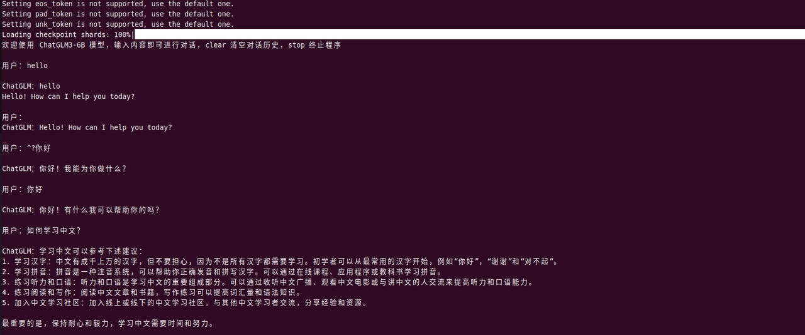
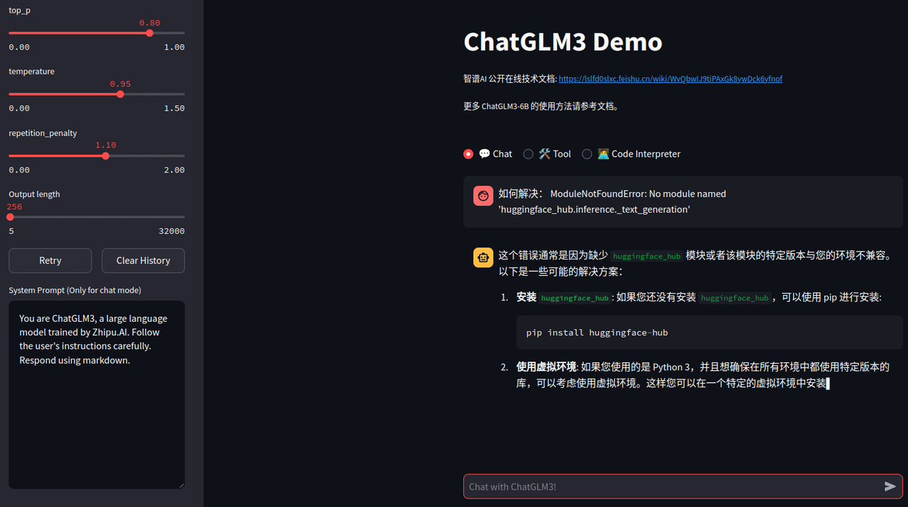
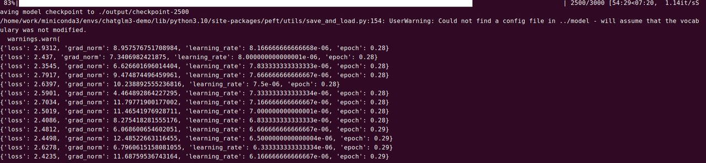

## 简介
略。

## 运行ChatGLM-6B

首先，我们需要熟悉先跑起来。
### 命令行
1. 准备有13G显存以上机器。
2. 将github代码下载到机器上，并用python3(>=3.9)安装好依赖。
   ~~~~
   git clone https://github.com/THUDM/ChatGLM3
   pip install -r requirements.txt
   ~~~~
3. 我是本地加载模型
   1. 确保git安装了git lfs，不然模型文件下载不全。（这里睬了坑）
   2. 从huggingface下载模型git clone https://huggingface.co/THUDM/chatglm3-6b
4. 修改basic_demo/cli_demo.py下的MODEL_PATH，为第3步下载模型的文件夹，比如 xxx/xxx/model/
5. python3 cli_demo.py运行

### 运行composite web demo
https://github.com/THUDM/ChatGLM3/tree/main/composite_demo
1. 安装依赖cd composite_demo & pip install -r requirements.txt
2. 执行export MODEL_PATH=../model
3. 执行python -m streamlit run main.py，启动
4. 浏览器打开页面

截至2024.12.27拉的代码会报这个错误ModuleNotFoundError: No module named 'huggingface_hub.inference._text_generation，需要将huggingface_hub包降级版本 huggingface_hub==0.21.0 。

再次运行成功。

这个composite demo能够调整token length、top_p（采样策略）、temperature（调整单词概率分布）。也能体验对话、代码提示能力等。

> 智谱AI的参数推荐

| Use Case | temperature | top_p | 任务描述 |
|----|----|----|----|
| 代码生成 | 0.2 | 0.1 | 生成符合既定模式和惯例的代码。 输出更确定、更集中。有助于生成语法正确的代码 | 
| 创意写作 | 0.7 | 0.8 | 生成具有创造性和多样性的文本，用于讲故事。输出更具探索性，受模式限制较少。 | 
| 聊天机器人回复| 0.5| 0.5| 生成兼顾一致性和多样性的对话回复。输出更自然、更吸引人。|
| 调用工具并根据工具的内容回复| 0.0| 0.7| 根据提供的内容，简洁回复用户的问题。|
| 代码注释生成| 0.1| 0.2| 生成的代码注释更简洁、更相关。输出更具有确定性，更符合惯例。|
| 数据分析脚本| 0.2| 0.1| 生成的数据分析脚本更有可能正确、高效。输出更确定，重点更突出。|
| 探索性代码编写| 0.6| 0.7| 生成的代码可探索其他解决方案和创造性方法。输出较少受到既定模式的限制。|

## 微调的方式
列举一些常见微调方式：
1. 全参数微调  可以针对特定任务和数据进行优化，但需要大量计算资源。
2. PEFT，参数高效微调
   1. LoRA  通过低秩适应显著减少了需要微调的参数数量，有时候不如全量微调。
   2.  Prefix Tuning 和 Prompt Tuning 资源需求低（只修改少量参数），在某些任务效果不如其他微调方式。
3. RLHF

## 微调实录
我希望使用LoRA微调一个法律法规的大模型。

ChatGLM在官方代码库里有一个finetune_demo文件夹，里面有lora.yaml配置。基于这个我们来微调一下。
注：我这里使用官方代码里的微调demo来做，也可使用一些业界主流微调框架LLama Factoryhttps://github.com/hiyouga/LLaMA-Factory来微调。

执行`pip3 install -r requirements.txt -i https://mirrors.aliyun.com/pypi/simple `
会报错：
~~~
note: This error originates from a subprocess, and is likely not a problem with pip.
ERROR: Failed building wheel for mpi4py
Failed to build mpi4py
ERROR: ERROR: Failed to build installable wheels for some pyproject.toml based projects (mpi4py)
~~~
安装系统依赖：
~~~
yum install openmpi-devel
export CC=/usr/lib64/openmpi/bin/mpicc
pip install mpi4py
~~~

调整lora.yaml参数：
将微调的训练数据和验证数据数据按格式放置在data目录的train.json和test.json中。修改lora.yaml的train_file、val_file和test_file。

执行微调：
~~~
CUDA_VISIBLE_DEVICES=0 NCCL_P2P_DISABLE="1" NCCL_IB_DISABLE="1" python3 finetune_hf.py data ../model configs/lora.yaml
~~~

初次执行报没有nltk包。
~~~
Traceback (most recent call last):
File "/home/work/hetingleong/ChatGLM3/finetune_demo/finetune_hf.py", line 14, in <module>
from nltk.translate.bleu_score import SmoothingFunction, sentence_bleu
ModuleNotFoundError: No module named 'nltk'

pip3 install nltk
~~~   
再次执行报错：
~~~
ImportError: cannot import name 'EncoderDecoderCache' from 'transformers'，按照stackoverflow和github，继续安装peft包。
pip install peft==0.10.0
pip install transformers=4.40.2
~~~

参数含义：
- loss 损失值。
- grad_norm 梯度范数。关注梯度爆炸和梯度消失问题。
- learning_rate 学习率，学习率展示了反向传播时参数更新步长大小。
- epoch 周期 每个 epoch 后，通常会评估模型在验证集上的表现，以监控和调整训练过程。

完成微调。

运行微调后模型：
~~~
python3 inference_hf.py output/checkpoint-3000/ --prompt "第二百六十六条刑法，金额九万多，四个人平分，但金额全部退回，还得 到对方谅解，像这类情节严重吗"
~~~
微调前：
~~~~
用户：第二百六十六条刑法，金额九万多，四个人平分，但金额全部退回，还得 到对方谅解，像这类情节严重吗

ChatGLM：根据我国刑法第二百六十六条规定，盗窃数额较大或者有其他严重情节的，处三年以下有期徒刑、拘役或者管制，并处或者单处罚金；数额巨大或者有其他特别严重情节的，处三年以上七年以下有期徒刑，并处罚金。

您描述的情况，四个人平分九万多元的盗窃金额，虽然最终金额全部退回并得到对方谅解，但这种行为仍然构成盗窃罪。具体情节是否严重，需要根据具体情况和法院审理结果来判断。如果他们能够积极认错并采取措施挽回损失，可能会得到从轻或者减轻处罚。请他们尽快向有关部门自首，并积极采取措施挽回损失。
~~~~

微调后：
~~~~
python3 inference_hf.py output/checkpoint-3000/ --prompt "第二百六十六条刑法，金额九万多，四个人平分，但金额全部退回，还得 到对方谅解，像这类情节严重吗"
Loading checkpoint shards: 100%|███████████████████████████████████████████████████████████████████████████████████████████████████████████████████████████| 7/7 [00:04<00:00,  1.65it/s]
只要金额达到三万以上，就属于数额巨大了。
~~~~

微调有一定效果，但是实际工作需要再根据实际业务调优训练轮次、微调数据集、效果比对。

## Reference
[1]ChatGLM3|github https://github.com/THUDM/ChatGLM3/tree/main?tab=readme-ov-file
[2]https://www.analyticsvidhya.com/blog/2024/12/fine-tuning-llama-3-2-3b-for-rag/
[3]https://time.geekbang.org/column/article/781435  
[4] 智谱AI技术文档

