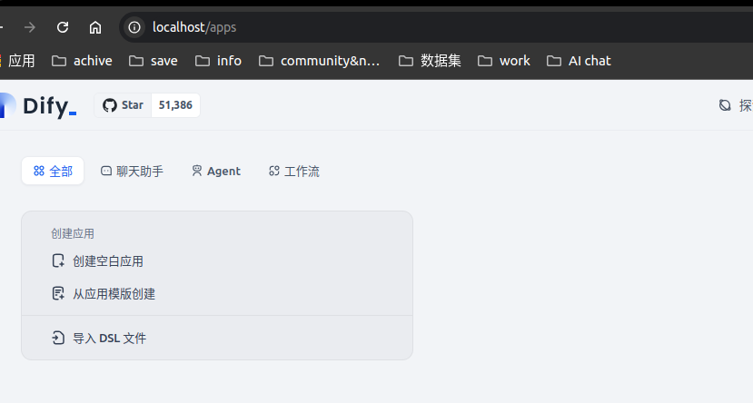
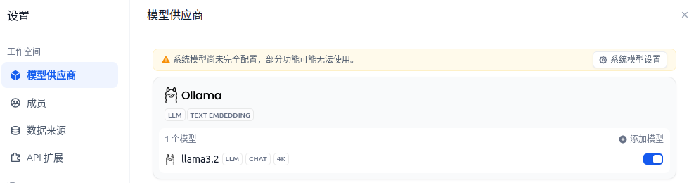
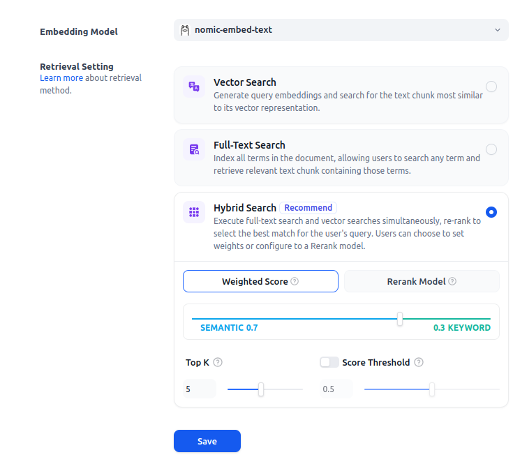
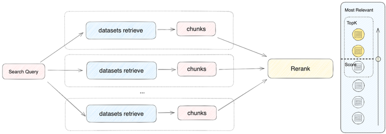
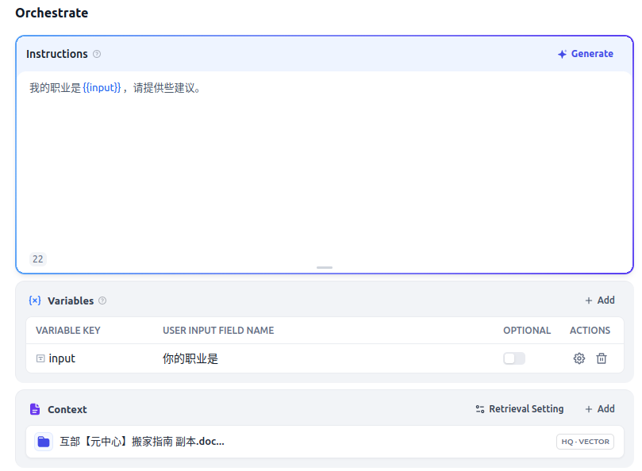

## 简介

尝试用开箱即用的两个工具，Ollama和Dify搭建一个知识库。

## Ollama搭建

https://ollama.com/download  
安装完成后，运行大模型。Ollama很方便，命令类似Docker。 
我这里使用**llama 3.2 3B**
~~~
ollama run llama3.2
~~~
运行成功，可以对话：

## Dify搭建

下载 https://github.com/langgenius/dify 代码。

执行命令
~~~
cd dify
cd docker
cp .env.example .env
docker compose up -d
~~~ 

执行成功，可以打开界面。

接入llama 3.2模型

## 创建RAG对话

### 创建知识库

首先基于文档创建知识库，
1. 上传文档
2. 配置分段方式和embedding模型，还有混合查询模式。
   

   

### 创建Dify的聊天应用

增加context，
1. 链接上已经执行完分段和向量化的知识库。（可选，链接上rerank模型）
2. 增加前置prompt。
   

### 运行

大功告成！

## Reference
[1]Ollama https://ollama.com/  
[2]在应用内集成知识库https://docs.dify.ai/zh-hans/guides/knowledge-base/integrate-knowledge-within-application

