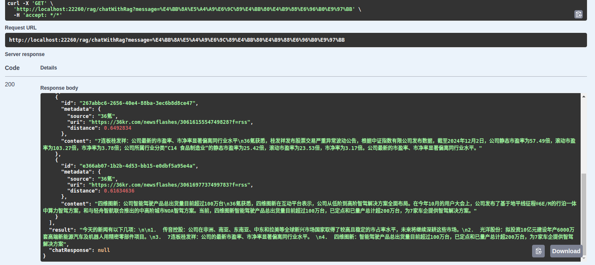
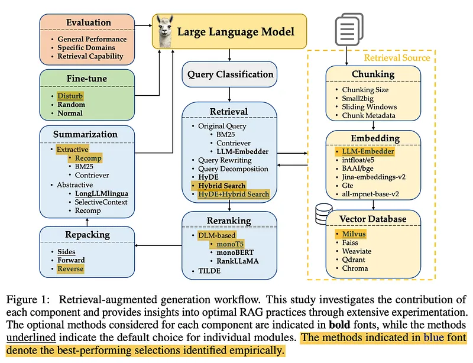
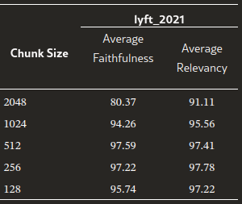
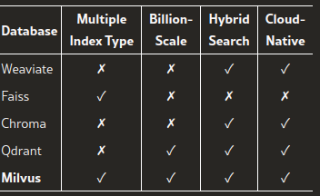

## 简介

RAG应用搭建探索，并对一两篇最佳实践论文进行分析。

### 需求

针对一个需求去做探索:
希望用RAG重塑和聚合我每日看的商业新闻源（36k、虎嗅）。
1. 资讯聚合：通过LLM去做碎片化提炼，得出每日重点简报。
2. 生成式聚合：输出带溯源标注的行业简报。
   
## 技术栈

- Spring AI 在线引擎框架
- Llama3.2 大模型
- nomic-embed-text:v1.5 embedding模型
- Elasticsearch/pgector 向量数据库
- Apache Tika pdf、doc等文件的处理库

## 搭建向量数据库

向量数据库benchmark：https://ann-benchmarks.com/index.html

### Elasticsearch

搭建，略，请看Elasticsearch一节。

### Pgvector

> Ubuntu安装https://blog.csdn.net/p1g2c32006/article/details/136371175

~~~
创建apt仓库文件
sudo sh -c 'echo "deb https://apt.postgresql.org/pub/repos/apt $(lsb_release -cs)-pgdg main" > /etc/apt/sources.list.d/pgdg.list'

导入仓库签名
wget --quiet -O - https://www.postgresql.org/media/keys/ACCC4CF8.asc | sudo apt-key add -

更新仓库列表
sudo apt update

安装pg(自己选择合适的版本)
sudo apt -y install postgresql-14

安装pgvector
sudo apt -y install postgresql-14-pgvector
~~~

创建用户和数据库
~~~~
postgres=# create user pv with password '22222222';
CREATE ROLE
postgres=# create database pv owner=pv;
CREATE DATABASE
postgres=# grant all privileges on database pv to pv;
GRANT
~~~~
建表交给Spring-ai自动建。

## Embedding模型和LLM

模型我直接用Ollama去管理：安装教程[通过Llama和Dify搭建一套RAG](../dify-rag)

因为是在本地电脑运行，所以选用的是性价比高、占用资源相对一般的模型。
- embedding模型选型：nomic-embed-text:v1.5。
- LLM选型：llama3.2:3b | qwen2:latest

## 服务构建

本文代码在 https://github.com/teaho-infra/spring-ai-rag-demo 。项目里有es http demo、
es-ollama-rag-demo和pgvector-ollama-rag-demo三个。

代码主要包括：
* ETL pipeline数据处理
  * pdf解析
  * rss解析
  * 文档切片和chunk处理
  * 调用文本模型knn数据生成
* RAG查询处理
  * knn查询
  * prompt构造，LLM请求
  * 后置处理

### ETL pipeline数据处理

下面说下ETL数据处理流程：

1. Rss下载
2. 进行chunk处理。采用简单的1000token做chunk
3. 调用向量模型，生成向量。
4. 保存到向量数据库
   ~~~
   ContentFormatTransformer contentFormatTransformer = new ContentFormatTransformer(DefaultContentFormatter.defaultConfig());
   TokenTextSplitter tokenTextSplitter = new TokenTextSplitter(1000, 400, 10, 5000, true);
   docs = tokenTextSplitter.split(contentFormatTransformer.transform(docs));
   ~~~

### 在线流程

在线流程，在接收到请求后，
1. 先查询向量数据库，
2. 然后让LLM整合和润饰。
   ~~~
   List<Document> documents = searchVectorDB(query, 4);
   //……省略转换代码

   String prompt = """
      请基于下面的内容，回答这个问题"%s":
      %s
      """;
   String reply = ollamaChatModel.call(String.format(prompt, query, similarDoc.toString()));
   ~~~

### 结果

搜索“今天有什么新闻”

## 方案优化
> 论文：https://arxiv.org/abs/2407.01219

我基于《Searching for Best Practices in Retrieval-Augmented Generation》（RAG最佳实践）去看看一个RAG系统（我搭建的这个简陋系统）有什么优化的空间。

### 一个RAG应用的组成部分

1. 查询分类：将查询划分为是否需要RAG检索。
2. Chunk
3. 向量转换和存储
4. Retrieal：检索。
5. Rerank
6. repacking
7. summarization
8. 大模型微调

### 查询分类 Query classification

通常我们通过查询分类，能够大大提升频繁检索的性能。对于一些完全是基于用户输入生成结果的query，不需要走检索。例如，对文字做总结的查询。

论文中提出使用BERT-base-multilingual-cased 作为分类器。

### 文本分块
有这几种方式：
1. 基于token的分块：
1. 优点：简单分块
2. 缺点：可能截断句子
2. 语义级分块：使用LLM进行分块。
1. 优点：保留上下文
2. 缺点：耗时高，实现麻烦。
3. 句子级分块
1. 平衡token和语义保留

### 块大小：评估

  
faithfulness指标表示：衡量响应是幻觉还是与检索到文本相匹配。  
relevancy指标表示：衡量检索到的文本和响应，与query的相关性。  

分块技术：
1. Original
2. small2big：从小块文本开始，逐步合并成更大的语义单元
3. 滑动窗口

源数据添加：目前没有优化手段。（我认为暂时常见场景也不需要）

### 向量数据库

  
论文中评估的向量数据库中，认为Milvus最优。

### 检索

1. query改写
2. query分解
3. 假设文档生成（Pseudo-documents Generation）
1. HyDE： 使用LLM生成假设查询并转化成embedding去查询，在Perplexity.ai等产品中已有类似思想的实践。

建议使用 HyDE 的混合搜索作为默认检索方法。即将HyDE的结果分解成如下：
1. 稀疏检索（BM25）
2. 密集检索（HyDE的结果embedding）

### 重排
1. DLM重排
2. TILDE重排

推荐monoT5作为平衡性能和效率的综合方法。

### 打包（document Repacking）

重排完，后续的LLM生成的性能也会受重排后的顺序影响。而论文引用，将相关文档放在最头或者最尾性能最优。

### 总结（Summarization）

经过上面步骤后，得到的结果可能包含不相关的冗余文档，从而
1. 影响LLM的生成结果。
2. 降低LLM查询性能。

而总结这一步有两种方法：
1. 提取式  分割成句子排序，摘除不重要的。
2. 抽象式   重新表述，生成连贯的摘要。

工具：
- Recomp
- LongLLMLingua
- Selective Context

推荐Recomp ，因为它具有出色的性能。

### 测评

[深度测评 RAG 应用评估框架：指标最全面的 RAGas](https://mp.weixin.qq.com/s?search_click_id=5934102951347616033-1733194024198-4008816536&__biz=MzI0OTAzNTEwMw==&mid=2247484823&idx=1&sn=58b07c61ff8c7803dd45d1f36e34b495&chksm=e8a7e942746705cfbd2b30a0768a71a3edc7b6f9ed063b9d67e81ce95fd1e3a2b21c69f4e177&scene=7&subscene=10000&sessionid=1733190900&clicktime=1733194024&enterid=1733194024&ascene=65&fasttmpl_type=0&fasttmpl_fullversion=7496853-zh_CN-zip&fasttmpl_flag=0&realreporttime=1733194024249&devicetype=android-34&version=2800363b&nettype=WIFI&abtest_cookie=AAACAA%3D%3D&lang=zh_CN&countrycode=CN&exportkey=n_ChQIAhIQ8cGH7RhHFUayFZRzBVdztBLYAQIE97dBBAEAAAAAAIlvD1B1ZUkAAAAOpnltbLcz9gKNyK89dVj0Opd4ZyaoW%2F7EuXA%2FdQ8vkIDFNX%2Fo3Ae0Mz4ccIkiZm96ghjHW62vuAwF%2FPK5DwJfLWD5X3ynvsZ0UH12%2FnxbH19YsNk24btMrPcgkhTNg8xAgwxp9HnWCs5M79pgyLpc%2FIUPVtchmf4dni86yztn9Mk5nbCZgQ7H6o2YMJmN2IvtTGMFdJZH84nW2N7uDIZVCn7KNmqx3bqUHJ%2FMDTo4QwSgafkI7hKvXYxHl3wPGW%2BCmg%3D%3D&pass_ticket=aGdP57BBGuCYjvhQC%2BsYZ4z3GcHGeOOqlk34AZT8GmFJu0%2Bz9YSYzoXuN1hFjAWl&wx_header=3)  
[评估与优化RAG指南：提高准确性与质量的最佳实践](https://mp.weixin.qq.com/s?__biz=MzI0OTAzNTEwMw==&mid=2247485280&idx=1&sn=b8d74b4fa6d43d6660d18117aa558665&chksm=e88f79613ff59840d3560be39f4dada3798f22a295afb81957b0b9124bb003a0e08c76b19b0b&sessionid=1733190900&scene=126&clicktime=1733194150&enterid=1733194150&subscene=10000&ascene=3&fasttmpl_type=0&fasttmpl_fullversion=7496853-zh_CN-zip&fasttmpl_flag=0&realreporttime=1733194150608&devicetype=android-34&version=2800363b&nettype=WIFI&abtest_cookie=AAACAA%3D%3D&lang=zh_CN&session_us=gh_3698af3b8754&countrycode=CN&exportkey=n_ChQIAhIQhn4dqL4nJ4X%2BCB1MYfjDhhLnAQIE97dBBAEAAAAAAAzrA0Bw7a4AAAAOpnltbLcz9gKNyK89dVj0UFfdYM4qx50ourgoJGdRbA3rKQ6UBOE642zY%2FLvgIs1neZvLsyJkraqbQrKWJKio644UNWBY5dFLor3avrNYdhahYuwzfTB2kyrNAOV4HECavm5%2BTLrUKPaaGHILYBCuzra3UnZ%2Fgq9CjCGgAgyHrUw8axAMlzHTNmN6o4604%2FIC3h29uk7z%2FgXc0IWlykqikdLPH7WiPPt0e%2FVRl%2FTIumzkiWmhPMZHvxVLukW%2Fj11QLy4D%2F%2BIMc90vqjtGYI2svg%3D%3D&pass_ticket=lW%2BqFRuL6HrqUrb%2F1LrN1WFBeIb0K7%2FiBb%2FI90SicT2W0Ko30xyULPpJLTR57SSy&wx_header=3)    

## 应用场景

就目前来看，企业数据库，垂类查询都是很好的应用场景。有实时诉求的搜索和查询也是。
它，能够结合工程，做一个随时换库的RAG搜索。微调LLM、LLM agent、RAG放在各行业链路里，依然有广阔的想象空间。

## Reference

[1]https://arxiv.org/abs/2407.01219    
[2]RECOMP: Improving Retrieval-Augmented LMs with Compression and Selective Augmentation https://arxiv.org/abs/2310.04408  
[3][Spring AI doc |spring.io](https://docs.spring.io/spring-ai/reference/api/vectordbs/elasticsearch.html)  
[4]Pgvector|github  
[5]From Local to Global: A Graph RAG Approach to Query-Focused Summarization https://arxiv.org/pdf/2404.16130  
[6]https://www.microsoft.com/en-us/research/blog/graphrag-unlocking-llm-discovery-on-narrative-private-data/  

