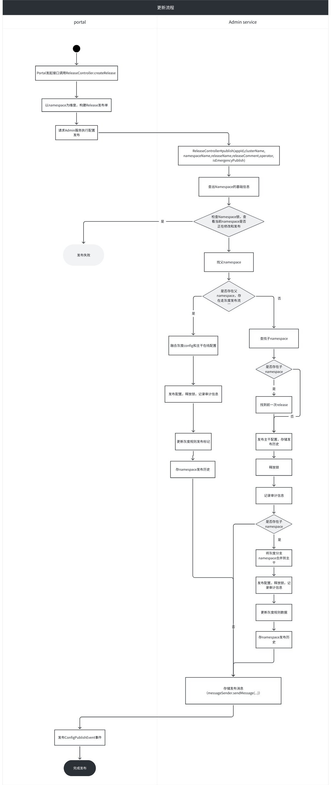

## 简介

Apollo 作为配置中心在市面上赢得这么多份额，得益于围绕配置管理和发布流程做了非常多审核、审计、抽象管理、用户管理能力。不过该节我们回归到研发关注的配置中心的一个核心流程——配置发布。

## 流程整理

Apollo 配置发布流程中主要涉及两个服务：portal 服务和 admin 服务。

- **portal 负责**
  - 接口提供
  - 权限管控
  - 变更通知拓展
- **admin-service 负责**
  - 发布单发布
  - 灰度逻辑处理
  - namespace 一致性
  - 配置合并



## Admin 服务 ReleaseService#publish

```java
@Transactional
public Release publish(Namespace namespace, String releaseName, String releaseComment,
                       String operator, boolean isEmergencyPublish) {
  //检查namespace锁是否持有
  checkLock(namespace, isEmergencyPublish, operator);
  //获取namespace的item
  Map<String, String> operateNamespaceItems = getNamespaceItems(namespace);
  //查找父namespace，有父namespace进行灰度发布
  Namespace parentNamespace = namespaceService.findParentNamespace(namespace);
  //branch release
  if (parentNamespace != null) {
    return publishBranchNamespace(parentNamespace, namespace, operateNamespaceItems,
                                  releaseName, releaseComment, operator, isEmergencyPublish);
  }

  Namespace childNamespace = namespaceService.findChildNamespace(namespace);

  Release previousRelease = null;
  if (childNamespace != null) {
    //找到灰度的有效发布
    previousRelease = findLatestActiveRelease(namespace);
  }

  //master release
  //发布主分支
  Map<String, Object> operationContext = Maps.newLinkedHashMap();
  operationContext.put(ReleaseOperationContext.IS_EMERGENCY_PUBLISH, isEmergencyPublish);
  //1. 找到上一次release
  //2. 保存release，释放namespace锁，创建审计日志
  //3. 创建发布历史
  Release release = masterRelease(namespace, releaseName, releaseComment, operateNamespaceItems,
                                  operator, ReleaseOperation.NORMAL_RELEASE, operationContext);
  //如果有子发布，合并子namespace并发布一次
  //merge to branch and auto release
  if (childNamespace != null) {
    mergeFromMasterAndPublishBranch(namespace, childNamespace, operateNamespaceItems,
                                    releaseName, releaseComment, operator, previousRelease,
                                    release, isEmergencyPublish);
  }

  return release;
}
```

## Release 表字段解释

```java
@Table(name = "`Release`")
public class Release extends BaseEntity {
  private String releaseKey;     //基于app、cluster、namespace、机器ip、随机数生成的releaseKey
  private String name;           //时间戳+release/gray
  private String appId;          //应用id
  private String clusterName;    //集群名/灰度分支名
  private String namespaceName;  //namespace名
  private String configurations; //配置信息
  private String comment;        //评论
  private boolean isAbandoned;   //是否删除
}
```

## Portal 发布通知

Portal release 接口发布完配置后，会发送 `ConfigPublishEvent` 事件，`ConfigPublishListener` 监听事件并启动 `ConfigPublishNotifyTask` 任务，发送消息。Portal 支持拓展，发送这三类通知：

1. Webhook
2. 邮件
3. MQ

```java
public class ConfigPublishListener {

  //省略

  @EventListener
  public void onConfigPublish(ConfigPublishEvent event) {
    executorService.submit(new ConfigPublishNotifyTask(event.getConfigPublishInfo()));
  }

  private class ConfigPublishNotifyTask implements Runnable {

    private final ConfigPublishEvent.ConfigPublishInfo publishInfo;

    ConfigPublishNotifyTask(ConfigPublishEvent.ConfigPublishInfo publishInfo) {
      this.publishInfo = publishInfo;
    }

    @Override
    public void run() {
      ReleaseHistoryBO releaseHistory = getReleaseHistory();
      if (releaseHistory == null) {
        Tracer.logError("Load release history failed", null);
        return;
      }
      //发webhook
      this.sendPublishWebHook(releaseHistory);
      //发邮件
      sendPublishEmail(releaseHistory);
      //发MQ消息
      sendPublishMsg(releaseHistory);
    }

    //省略
  }

}
```

## 总结

至此完成配置发布保存，接下来看配置如何通知 Apollo client。