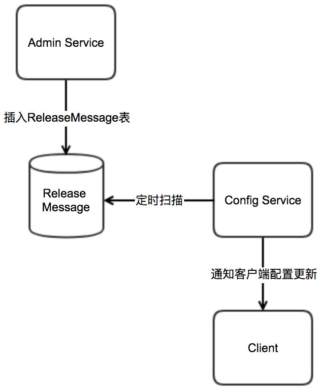

# 简介

该节我们继续研发关注的配置中心的一个核心流程--client接收配置变更。下面是官方设计文档里流程图，它说明了Apollo发布通知的大致流程。




下面我们更加具体地分析Apollo的配置通知。


# 发布消息的数据库消息队列实现

在admin-service的release接口最后，完成消息保存后，会调用`MessageSender`的sendMessage发布配置发布消息。

看看`MessageSender`的实现`DatabaseMessageSender`干了什么。

```java
public class DatabaseMessageSender implements MessageSender {
  private static final Logger logger = LoggerFactory.getLogger(DatabaseMessageSender.class);
  private static final int CLEAN_QUEUE_MAX_SIZE = 100;
  private final BlockingQueue<Long> toClean = Queues.newLinkedBlockingQueue(CLEAN_QUEUE_MAX_SIZE);
  private final ExecutorService cleanExecutorService;
  private final AtomicBoolean cleanStopped;

  private final ReleaseMessageRepository releaseMessageRepository;

  public DatabaseMessageSender(final ReleaseMessageRepository releaseMessageRepository) {
    cleanExecutorService = Executors.newSingleThreadExecutor(ApolloThreadFactory.create("DatabaseMessageSender", true));
    cleanStopped = new AtomicBoolean(false);
    this.releaseMessageRepository = releaseMessageRepository;
  }

  @Override
  @Transactional
  public void sendMessage(String message, String channel) {
    //省略
    //保存releaseMessage
      ReleaseMessage newMessage = releaseMessageRepository.save(new ReleaseMessage(message));
      //往队列里增加一个删除标记，有一个线程不停扫描表（队列空了隔5秒），扫描同namespace下小于当前消息id的消息，删除历史消息
      if(!toClean.offer(newMessage.getId())){
        logger.warn("Queue is full, Failed to add message {} to clean queue", newMessage.getId());
      }
    //省略
  }

//省略其他方法

}

```


# 读取数据库消息

ReleaseMessageScanner负责读取数据库里的消息表，主要做了两个事情：

1. 定时扫描ReleaseMessage表
2. 将发布消息通知**ReleaseMessageListener**


我们来看看其实现：

```java
public class ReleaseMessageScanner implements InitializingBean {
  //省略

  @Override
  public void afterPropertiesSet() throws Exception {
    //扫描间隔，100ms
    databaseScanInterval = bizConfig.releaseMessageScanIntervalInMilli();
    //找到最大的消息id
    maxIdScanned = loadLargestMessageId();
    executorService.scheduleWithFixedDelay(() -> {
      Transaction transaction = Tracer.newTransaction("Apollo.ReleaseMessageScanner", "scanMessage");
      try {
        //
        scanMissingMessages();
        scanMessages();
        transaction.setStatus(Transaction.SUCCESS);
      } catch (Throwable ex) {
        transaction.setStatus(ex);
        logger.error("Scan and send message failed", ex);
      } finally {
        transaction.complete();
      }
    }, databaseScanInterval, databaseScanInterval, TimeUnit.MILLISECONDS);

  }

  /**
   * add message listeners for release message
   * @param listener
   */
  public void addMessageListener(ReleaseMessageListener listener) {
    if (!listeners.contains(listener)) {
      listeners.add(listener);
    }
  }

  /**
   * Scan messages, continue scanning until there is no more messages
   */
  private void scanMessages() {
    boolean hasMoreMessages = true;
    while (hasMoreMessages && !Thread.currentThread().isInterrupted()) {
      hasMoreMessages = scanAndSendMessages();
    }
  }

  /**
   * scan messages and send
   *
   * @return whether there are more messages
   */
  private boolean scanAndSendMessages() {
    //current batch is 500
    //拉取大于当前最大id的500条
    List<ReleaseMessage> releaseMessages =
        releaseMessageRepository.findFirst500ByIdGreaterThanOrderByIdAsc(maxIdScanned);
    if (CollectionUtils.isEmpty(releaseMessages)) {
      return false;
    }
    //触发所有ReleaseMessageListener执行
    fireMessageScanned(releaseMessages);
    int messageScanned = releaseMessages.size();
    long newMaxIdScanned = releaseMessages.get(messageScanned - 1).getId();
    // check id gaps, possible reasons are release message not committed yet or already rolled back
    //存在一些消息”看不见“，可能是没commit或者rollback了，针对这些消息加到下一次扫描里，如果下一次可以找到，则补发消息。
    if (newMaxIdScanned - maxIdScanned > messageScanned) {
      recordMissingReleaseMessageIds(releaseMessages, maxIdScanned);
    }
    //记录已扫描最大id
    maxIdScanned = newMaxIdScanned;
    return messageScanned == 500;
  }


}
```

## 触发通知

ReleaseMessageScanner会循环遍历发布消息监听器(ReleaseMessageListener)集合。

**ReleaseMessageListener**的实现类在ConfigServiceAutoConfiguration里初始化，我们看看它们实现了*`handleMessage`方法并*执行哪些操作：

- **ReleaseMessageServiceWithCache**：主要将Namespace的最新messageId存起来，在client请求配置时校验是否需要更新。
- **GrayReleaseRulesHolder**：处理、合并、持有灰度策略（GrayReleaseRule表）

```java
// GrayReleaseRulesHolder

@Override
public void handleMessage(ReleaseMessage message, String channel) {
  logger.info("message received - channel: {}, message: {}", channel, message);
  String releaseMessage = message.getMessage();
  if (!Topics.APOLLO_RELEASE_TOPIC.equals(channel) || Strings.isNullOrEmpty(releaseMessage)) {
    return;
  }
  List<String> keys = ReleaseMessageKeyGenerator.messageToList(releaseMessage);
  //message should be appId+cluster+namespace
  if (CollectionUtils.isEmpty(keys)) {
    return;
  }
  String appId = keys.get(0);
  String cluster = keys.get(1);
  String namespace = keys.get(2);

  List<GrayReleaseRule> rules = grayReleaseRuleRepository
      .findByAppIdAndClusterNameAndNamespaceName(appId, cluster, namespace);
  
  mergeGrayReleaseRules(rules);
}
```

- **ConfigService**：默认是DefaultConfigService，这个阶段没操作，如果切换为ConfigServiceWithCache，则在ReleaseMessage时更新缓存。
- **ConfigFileController**：更新ConfigFileController里的配置缓存，client sdk会定时向这个controller里的API接口拉取配置。
- **NotificationControllerV2**：找到client的longPolling请求（使用springMVC的DeferredResult实现），往请求响应里返回发布通知信息。
- **notificationController**：已废弃，功能同V2，区别是V2能够同时处理一个client的多个longPolling监听和返回。


重点分析NotificationControllerV2的实现分析。


# NotificationControllerV2的实现分析


NotificationControllerV2是Apollo配置中心实现配置监听和更新的重要接口类。我们一一看一下实现。

```java
@RestController
@RequestMapping("/notifications/v2")
public class NotificationControllerV2 implements ReleaseMessageListener {
  private static final Logger logger = LoggerFactory.getLogger(NotificationControllerV2.class);
  private final Multimap<String, DeferredResultWrapper> deferredResults =
      Multimaps.synchronizedSetMultimap(TreeMultimap.create(String.CASE_INSENSITIVE_ORDER, Ordering.natural()));
  //GSON用
  private static final Type notificationsTypeReference =
      new TypeToken<List<ApolloConfigNotification>>() {
      }.getType();
  //
  private final ExecutorService largeNotificationBatchExecutorService;

  private final WatchKeysUtil watchKeysUtil;
  private final ReleaseMessageServiceWithCache releaseMessageService; //获取Release配置消息的service
  private final EntityManagerUtil entityManagerUtil; //数据库操作工具类
  private final NamespaceUtil namespaceUtil; //namespace工具
  private final Gson gson;
  private final BizConfig bizConfig;  //服务配置

// 省略

  @GetMapping
  public DeferredResult<ResponseEntity<List<ApolloConfigNotification>>> pollNotification(
      @RequestParam(value = "appId") String appId,
      @RequestParam(value = "cluster") String cluster,
      @RequestParam(value = "notifications") String notificationsAsString,
      @RequestParam(value = "dataCenter", required = false) String dataCenter,
      @RequestParam(value = "ip", required = false) String clientIp) {
    List<ApolloConfigNotification> notifications = null;

    try {
      notifications =
          gson.fromJson(notificationsAsString, notificationsTypeReference);
    } catch (Throwable ex) {
      Tracer.logError(ex);
    }

    if (CollectionUtils.isEmpty(notifications)) {
      throw BadRequestException.invalidNotificationsFormat(notificationsAsString);
    }
    //验证逻辑，对client请求的namespace名做一些合法化处理和过滤
    Map<String, ApolloConfigNotification> filteredNotifications = filterNotifications(appId, notifications);
    
    if (CollectionUtils.isEmpty(filteredNotifications)) {
      throw BadRequestException.invalidNotificationsFormat(notificationsAsString);
    }

    DeferredResultWrapper deferredResultWrapper = new DeferredResultWrapper(bizConfig.longPollingTimeoutInMilli());
    Set<String> namespaces = Sets.newHashSetWithExpectedSize(filteredNotifications.size());
    Map<String, Long> clientSideNotifications = Maps.newHashMapWithExpectedSize(filteredNotifications.size());

    for (Map.Entry<String, ApolloConfigNotification> notificationEntry : filteredNotifications.entrySet()) {
      String normalizedNamespace = notificationEntry.getKey();
      ApolloConfigNotification notification = notificationEntry.getValue();
      namespaces.add(normalizedNamespace);
      clientSideNotifications.put(normalizedNamespace, notification.getNotificationId());
      if (!Objects.equals(notification.getNamespaceName(), normalizedNamespace)) {
        deferredResultWrapper.recordNamespaceNameNormalizedResult(notification.getNamespaceName(), normalizedNamespace);
      }
    }

    Multimap<String, String> watchedKeysMap =
        watchKeysUtil.assembleAllWatchKeys(appId, cluster, namespaces, dataCenter);

    Set<String> watchedKeys = Sets.newHashSet(watchedKeysMap.values());

    /**
     * 1、set deferredResult before the check, for avoid more waiting
     * If the check before setting deferredResult,it may receive a notification the next time
     * when method handleMessage is executed between check and set deferredResult.
     */
    deferredResultWrapper
          .onTimeout(() -> logWatchedKeys(watchedKeys, "Apollo.LongPoll.TimeOutKeys"));

    deferredResultWrapper.onCompletion(() -> {
      //unregister all keys
      for (String key : watchedKeys) {
        deferredResults.remove(key, deferredResultWrapper);
      }
      logWatchedKeys(watchedKeys, "Apollo.LongPoll.CompletedKeys");
    });

    //register all keys
    for (String key : watchedKeys) {
      this.deferredResults.put(key, deferredResultWrapper);
    }

    logWatchedKeys(watchedKeys, "Apollo.LongPoll.RegisteredKeys");
    logger.debug("Listening {} from appId: {}, cluster: {}, namespace: {}, datacenter: {}",
        watchedKeys, appId, cluster, namespaces, dataCenter);

    /**
     * 2、check new release
       接下来的代码：检查ReleaseMessage（在config-service启动加载和监听消息通知表更新），看有没有新的notification，有的话马上返回
       一般在client应用启动时，或者两次longPolling间隔中会执行
     */
    List<ReleaseMessage> latestReleaseMessages =
        releaseMessageService.findLatestReleaseMessagesGroupByMessages(watchedKeys);

    /**
     * Manually close the entity manager.
     * Since for async request, Spring won't do so until the request is finished,
     * which is unacceptable since we are doing long polling - means the db connection would be hold
     * for a very long time
     */
    entityManagerUtil.closeEntityManager();

    List<ApolloConfigNotification> newNotifications =
        getApolloConfigNotifications(namespaces, clientSideNotifications, watchedKeysMap,
            latestReleaseMessages);

    if (!CollectionUtils.isEmpty(newNotifications)) {
      deferredResultWrapper.setResult(newNotifications);
    }

    return deferredResultWrapper.getResult();
  }


  private List<ApolloConfigNotification> getApolloConfigNotifications(Set<String> namespaces,
                                                                      Map<String, Long> clientSideNotifications,
                                                                      Multimap<String, String> watchedKeysMap,
                                                                      List<ReleaseMessage> latestReleaseMessages) {
    List<ApolloConfigNotification> newNotifications = Lists.newArrayList();
    if (!CollectionUtils.isEmpty(latestReleaseMessages)) {
      Map<String, Long> latestNotifications = Maps.newHashMap();
      for (ReleaseMessage releaseMessage : latestReleaseMessages) {
        latestNotifications.put(releaseMessage.getMessage(), releaseMessage.getId());
      }

      for (String namespace : namespaces) {
        long clientSideId = clientSideNotifications.get(namespace);
        long latestId = ConfigConsts.NOTIFICATION_ID_PLACEHOLDER;
        Collection<String> namespaceWatchedKeys = watchedKeysMap.get(namespace);
        for (String namespaceWatchedKey : namespaceWatchedKeys) {
          long namespaceNotificationId =
              latestNotifications.getOrDefault(namespaceWatchedKey, ConfigConsts.NOTIFICATION_ID_PLACEHOLDER);
          if (namespaceNotificationId > latestId) {
            latestId = namespaceNotificationId;
          }
        }
        if (latestId > clientSideId) {
          ApolloConfigNotification notification = new ApolloConfigNotification(namespace, latestId);
          namespaceWatchedKeys.stream().filter(latestNotifications::containsKey).forEach(namespaceWatchedKey ->
              notification.addMessage(namespaceWatchedKey, latestNotifications.get(namespaceWatchedKey)));
          newNotifications.add(notification);
        }
      }
    }
    return newNotifications;
  }

  @Override
  public void handleMessage(ReleaseMessage message, String channel) {
    logger.info("message received - channel: {}, message: {}", channel, message);

    String content = message.getMessage();
    Tracer.logEvent("Apollo.LongPoll.Messages", content);
    if (!Topics.APOLLO_RELEASE_TOPIC.equals(channel) || Strings.isNullOrEmpty(content)) {
      return;
    }

    String changedNamespace = retrieveNamespaceFromReleaseMessage.apply(content);

    if (Strings.isNullOrEmpty(changedNamespace)) {
      logger.error("message format invalid - {}", content);
      return;
    }

    if (!deferredResults.containsKey(content)) {
      return;
    }

    //create a new list to avoid ConcurrentModificationException
    //找到监听namespace消息的long polling请求，然后通知他们拉配置
    List<DeferredResultWrapper> results = Lists.newArrayList(deferredResults.get(content));

    ApolloConfigNotification configNotification = new ApolloConfigNotification(changedNamespace, message.getId());
    configNotification.addMessage(content, message.getId());

    //do async notification if too many clients
    //默认会进来，都是异步去发布消息
    if (results.size() > bizConfig.releaseMessageNotificationBatch()) {
      largeNotificationBatchExecutorService.submit(() -> {
        logger.debug("Async notify {} clients for key {} with batch {}", results.size(), content,
            bizConfig.releaseMessageNotificationBatch());
        for (int i = 0; i < results.size(); i++) {
          if (i > 0 && i % bizConfig.releaseMessageNotificationBatch() == 0) {
            try {
              TimeUnit.MILLISECONDS.sleep(bizConfig.releaseMessageNotificationBatchIntervalInMilli());
            } catch (InterruptedException e) {
              //ignore
            }
          }
          logger.debug("Async notify {}", results.get(i));
          results.get(i).setResult(configNotification);
        }
      });
      return;
    }

    logger.debug("Notify {} clients for key {}", results.size(), content);

    for (DeferredResultWrapper result : results) {
      result.setResult(configNotification);
    }
    logger.debug("Notification completed");
  }

  //省略……
}
```


# client侧接收通知

前面说到Client端会longPolling请求配置，或者定时拉取刷新配置，我们看看client sdk是怎么处理的，重点分析这两个类：

## RemoteConfigRepository


remoteConfigReposity是Apollo client实际拉取配置的实现类，里面除了促发**长轮询请求**拉取配置通知外，还会**定时主动**请求Apollo config service更新配置。

```java
public class RemoteConfigRepository extends AbstractConfigRepository {
  private static final Logger logger = DeferredLoggerFactory.getLogger(RemoteConfigRepository.class);
  private static final Joiner STRING_JOINER = Joiner.on(ConfigConsts.CLUSTER_NAMESPACE_SEPARATOR);
  private static final Joiner.MapJoiner MAP_JOINER = Joiner.on("&").withKeyValueSeparator("=");
  private static final Escaper pathEscaper = UrlEscapers.urlPathSegmentEscaper();
  private static final Escaper queryParamEscaper = UrlEscapers.urlFormParameterEscaper();

  private final ConfigServiceLocator m_serviceLocator; //从meta server或者本地配置里，（定时）获取config-service地址
  private final HttpClient m_httpClient; //http client
  private final ConfigUtil m_configUtil; //配置工具类
  private final RemoteConfigLongPollService remoteConfigLongPollService; //负责实际执行longPolling的策略类
  private volatile AtomicReference<ApolloConfig> m_configCache; // 缓存
  private final String m_appId; //appId
  private final String m_namespace; //namespace
  protected final static ScheduledExecutorService m_executorService; //定时刷新配置的单线程池子
  private final AtomicReference<ServiceDTO> m_longPollServiceDto; //获取到的config service地址
  private final AtomicReference<ApolloNotificationMessages> m_remoteMessages; //当前拉取到的消息通知（标记最新版配置）
  private final RateLimiter m_loadConfigRateLimiter; //拉取限流
  private final AtomicBoolean m_configNeedForceRefresh; //更新配置时控制刷新频次
  private final SchedulePolicy m_loadConfigFailSchedulePolicy; //拉取配置失败后的策略，默认是指数递增策略，防止拉跨config service
  private static final Gson GSON = new Gson();

  static {
    m_executorService = Executors.newScheduledThreadPool(1,
        ApolloThreadFactory.create("RemoteConfigRepository", true));
  }

  /**
   * Constructor.
   *
   * @param appId the appId
   * @param namespace the namespace
   */
  public RemoteConfigRepository(String appId, String namespace) {
    m_appId = appId;
    m_namespace = namespace;
    m_configCache = new AtomicReference<>();
    m_configUtil = ApolloInjector.getInstance(ConfigUtil.class);
    m_httpClient = ApolloInjector.getInstance(HttpClient.class);
    m_serviceLocator = ApolloInjector.getInstance(ConfigServiceLocator.class);
    remoteConfigLongPollService = ApolloInjector.getInstance(RemoteConfigLongPollService.class);
    m_longPollServiceDto = new AtomicReference<>();
    m_remoteMessages = new AtomicReference<>();
    m_loadConfigRateLimiter = RateLimiter.create(m_configUtil.getLoadConfigQPS());
    m_configNeedForceRefresh = new AtomicBoolean(true);
    m_loadConfigFailSchedulePolicy = new ExponentialSchedulePolicy(m_configUtil.getOnErrorRetryInterval(),
        m_configUtil.getOnErrorRetryInterval() * 8);
    this.schedulePeriodicRefresh(); //启动定时刷新配置（默认每5分钟）
    this.scheduleLongPollingRefresh(); //启动配置更新监听，longPolling实现，默认20秒超时重拉
  }

  @Override
  public Properties getConfig() {
    //首次（比如启动时）初始化拉取
    if (m_configCache.get() == null) {
      long start = System.currentTimeMillis();
      //核心方法sync
      this.sync();
      Tracer.logEvent(APOLLO_CLIENT_NAMESPACE_FIRST_LOAD_SPEND+":"+m_namespace,
          String.valueOf(System.currentTimeMillis() - start));
    }
    return transformApolloConfigToProperties(m_configCache.get());
  }

  @Override
  public void setUpstreamRepository(ConfigRepository upstreamConfigRepository) {
    //remote config doesn't need upstream
  }

  @Override
  public ConfigSourceType getSourceType() {
    return ConfigSourceType.REMOTE;
  }

  private void schedulePeriodicRefresh() {
    logger.debug("Schedule periodic refresh with interval: {} {}",
        m_configUtil.getRefreshInterval(), m_configUtil.getRefreshIntervalTimeUnit());
    m_executorService.scheduleAtFixedRate(
        new Runnable() {
          @Override
          public void run() {
            Tracer.logEvent(APOLLO_CONFIGSERVICE, String.format("periodicRefresh: %s", m_namespace));
            logger.debug("refresh config for namespace: {}", m_namespace);
            trySync();
            Tracer.logEvent(APOLLO_CLIENT_VERSION, Apollo.VERSION);
          }
        }, m_configUtil.getRefreshInterval(), m_configUtil.getRefreshInterval(),
        m_configUtil.getRefreshIntervalTimeUnit());
  }


  //核心方法，从远端同步配置并通知更新
  @Override
  protected synchronized void sync() {
    Transaction transaction = Tracer.newTransaction("Apollo.ConfigService", "syncRemoteConfig");

    try {
      ApolloConfig previous = m_configCache.get();
      //从config service拉取配置
      ApolloConfig current = loadApolloConfig();

      //reference equals means HTTP 304
      //没更新则不用去置换老配置
      if (previous != current) {
        logger.debug("Remote Config refreshed!");
        m_configCache.set(current);
        //通知listen去更新，目前只有localfileRepository更新本地文件这个操作
        this.fireRepositoryChange(m_appId, m_namespace, this.getConfig());
      }

      if (current != null) {
        Tracer.logEvent(String.format(APOLLO_CLIENT_CONFIGS+"%s", current.getNamespaceName()),
            current.getReleaseKey());
      }

      transaction.setStatus(Transaction.SUCCESS);
    } catch (Throwable ex) {
      transaction.setStatus(ex);
      throw ex;
    } finally {
      transaction.complete();
    }
  }

  private Properties transformApolloConfigToProperties(ApolloConfig apolloConfig) {
    Properties result = propertiesFactory.getPropertiesInstance();
    result.putAll(apolloConfig.getConfigurations());
    return result;
  }
  
  //实际拉取apollo配置的方法，往config-service的/{appId}/{clusterName}/{namespace:.+} 接口拉取配置
  private ApolloConfig loadApolloConfig() {
    if (!m_loadConfigRateLimiter.tryAcquire(5, TimeUnit.SECONDS)) {
      //wait at most 5 seconds
      try {
        TimeUnit.SECONDS.sleep(5);
      } catch (InterruptedException e) {
      }
    }
    String appId = this.m_appId;
    String cluster = m_configUtil.getCluster();
    String dataCenter = m_configUtil.getDataCenter();
    String secret = m_configUtil.getAccessKeySecret(appId);
    Tracer.logEvent(APOLLO_CLIENT_CONFIGMETA, STRING_JOINER.join(appId, cluster, m_namespace));
    int maxRetries = m_configNeedForceRefresh.get() ? 2 : 1;
    long onErrorSleepTime = 0; // 0 means no sleep
    Throwable exception = null;

    List<ServiceDTO> configServices = getConfigServices();
    String url = null;
    retryLoopLabel:
    for (int i = 0; i < maxRetries; i++) {
      List<ServiceDTO> randomConfigServices = Lists.newLinkedList(configServices);
      Collections.shuffle(randomConfigServices);
      //Access the server which notifies the client first
      if (m_longPollServiceDto.get() != null) {
        randomConfigServices.add(0, m_longPollServiceDto.getAndSet(null));
      }

      for (ServiceDTO configService : randomConfigServices) {
        if (onErrorSleepTime > 0) {
          logger.warn(
              "Load config failed, will retry in {} {}. appId: {}, cluster: {}, namespaces: {}",
              onErrorSleepTime, m_configUtil.getOnErrorRetryIntervalTimeUnit(), appId, cluster, m_namespace);

          try {
            m_configUtil.getOnErrorRetryIntervalTimeUnit().sleep(onErrorSleepTime);
          } catch (InterruptedException e) {
            //ignore
          }
        }

        url = assembleQueryConfigUrl(configService.getHomepageUrl(), appId, cluster, m_namespace,
                dataCenter, m_remoteMessages.get(), m_configCache.get());

        logger.debug("Loading config from {}", url);

        HttpRequest request = new HttpRequest(url);
        if (!StringUtils.isBlank(secret)) {
          Map<String, String> headers = Signature.buildHttpHeaders(url, appId, secret);
          request.setHeaders(headers);
        }

        Transaction transaction = Tracer.newTransaction("Apollo.ConfigService", "queryConfig");
        transaction.addData("Url", url);
        try {

          HttpResponse<ApolloConfig> response = m_httpClient.doGet(request, ApolloConfig.class);
          m_configNeedForceRefresh.set(false);
          m_loadConfigFailSchedulePolicy.success();

          transaction.addData("StatusCode", response.getStatusCode());
          transaction.setStatus(Transaction.SUCCESS);

          if (response.getStatusCode() == 304) {
            logger.debug("Config server responds with 304 HTTP status code.");
            return m_configCache.get();
          }

          ApolloConfig result = response.getBody();

          if (result != null) {
            //配置更新类型，全量更新、增量更新、unknown，目前看这个配置没啥卵用
            ConfigSyncType configSyncType = ConfigSyncType.fromString(result.getConfigSyncType());
            if (configSyncType == ConfigSyncType.INCREMENTAL_SYNC) {
              ApolloConfig previousConfig = m_configCache.get();
              Map<String, String> previousConfigurations =
                  (previousConfig != null) ? previousConfig.getConfigurations() : null;
              result.setConfigurations(
                  mergeConfigurations(previousConfigurations, result.getConfigurationChanges()));
            } else if (configSyncType == ConfigSyncType.UNKNOWN) {
              String message = String.format(
                  "Invalid config sync type - %s",
                  result.getConfigSyncType());
              throw new ApolloConfigException(message, exception);
            }

          }

          logger.debug("Loaded config for {}: {}", m_namespace, result);

          return result;
        } catch (ApolloConfigStatusCodeException ex) {
          ApolloConfigStatusCodeException statusCodeException = ex;
          //config not found
          if (ex.getStatusCode() == 404) {
            String message = String.format(
                "Could not find config for namespace - appId: %s, cluster: %s, namespace: %s, " +
                    "please check whether the configs are released in Apollo!",
                appId, cluster, m_namespace);
            statusCodeException = new ApolloConfigStatusCodeException(ex.getStatusCode(),
                message);
            Tracer.logEvent(APOLLO_CLIENT_NAMESPACE_NOT_FOUND,m_namespace);

          }
          Tracer.logEvent(APOLLO_CONFIG_EXCEPTION, ExceptionUtil.getDetailMessage(statusCodeException));
          transaction.setStatus(statusCodeException);
          exception = statusCodeException;
          if(ex.getStatusCode() == 404) {
            break retryLoopLabel;
          }
        } catch (Throwable ex) {
          Tracer.logEvent(APOLLO_CONFIG_EXCEPTION, ExceptionUtil.getDetailMessage(ex));
          transaction.setStatus(ex);
          exception = ex;
        } finally {
          transaction.complete();
        }

        // if force refresh, do normal sleep, if normal config load, do exponential sleep
        onErrorSleepTime = m_configNeedForceRefresh.get() ? m_configUtil.getOnErrorRetryInterval() :
            m_loadConfigFailSchedulePolicy.fail();
      }

    }
    String message = String.format(
        "Load Apollo Config failed - appId: %s, cluster: %s, namespace: %s, url: %s",
        appId, cluster, m_namespace, url);
    throw new ApolloConfigException(message, exception);
  }

 
  
  private void scheduleLongPollingRefresh() {
    remoteConfigLongPollService.submit(m_appId, m_namespace, this);
  }
  //配置发生更新，拉取配置
  public void onLongPollNotified(ServiceDTO longPollNotifiedServiceDto, ApolloNotificationMessages remoteMessages) {
    m_longPollServiceDto.set(longPollNotifiedServiceDto);
    m_remoteMessages.set(remoteMessages);
    m_executorService.submit(new Runnable() {
      @Override
      public void run() {
        m_configNeedForceRefresh.set(true);
        trySync();
      }
    });
  }
  //省略其他代码
}
```


## RemoteConfigLongPollService

RemoteConfigLongPollService是RemoteConfigRepository持有的长轮询执行策略**实现**，核心是以App维度，长轮询Config-service的/notification/v2接口。获取结果后通知上层监听。

```java
public class RemoteConfigLongPollService {
    private static final Logger logger = LoggerFactory.getLogger(RemoteConfigLongPollService.class);
    private static final Joiner STRING_JOINER = Joiner.on("+");
    private static final Joiner.MapJoiner MAP_JOINER = Joiner.on("&").withKeyValueSeparator("=");
    private static final Escaper queryParamEscaper = UrlEscapers.urlFormParameterEscaper();
    private static final long INIT_NOTIFICATION_ID = -1L;
    private static final int LONG_POLLING_READ_TIMEOUT = 90000;
    private final ExecutorService m_longPollingService = Executors.newCachedThreadPool(ApolloThreadFactory.create("RemoteConfigLongPollService", true));
    private final AtomicBoolean m_longPollingStopped = new AtomicBoolean(false);
    private SchedulePolicy m_longPollFailSchedulePolicyInSecond = new ExponentialSchedulePolicy(1L, 120L);
    private RateLimiter m_longPollRateLimiter;
    private final ConcurrentMap<String, Boolean> m_longPollStarted = new ConcurrentHashMap();
    private final Map<String, Multimap<String, RemoteConfigRepository>> m_longPollNamespaces = Maps.newConcurrentMap();
    private final Table<String, String, Long> m_notifications = Tables.synchronizedTable(HashBasedTable.create());
    private final Map<String, ApolloNotificationMessages> m_remoteNotificationMessages = Maps.newConcurrentMap();
    private Type m_responseType = (new TypeToken<List<ApolloConfigNotification>>() {
    }).getType();
    private static final Gson GSON = new Gson();
    private ConfigUtil m_configUtil = (ConfigUtil)ApolloInjector.getInstance(ConfigUtil.class);
    private HttpClient m_httpClient = (HttpClient)ApolloInjector.getInstance(HttpClient.class);
    private ConfigServiceLocator m_serviceLocator = (ConfigServiceLocator)ApolloInjector.getInstance(ConfigServiceLocator.class);
    private final ConfigServiceLoadBalancerClient configServiceLoadBalancerClient = (ConfigServiceLoadBalancerClient)ServiceBootstrap.loadPrimary(ConfigServiceLoadBalancerClient.class);

    public RemoteConfigLongPollService() {
        this.m_longPollRateLimiter = RateLimiter.create((double)this.m_configUtil.getLongPollQPS());
    }

    public boolean submit(String appId, String namespace, RemoteConfigRepository remoteConfigRepository) {
        Multimap<String, RemoteConfigRepository> repositoryMultimap = (Multimap)this.m_longPollNamespaces.computeIfAbsent(appId, (k) -> Multimaps.synchronizedSetMultimap(HashMultimap.create()));
        boolean result = repositoryMultimap.put(namespace, remoteConfigRepository);
        this.m_notifications.put(appId, namespace, -1L);
        if (this.m_longPollStarted.get(appId) == null) {
            this.startLongPolling(appId);
        }

        return result;
    }
    
    //执行longPolling
    private void startLongPolling(final String sysAppId) {
        if (!Boolean.TRUE.equals(this.m_longPollStarted.putIfAbsent(sysAppId, true))) {
            try {
                final String cluster = this.m_configUtil.getCluster();
                final String dataCenter = this.m_configUtil.getDataCenter();
                final String secret = this.m_configUtil.getAccessKeySecret(sysAppId);
                final long longPollingInitialDelayInMills = this.m_configUtil.getLongPollingInitialDelayInMills();
                this.m_longPollingService.submit(new Runnable() {
                    public void run() {
                        if (longPollingInitialDelayInMills > 0L) {
                            try {
                                RemoteConfigLongPollService.logger.debug("Long polling will start in {} ms.", longPollingInitialDelayInMills);
                                TimeUnit.MILLISECONDS.sleep(longPollingInitialDelayInMills);
                            } catch (InterruptedException var2) {
                            }
                        }

                        RemoteConfigLongPollService.this.doLongPollingRefresh(sysAppId, cluster, dataCenter, secret);
                    }
                });
            } catch (Throwable ex) {
                this.m_longPollStarted.remove(sysAppId);
                ApolloConfigException exception = new ApolloConfigException("Schedule long polling refresh failed", ex);
                Tracer.logError(exception);
                logger.warn(ExceptionUtil.getDetailMessage(exception));
            }

        }
    }
    
    void stopLongPollingRefresh() {
        this.m_longPollingStopped.compareAndSet(false, true);
    }
    
    //执行longPolling核心方法
    // 1. longPolling监听配置
    // 2. 如果返回200，则说明配置有更新，拉取更新了的namespace的remoteRepository
    // 3. 执行notify方法，回调对应RemoteConfigRepository的onLongPollNotified方法，触发更新
    private void doLongPollingRefresh(String appId, String cluster, String dataCenter, String secret) {
        ServiceDTO lastServiceDto = null;

        while(!this.m_longPollingStopped.get() && !Thread.currentThread().isInterrupted()) {
            if (!this.m_longPollRateLimiter.tryAcquire(5L, TimeUnit.SECONDS)) {
                try {
                    TimeUnit.SECONDS.sleep(5L);
                } catch (InterruptedException var18) {
                }
            }

            Transaction transaction = Tracer.newTransaction("Apollo.ConfigService", "pollNotification");
            String url = null;

            try {
                if (lastServiceDto == null) {
                    lastServiceDto = this.resolveConfigService();
                }

                url = this.assembleLongPollRefreshUrl(lastServiceDto.getHomepageUrl(), appId, cluster, dataCenter, this.m_notifications.row(appId));
                logger.debug("Long polling from {}", url);
                HttpRequest request = new HttpRequest(url);
                request.setReadTimeout(90000);
                if (!StringUtils.isBlank(secret)) {
                    Map<String, String> headers = Signature.buildHttpHeaders(url, appId, secret);
                    request.setHeaders(headers);
                }

                transaction.addData("Url", url);
                HttpResponse<List<ApolloConfigNotification>> response = this.m_httpClient.doGet(request, this.m_responseType);
                logger.debug("Long polling response: {}, url: {}", response.getStatusCode(), url);
                if (response.getStatusCode() == 200 && response.getBody() != null) {
                    //更新m_notifications table，在发送longPolling请求时，以appid维度向config-service监听更新通知
                    this.updateNotifications(appId, (List)response.getBody());
                    //更新m_remoteNotificationMessages map，用于给上层Repository更新数据
                    this.updateRemoteNotifications((List)response.getBody());
                    transaction.addData("Result", ((List)response.getBody()).toString());
                    this.notify(appId, lastServiceDto, (List)response.getBody());
                }

                if (response.getStatusCode() == 304 && ThreadLocalRandom.current().nextBoolean()) {
                    lastServiceDto = null;
                }

                this.m_longPollFailSchedulePolicyInSecond.success();
                transaction.addData("StatusCode", response.getStatusCode());
                transaction.setStatus("0");
            } catch (Throwable ex) {
                lastServiceDto = null;
                Tracer.logEvent("ApolloConfigException", ExceptionUtil.getDetailMessage(ex));
                transaction.setStatus(ex);
                long sleepTimeInSecond = this.m_longPollFailSchedulePolicyInSecond.fail();
                if (ex.getCause() instanceof SocketTimeoutException) {
                    Tracer.logEvent("Apollo.Client.NamespaceTimeout", this.assembleNamespaces(appId));
                }

                logger.warn("Long polling failed, will retry in {} seconds. appId: {}, cluster: {}, namespaces: {}, long polling url: {}, reason: {}", new Object[]{sleepTimeInSecond, appId, cluster, this.assembleNamespaces(appId), url, ExceptionUtil.getDetailMessage(ex)});

                try {
                    TimeUnit.SECONDS.sleep(sleepTimeInSecond);
                } catch (InterruptedException var17) {
                }
            } finally {
                transaction.complete();
            }
        }

    }

    private void notify(String appId, ServiceDTO lastServiceDto, List<ApolloConfigNotification> notifications) {
      //1. 找到AppId对应的RemoteConfigRepository
      //2. 获取config-service返回的通知，ApolloNotificationMessages（格式是 namespace， 通知id）
      //3. 回调RemoteConfigRepository，参数是调用的config-service连接信息和ApolloNotificationMessages
    }
   
   //省略其他方法
}
```


# 总结

以上就是client接受配置的流程，默认实现是监听MySQL数据表的更新，并发布消息。

client端通过长轮询去刷新本地数据。