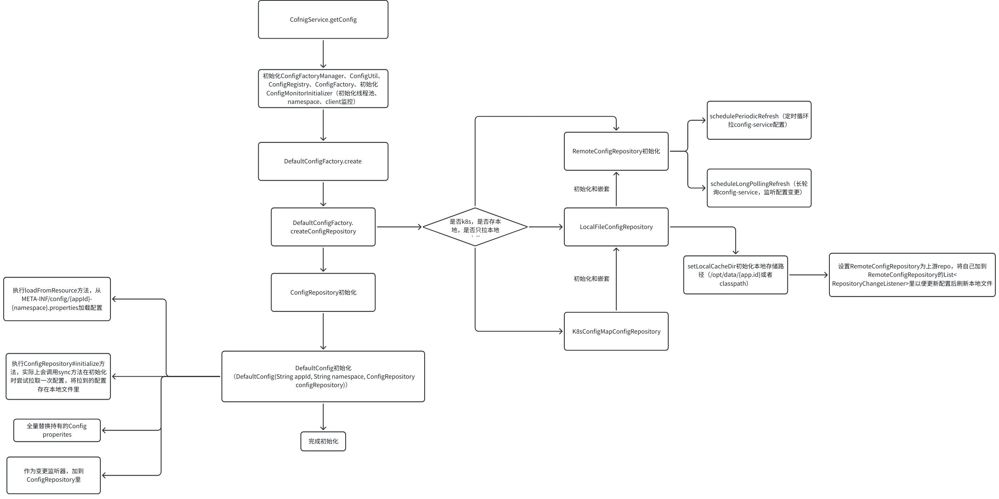

# 简介

前面谈到过，Apollo config类是维护apollo配置的核心类，Spring boot、注解等都通过此组件获取Apollo配置。本文说说获取Config时的处理逻辑。


# 初始化核心类


Config初始化过程中，我们主要关注这几个类的处理。

- **ConfigService**：核心类，也是一个门面类，封装了配置monitor、**Manager**、Registry初始化和`getConfig`方法。Java sdk的Spring封装都会基于此类创建Config类。
- **DefaultConfig**：核心类，一般获取到的配置会丢到这里，此类有配置获取、监听配置发变更通知等功能。
- ConfigFactoryManager：默认实现`DefaultConfigFactoryManager` ，由guice管理的。会持有ConfigFacotry实现。
- ConfigFactory：默认实现`DefaultConfigFactory`类，是创建ConfigRepository的工厂。
- ConfigRegistry：允许自定义不同应用和namespace的configFactory。默认没干啥事。
- **ConfigRepository**：有这些核心实现RemoteConfigRepository、LocalFileConfigRepository等。是获取/监听远端配置、本地文件配置的核心入口。
- **ConfigUtil**：核心配置类，Apollo sdk用到的系统参数、环境变量都在这个类里维护。
- ConfigMonitorInitializer，注册了这些监控项。DefaultApolloClientNamespaceApi（监控namespace是否缺失）、DefaultApolloClientThreadPoolApi（监控县城池）、DefaultApolloClientBootstrapArgsApi（apollo的启动参数监控）、DefaultApolloClientExceptionApi（监控异常）。Apollo的prometheus sdk实现目前只上报线程池和namespace的监控。

值得注意，以上部分Apollo核心类通过Google Guice管理，作为单例对象在Guice容器中。（个人猜测Apollo引入Guice管理的原因，是希望轻量化Apollo java sdk）


# 初始化原理分析

下面是初始化Config的Demo代码：

```text
Config appConfig = ConfigService.getConfig("SampleApp", "application");
appConfig.addChangeListener(changeListener);
ConfigFile applicationConfigFile = ConfigService.getConfigFile("application", ConfigFileFormat.Properties);
```


`ConfigService.getConfig`这一方法，是Apollo获取配置的核心方法。（下图以初始化properties格式namespace为例）




`ConfigService.getConfigFile`获取到ConfigFile对象，而`ConfigService.getConfig`方法则会返回Config对象，

但是**两者的的初始化逻辑基本一致**，他们都会初始化并持有ConfigRepository来获取配置，但是他们对外提供的方法不一样，Config能够针对配置的kv做细粒度的获取和更改，而ConfigFile只能获取文件所有配置内容（getContent()）。

**注意**：实际上当配置namespace为**非Properties**时，getConfig会在内部会初始化`PropertiesCompatibleFileConfigRepository`，其内部会包装一个ConfigService.getConfigFile来获取。