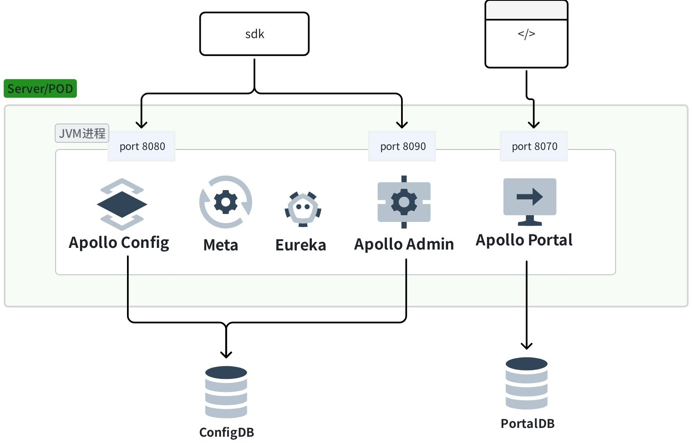
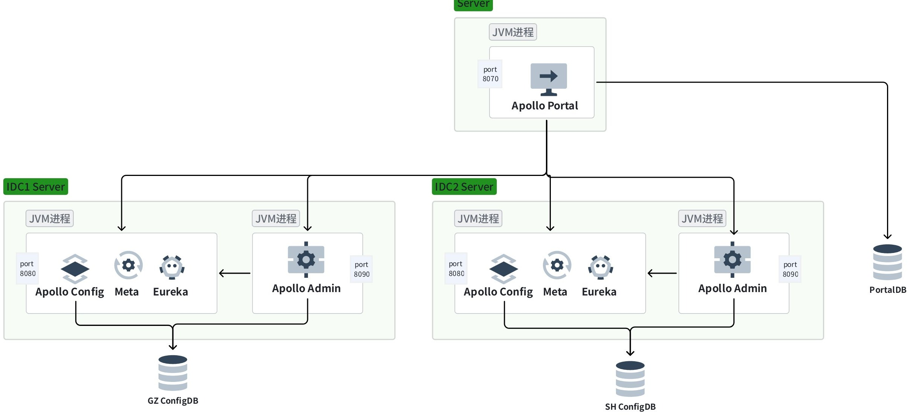
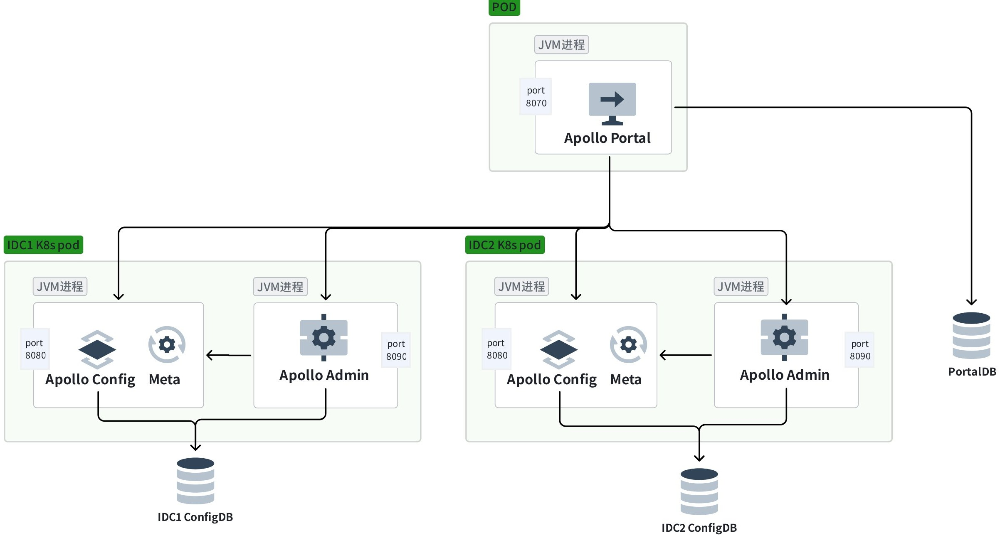

## 单实例单进程部署

使用 Apollo-Assembly 模块可以打一个 all-in-one 的包，能够在一个 JVM 进程启动所有 Apollo 服务。通过 github 的 quick start 库里的 `demo.sh` 或者直接通过命令行启动。通常，这种启动方式适合个人学习和简易的本地调试。

## 物理机 / VM 多集群多 IDC 多环境部署

物理机或者云 VM 部署，一般将 Portal、ConfigService、AdminService 集群拆开独立部署。

将 Portal 集群独立部署，作为一个统一管理台管理多个集群的 config 配置，同时考虑 portal 可用性容灾时，考虑将 Portal 集群部署在多个可用区作容灾，通过可同地域流量优先的 DNS 和可同机房流量优先的 LB 完成流量分发。PortalDB 则做主从集群或者基于 DTS 做双向同步。

Config 和 Admin 服务集群也是各自独立部署，每 IDC 每环境独立部署 config 和 admin，每 IDC 的多可用区集群共用一个域名，可用区内优先分发流量。容灾部署方面，由于 config 是可用区内独立、admin 是无状态的，主要关注 ConfigDB，configDB 做多可用区主从（具体情况看可用区建设，也可双主等）。

## 云原生 K8s 多集群多 IDC 多环境部署

云原生的部署，基本同物理机 VM 的部署情况，Portal、ConfigService、AdminService 集群拆开独立部署。

不同的是，k8s 部署时会把 Eureka 拆除，通过 Meta 返回 config、admin 服务域名的方式做服务发现。数据库容灾也和上面一样。

### 说明一些疑问

**第一，为什么不在 K8s 部署 Eureka？** 网上有些 Apollo 解决方案在 K8s 内部署 Eureka 的案例，Github 有相关的仓库。我个人不建议，因为 Eureka 作为一个在 17 年后逐渐放弃维护的组件在维护时会更费力，慢慢也跟不上业界变化，再者应当拥抱 k8s 自己提供的服务发现和负载均衡机制，这样更容易在 k8s 集群迭代和 apollo 迭代中，将依赖归一、也使 apollo 迭代更专注在**配置管理**上，也减少了 Apollo 依赖的内部组件，符合 Apollo 作者的架构哲学，**提高了可用性**。

**第二，为什么保留 Meta Server？** 其实在 Apollo 源码里提供了完全摒弃 Meta 发现，直接连接 config 的打包和启动方式。为了使得 VM 部署和 k8s 部署更接近和平滑，在某些实际情况下（比如考虑企业成本时）client 等无须分开两种配置，保留了 meta 发现能力在 config 进程里。这也是官方 github 里的推荐方式，我个人实际部署中也更推荐保留 meta 的简易服务发现机制。

## 可用性分级

| 场景 | 影响 | 降级 |
| --- | --- | --- |
| 某台 Config / Admin / Portal 下线 | 无影响 | — |
| 所有 Config Service 下线 | 客户端无法读取最新配置，Portal 无影响 | 客户端实例重启时，可以读取本地缓存配置文件。 未来可实现特性： 1. k8s 集群实现 config-map 缓存 2. 从 CD 系统其他已部署节点相同目录复制配置文件 |
| 全部 Portal / Admin 下线 | 客户端无影响，Portal 无法更新配置 | — |
| IDC 下线（比如 GZ、本地、SH 挂了一个） | 无影响，部署架构 IDC 内闭环 | — |
| 数据库宕机 | 客户端无影响，Portal 无法更新配置 | 可开启全量配置缓存（评估内存占用），Config Service 开启配置缓存后，对配置的读取不受数据库宕机影响 |

## 附录

- k8s 部署架构变迁：[https://github.com/apolloconfig/apollo/issues/3054](https://github.com/apolloconfig/apollo/issues/3054)
- k8s 部署相关变更 commit：[https://github.com/apolloconfig/apollo/pull/3055](https://github.com/apolloconfig/apollo/pull/3055)