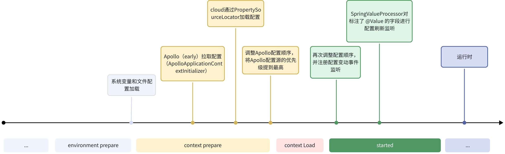

## 简介

通过 Apollo 客户端拉取配置时，我们要关心启动参数、环境参数、Spring（Boot/Cloud）、其他配置中心和 Apollo 的配置如果都配置了同一 kv 时，谁会在什么时候会优先被获取到。

> 注：Apollo Java client 本身的配置优先级在其他章节已经描述，这里不展开。

## 加载流程

以下是在 Spring Boot/Cloud 应用启动时间线上的配置加载时机：

**重点**：

1. Apollo 加载配置后，会在 context prepare 后和 started 时将 Apollo 配置加到 environment 的 propertiesSource 的最高优先级。
2. Apollo client 会将 Spring 的 `@Value` 和 spel 配置（形如 `` ${xxx.xxx} ``）都纳入到配置更新里。