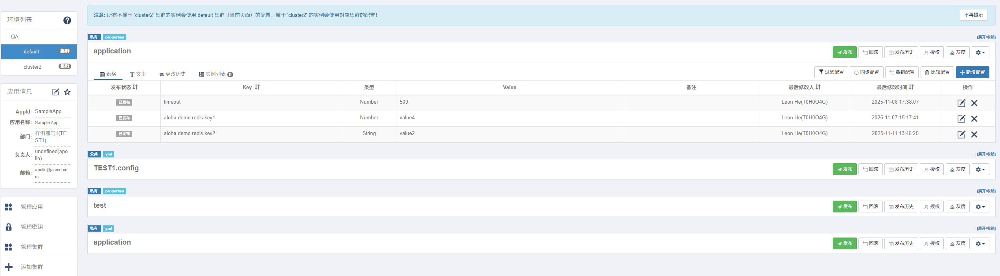
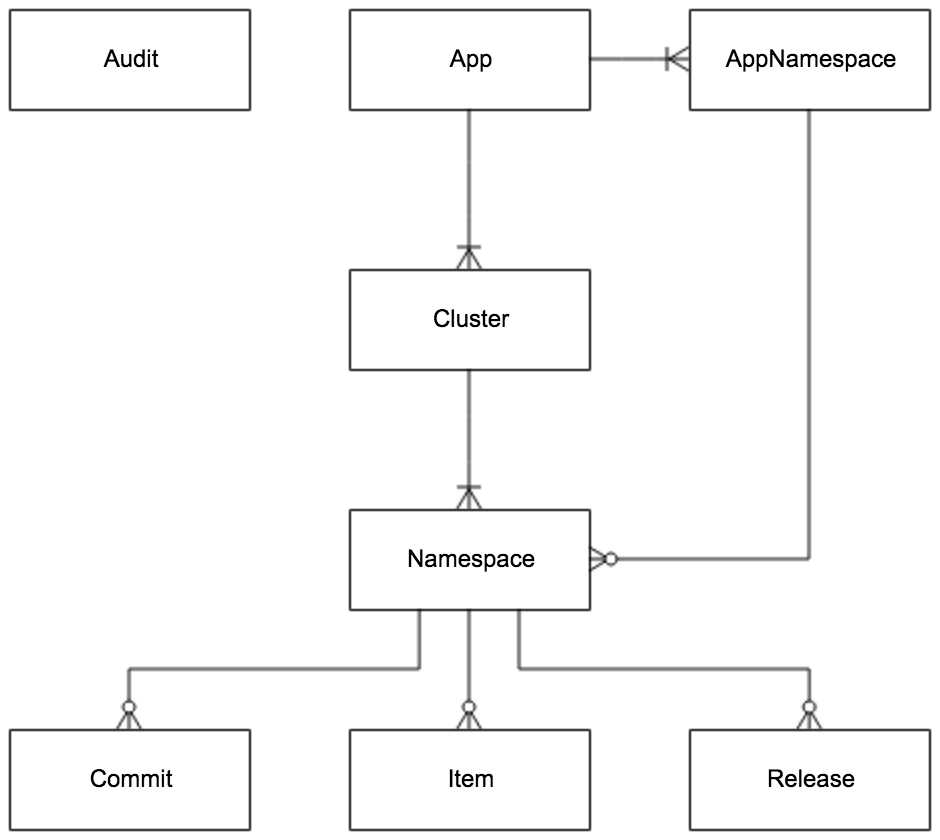
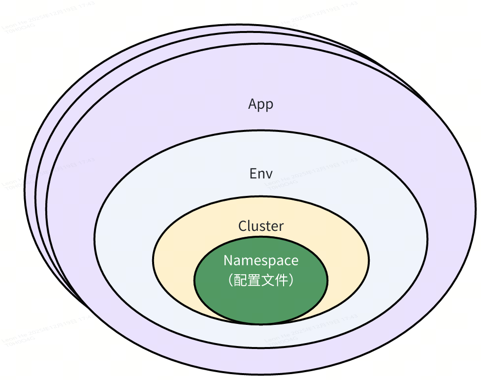

## 简介

Apollo Portal 的核心管理界面如下：

初看肯定会对 Namespace、Cluster、App 这些名词有疑问，究竟他们各自代表什么？他们在配置管理里起到什么作用？以及他们有什么关联关系？我们下面聊聊。

## 实体类及关系

> 图片取自官网

实体的关联关系（ER 图）：

Apollo 配置有这些实体表（类），说明一下他们作用：

- **APP**：Apollo 以应用维度标识一个服务，API 入口在 AppController。
- **Cluster**：集群，一般一个环境内有一个 config 服务集群可以支持多个集群（cluster）配置，比如 QA 的 config 集群能够新建 qa 灰度 cluster、qa 集成 cluster、qa 某某专项 cluster 以支持同应用同环境多套配置。
  - 创建 cluster：`ClusterController -> apps/{appId}/envs/{env}/clusters`
- **Namespace**：配置文件
  - AppNamespace：app 下的 namespace
  - Namespace：类比一个配置文件，一个 AppNamespace 可派生包括 default namespace、cluster namespace、灰度 namespace（一种特殊的 cluster namespace）
- **Item**：配置项，properties 一个 kv 为一个 item；其他格式（yml、json 等）配置文件，整个文件内容以纯文本放在 key 名为 "content" 的 value 里。
- **Release**：已发布的配置，apollo client 拉取的就是 Release 里的内容。
- **Commit**：就是配置修改记录，在灰度时比对新旧配置用到。
- **Audit**：记录核心数据实体表的增删改的用户审计操作。

## 配置层级关系

我在前面画过一个配置文件的层级关系，如下图：

## Q&A

**问题：创建 app 和 namespace 时，如何保证 config 和 portal 数据一致性？**

无法保证。在特定情况下（比如 admin 都挂了），创建 appNamespace 成功，但调用 admin 更新失败。

导致 portal 和 config 数据不一致，Apollo 通过扫描能够在 admin 恢复后让使用者自行补建（如下图），由于是 namespace 缺失，不会影响 config 和客户端正常的配置更新通知流程。

