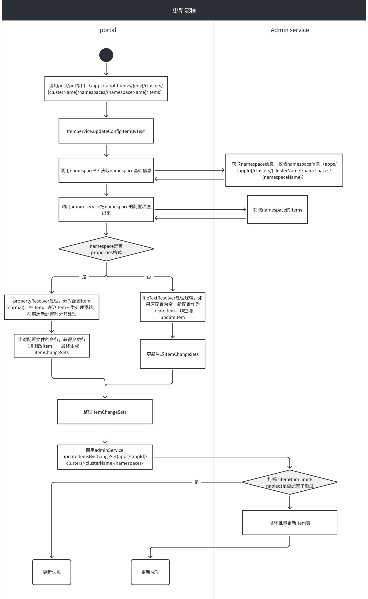

## 简介

该节分析一下从 Portal 界面点击保存到配置实际保存到 Item 表的整个过程里，代码重点做了哪些操作。

## 流程简析

在 Portal 界面上更改配置后，点击确认会调用 Portal 的 http 接口：

```
/apps/{appId}/envs/{env}/clusters/{clusterName}/namespaces/{namespaceName}/items
```

实际执行流程如下：

