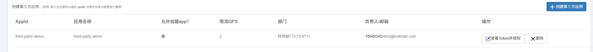
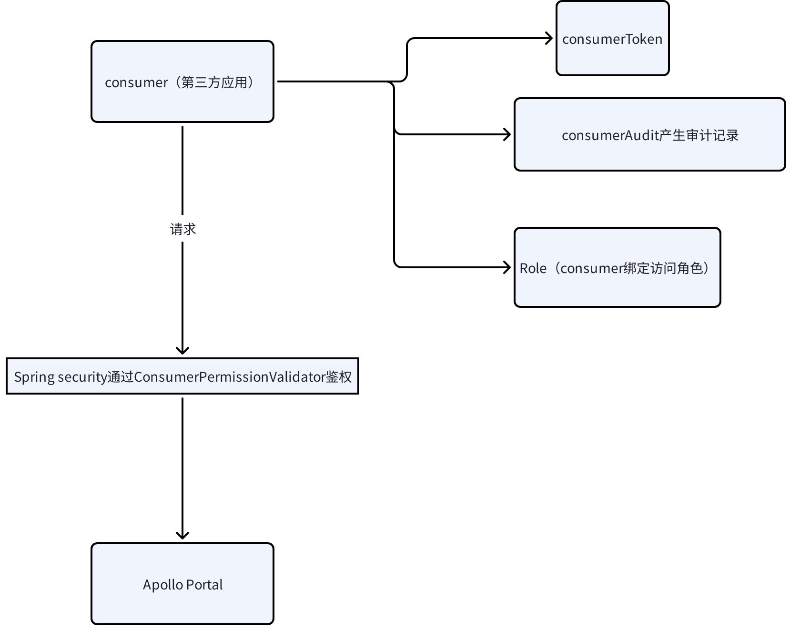

## 简介

尽管 Apollo 管理台提供了完善的配置管理能力，但为满足一些三方应用和一些特殊需求，Apollo 提供 OpenAPI 能力。通过 OpenAPI 能力，**三方应用**通过 token 机制在预配置的角色中获得一些更改配置能力。

如何使用？拥有超级管理员的用户在后台添加三方应用的访问权限，例如：



## 调用 demo

```java
@Test
public void testOpenAPI() {

    String portalUrl = "http://localhost:8070"; // portal url
    String token = "token";
    ApolloOpenApiClient client = ApolloOpenApiClient.newBuilder()
        .withPortalUrl(portalUrl)
        .withToken(token)
        .build();
    client.getAllApps().forEach(System.out::println);
    OpenItemDTO openItemDTO = new OpenItemDTO();
    openItemDTO.setKey("openapi.key");
    openItemDTO.setValue("openapi.value");
    openItemDTO.setDataChangeCreatedBy("t0h0o4g");
    openItemDTO.setDataChangeCreatedTime(new Date());
    client.createOrUpdateItem("aloha-apollo-spring-demo", "local", "default", "application.properties", openItemDTO);
}
```

## 机制分析



## 核心类 ConsumerPermissionValidator

Apollo 基于 Spring Security 通过 `ConsumerPermissionValidator` 做切面，对一些接口做 RBAC 权限校验。

具体有下面列举的权限：

```java
public class ConsumerPermissionValidator {

  //PermissionType.MODIFY_NAMESPACE 修改namespace（修改配置项相关的权限）
  public boolean hasModifyNamespacePermission(...) {}

  //PermissionType.RELEASE_NAMESPACE 发布namespace
  public boolean hasReleaseNamespacePermission(...) {}

  //PermissionType.CREATE_NAMESPACE 创建namespace
  public boolean hasCreateNamespacePermission(...) {}

  //PermissionType.CREATE_CLUSTER 创建cluster
  public boolean hasCreateClusterPermission(HttpServletRequest request, String appId) {}

  //PermissionType.CREATE_APPLICATION 创建App，谨慎授权
  public boolean hasCreateApplicationPermission(HttpServletRequest request) {}
}
```

## 附录

- [Apollo Open API 平台](https://www.apolloconfig.com/#/zh/portal/apollo-open-api-platform)