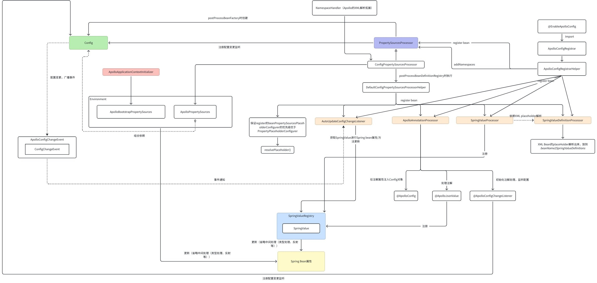

> 针对Spring Boot/Spring应用做分析，但不展开分析xml bean的属性配置处理

Apollo client的初始化，核心都是采用形如`ConfigService.getConfig`方式初始化核心组件--Config，借由这个类去获取配置和配置更新通知。在Spring（Boot）应用里，初始化时会将Config结合各类配置能力比如ConfigProperties，@Value，@ApolloConfig等等，在Spring上下文的生命周期做一些整合，提供给使用者更高效和开箱即用的能力。这一节主要聚焦Spring（Boot）应用初始化时Apollo所做的相关整合。不依赖Spring Boot直接用Config的初始化分析，我们留在下一章分析。


# Apollo Spring配置初始化更新全景图




分两部分说明：

1. Spring Boot启动时组件初始化

   1. environment配置初始化
   2. Apollo annotation处理
2. spring初始化

   1. xml启动 （不谈）
   2. @EnableApolloConfig 为主的初始化启动


# Spring Boot启动组件


Spring Boot的初始化配置，一般如下：

```text
app.id=xxx
apollo.meta=xxx
apollo.bootstrap.enabled=true
```

apollo.bootstrap.enabled=true时会做Apollo初始化。


我们来看看这几个类作了什么初始化工作：

- **ApolloApplicationContextInitializer**: 
- ApolloAutoConfiguration：Spring Boot的加载配置和注入属性入口。

  - **ConfigPropertySourcesProcessor**+DefaultConfigPropertySourcesProcessorHelper：负责注册下面的组件
  
    - PropertySourcesPlaceholderConfigurer: apollo调整了这个类初始化保证它必被初始化。
    - AutoUpdateConfigChangeListener:  接受Apollo配置变更事件，并且更新到SpringValue封装好的字段属性里。
    - ApolloAnnotationProcessor: 处理Apollo的注解。
    - SpringValueProcessor: 处理Spring的@Value注解的属性和xml的placeholder配置变更。
    - SpringValueDefinitionProcessor: 将XML Bean的placeHolder解析出来。

## Spring Boot配置提前加载

## ApolloApplicationContextInitializer

为适配Spring Boot的加载，由apollo.bootstrap.eagerLoad.enabled和apollo.bootstrap.enabled这两开关控制，将Apollo配置在environmentPrepare后或者初始化spring context时，加载到propertiesSources里。

我们来看看ApolloApplicationContextInitializer的实现：

```java
public class ApolloApplicationContextInitializer implements
    ApplicationContextInitializer<ConfigurableApplicationContext> , EnvironmentPostProcessor, Ordered {
  public static final int DEFAULT_ORDER = 0;
  //省略
  
  //初始化context时会触发
  @Override
  public void initialize(ConfigurableApplicationContext context) {
    ConfigurableEnvironment environment = context.getEnvironment();
    //
    if (!environment.getProperty(PropertySourcesConstants.APOLLO_BOOTSTRAP_ENABLED, Boolean.class, false)) {
      logger.debug("Apollo bootstrap config is not enabled for context {}, see property: ${{}}", context, PropertySourcesConstants.APOLLO_BOOTSTRAP_ENABLED);
      return;
    }
    logger.debug("Apollo bootstrap config is enabled for context {}", context);

    initialize(environment);
  }


  /**
   * Initialize Apollo Configurations Just after environment is ready.
   *
   * @param environment
   */
  protected void initialize(ConfigurableEnvironment environment) {
    final ConfigUtil configUtil = ApolloInjector.getInstance(ConfigUtil.class);
    if (environment.getPropertySources().contains(PropertySourcesConstants.APOLLO_BOOTSTRAP_PROPERTY_SOURCE_NAME)) {
      //already initialized, replay the logs that were printed before the logging system was initialized
      DeferredLogger.replayTo();
      if (configUtil.isOverrideSystemProperties()) {
        // ensure ApolloBootstrapPropertySources is still the first
        //始终将Apollo的propertySource放在最前面
        PropertySourcesUtil.ensureBootstrapPropertyPrecedence(environment);
      }
      return;
    }
    
    String namespaces = environment.getProperty(PropertySourcesConstants.APOLLO_BOOTSTRAP_NAMESPACES, ConfigConsts.NAMESPACE_APPLICATION);
    System.setProperty(PropertySourcesConstants.APOLLO_BOOTSTRAP_NAMESPACES, namespaces);
    logger.debug("Apollo bootstrap namespaces: {}", namespaces);
    List<String> namespaceList = NAMESPACE_SPLITTER.splitToList(namespaces);

    CompositePropertySource composite;
    //默认false，CachedCompositePropertySource和CompositePropertySource区别，就是有没有把所有配置名缓存
    if (configUtil.isPropertyNamesCacheEnabled()) {   
      composite = new CachedCompositePropertySource(PropertySourcesConstants.APOLLO_BOOTSTRAP_PROPERTY_SOURCE_NAME);
    } else {
      composite = new CompositePropertySource(PropertySourcesConstants.APOLLO_BOOTSTRAP_PROPERTY_SOURCE_NAME);
    }
    for (String namespace : namespaceList) {
      //核心逻辑，初始化Apollo配置
      // Config类作为ConfigPropertySource的source为Spring提供配置
      // 并将ConfigPropertySource加到apollo的CompositePropertySource里
      Config config = ConfigService.getConfig(namespace);
      composite.addPropertySource(configPropertySourceFactory.getConfigPropertySource(namespace, config));
    }
    //默认apollo配置放在最前，这里可选择将system properties的配置不被覆盖
    if (!configUtil.isOverrideSystemProperties()) {
      if (environment.getPropertySources().contains(StandardEnvironment.SYSTEM_ENVIRONMENT_PROPERTY_SOURCE_NAME)) {
        environment.getPropertySources().addAfter(StandardEnvironment.SYSTEM_ENVIRONMENT_PROPERTY_SOURCE_NAME, composite);
        return;
      }
    }
    //将apollo配置加到environment
    environment.getPropertySources().addFirst(composite);
  }

  /**
     在environmentPrepared后触发，
     1. 将Apollo client的配置加载到system properties里，为了让Apollo core的util也读取到
     2. 当apollo.bootstrap.eagerLoad.enabled=true和apollo.bootstrap.enabled=true时就加载apollo配置到environment
        为了让log初始化也用到apollo配置
   */
  @Override
  public void postProcessEnvironment(ConfigurableEnvironment configurableEnvironment, SpringApplication springApplication) {
    
    // should always initialize system properties like app.id in the first place
    initializeSystemProperty(configurableEnvironment);

    Boolean eagerLoadEnabled = configurableEnvironment.getProperty(PropertySourcesConstants.APOLLO_BOOTSTRAP_EAGER_LOAD_ENABLED, Boolean.class, false);
    System.setProperty(PropertySourcesConstants.APOLLO_BOOTSTRAP_EAGER_LOAD_ENABLED, String.valueOf(eagerLoadEnabled));
    //EnvironmentPostProcessor should not be triggered if you don't want Apollo Loading before Logging System Initialization
    if (!eagerLoadEnabled) {
      return;
    }

    Boolean bootstrapEnabled = configurableEnvironment.getProperty(PropertySourcesConstants.APOLLO_BOOTSTRAP_ENABLED, Boolean.class, false);
    System.setProperty(PropertySourcesConstants.APOLLO_BOOTSTRAP_ENABLED, String.valueOf(bootstrapEnabled));
    if (bootstrapEnabled) {
      DeferredLogger.enable();
      initialize(configurableEnvironment);
    }

  }

 //省略

}
```


## ConfigPropertySourcesProcessor和PropertySourcesProcessor 

ConfigPropertySourcesProcessor（及其父类）实现了BeanDefinitionRegistryPostProcessor 和BeanFactoryPostProcessor接口，在postProcessBeanDefinitionRegistry时注册了AutoUpdateConfigChangeListener、ApolloAnnotationProcessor、SpringValueProcessor、SpringValueDefinitionProcessor这几个配置注入的核心类，在postProcessBeanFactory时期，则主要处理xml、@EnableApolloConfig里定义的Appid和namespace，创建/获取相应Apollo配置，并注册配置变更监听，在配置发生变更时发送ApolloConfigChangeEvent事件。

```java
public class ConfigPropertySourcesProcessor extends PropertySourcesProcessor
    implements BeanDefinitionRegistryPostProcessor {

  private ConfigPropertySourcesProcessorHelper helper = ServiceBootstrap.loadPrimary(ConfigPropertySourcesProcessorHelper.class);

  @Override
  public void postProcessBeanDefinitionRegistry(BeanDefinitionRegistry registry) throws BeansException {
    helper.postProcessBeanDefinitionRegistry(registry);
  }
}

public class PropertySourcesProcessor implements BeanFactoryPostProcessor, EnvironmentAware,
    ApplicationEventPublisherAware, PriorityOrdered {
  //按order，存放appId对应namespace，会将Config（通过ConfigService.getConfig）加载到propertiesSource
  private static final Map<Integer, Multimap<String, String>> APP_NAMESPACE_NAMES = Maps.newHashMap();
  private static final Set<BeanFactory> AUTO_UPDATE_INITIALIZED_BEAN_FACTORIES = Sets.newConcurrentHashSet();

  private final ConfigPropertySourceFactory configPropertySourceFactory = SpringInjector
      .getInstance(ConfigPropertySourceFactory.class);
  private ConfigUtil configUtil;
  private ConfigurableEnvironment environment;
  private ApplicationEventPublisher applicationEventPublisher;

  //省略
  
  //增加namespace，将xml，@EnableApolloConfig定义的namespace加到APP_NAMESPACE_NAMES里，然后在这类的后续流程初始化拉取配置
  public static boolean addNamespaces(String appId, Collection<String> namespaces, int order) {
    Multimap<String, String> multimap = APP_NAMESPACE_NAMES.get(order);
    if (multimap == null) {
      multimap = LinkedHashMultimap.create();
      APP_NAMESPACE_NAMES.put(order, multimap);
    }
    return multimap.putAll(appId, namespaces);
  }

  @Override
  public void postProcessBeanFactory(ConfigurableListableBeanFactory beanFactory) throws BeansException {
    this.configUtil = ApolloInjector.getInstance(ConfigUtil.class);
    initializePropertySources();
    initializeAutoUpdatePropertiesFeature(beanFactory);
  }

  private void initializePropertySources() {
    //是否已经初始化 apolloPropertiesSrouce
    if (environment.getPropertySources().contains(PropertySourcesConstants.APOLLO_PROPERTY_SOURCE_NAME)) {
      //already initialized
      return;
    }
    CompositePropertySource composite;
    if (configUtil.isPropertyNamesCacheEnabled()) {
      composite = new CachedCompositePropertySource(PropertySourcesConstants.APOLLO_PROPERTY_SOURCE_NAME);
    } else {
      composite = new CompositePropertySource(PropertySourcesConstants.APOLLO_PROPERTY_SOURCE_NAME);
    }

    //sort by order asc
    ImmutableSortedSet<Integer> orders = ImmutableSortedSet.copyOf(APP_NAMESPACE_NAMES.keySet());
    Iterator<Integer> iterator = orders.iterator();
    
    while (iterator.hasNext()) {
      int order = iterator.next();
      Multimap<String, String> appMultimap = APP_NAMESPACE_NAMES.get(order);
      // app and namespace
      Set<String> appIds = appMultimap.keySet();
      for (String appId : appIds) {
        Collection<String> namespaces = appMultimap.get(appId);
        for (String namespace : namespaces) {
          //初始化Apollo配置，并且塞到PropertiesSource里
          Config config = ConfigService.getConfig(appId, namespace);
          composite.addPropertySource(configPropertySourceFactory.getConfigPropertySource(
              appId + ConfigConsts.CLUSTER_NAMESPACE_SEPARATOR + namespace, config));
        }
      }

    }

    // clean up
    APP_NAMESPACE_NAMES.clear();

    // add after the bootstrap property source or to the first
    //将bootstrapPropertiesSource（就是Spring Boot -> ApolloApplicationContextInitializer初始化的配置源）放第一位
    //apolloPropertiesSrouce放第二位
    if (environment.getPropertySources()
        .contains(PropertySourcesConstants.APOLLO_BOOTSTRAP_PROPERTY_SOURCE_NAME)) {
      //默认为true
      if (configUtil.isOverrideSystemProperties()) {
        // ensure ApolloBootstrapPropertySources is still the first
        PropertySourcesUtil.ensureBootstrapPropertyPrecedence(environment);
      }

      environment.getPropertySources()
          .addAfter(PropertySourcesConstants.APOLLO_BOOTSTRAP_PROPERTY_SOURCE_NAME, composite);
    } else {
      if (!configUtil.isOverrideSystemProperties()) {
        if (environment.getPropertySources().contains(StandardEnvironment.SYSTEM_ENVIRONMENT_PROPERTY_SOURCE_NAME)) {
          environment.getPropertySources().addAfter(StandardEnvironment.SYSTEM_ENVIRONMENT_PROPERTY_SOURCE_NAME, composite);
          return;
        }
      }
      environment.getPropertySources().addFirst(composite);
    }
  }
   
   //给所有的Apollo Config注册事件监听，当拉取配置发生变更，发送ApolloConfigChangeEvent事件
  private void initializeAutoUpdatePropertiesFeature(ConfigurableListableBeanFactory beanFactory) {
    if (!AUTO_UPDATE_INITIALIZED_BEAN_FACTORIES.add(beanFactory)) {
      return;
    }

    ConfigChangeListener configChangeEventPublisher = changeEvent ->
        applicationEventPublisher.publishEvent(new ApolloConfigChangeEvent(changeEvent));

    List<ConfigPropertySource> configPropertySources = configPropertySourceFactory.getAllConfigPropertySources();
    for (ConfigPropertySource configPropertySource : configPropertySources) {
      configPropertySource.addChangeListener(configChangeEventPublisher);
    }
  }

  //省略
}


```


## AutoUpdateConfigChangeListener源码分析


用来监听 `ConfigChangeEvent`，将 Apollo 配置（通过 `SpringValueRegistry`）更新到 `@ApolloJsonValue`、`@Value` 标注和 `${configkey}` 占位符的属性里。

```java
public class AutoUpdateConfigChangeListener implements ConfigChangeListener,
    ApplicationListener<ApolloConfigChangeEvent>, ApplicationContextAware {

  private static final Logger logger = LoggerFactory.getLogger(
      AutoUpdateConfigChangeListener.class);

  private final boolean typeConverterHasConvertIfNecessaryWithFieldParameter; //一个flag，标记当前应用spring版本typeConverter有没有相应方法
  private ConfigurableBeanFactory beanFactory; //
  private TypeConverter typeConverter;  //spring factory的类型转换器
  private final PlaceholderHelper placeholderHelper; //一个spring placeholder(比如${xxbean.xxProp})的工具类
  private final SpringValueRegistry springValueRegistry; //apollo解析了spring的bean后，将需要注入配置的属性抽象成SpringValue并托管在这里
  private final Map<String, Gson> datePatternGsonMap; //gson转换map
  private final ConfigUtil configUtil;

  //省略


  //1. 获取springValueRegistry里对应配置key的springValue
  //2. 将配置注入对应bean属性
  @Override
  public void onChange(ConfigChangeEvent changeEvent) {
    Set<String> keys = changeEvent.changedKeys();
    if (CollectionUtils.isEmpty(keys)) {
      return;
    }
    for (String key : keys) {
      // 1. check whether the changed key is relevant
      Collection<SpringValue> targetValues = springValueRegistry.get(beanFactory, key);
      if (targetValues == null || targetValues.isEmpty()) {
        continue;
      }

      // 2. update the value
      for (SpringValue val : targetValues) {
        updateSpringValue(val);
      }
    }
  }

  private void updateSpringValue(SpringValue springValue) {
    try {
      //解析出属性值
      Object value = resolvePropertyValue(springValue);
      //用反射设置新属性
      springValue.update(value);

      logger.info("Auto update apollo changed value successfully, new value: {}, {}", value,
          springValue);
    } catch (Throwable ex) {
      logger.error("Auto update apollo changed value failed, {}", springValue.toString(), ex);
    }
  }

  /**
    模仿DefaultListableBeanFactory的逻辑，
    1. 获取placeHolder的真实值
    2. 基于SpringValue来做，如果时json值则用GSON作反序列化
    2. 如果是属性，则获取通过TypeConverter（ConversionService）去解析成属性对象
   * Logic transplanted from DefaultListableBeanFactory
   *
   * @see org.springframework.beans.factory.support.DefaultListableBeanFactory#doResolveDependency(org.springframework.beans.factory.config.DependencyDescriptor,
   * java.lang.String, java.util.Set, org.springframework.beans.TypeConverter)
   */
  private Object resolvePropertyValue(SpringValue springValue) {
    // value will never be null, as @Value and @ApolloJsonValue will not allow that
    Object value = placeholderHelper
        .resolvePropertyValue(beanFactory, springValue.getBeanName(), springValue.getPlaceholder());

    if (springValue.isJson()) {
      ApolloJsonValue apolloJsonValue = springValue.isField() ?
              springValue.getField().getAnnotation(ApolloJsonValue.class) :
              springValue.getMethodParameter().getMethodAnnotation(ApolloJsonValue.class);
      String datePattern = apolloJsonValue != null ? apolloJsonValue.datePattern() : StringUtils.EMPTY;
      value = parseJsonValue((String) value, springValue.getGenericType(), datePattern);
    } else {
      if (springValue.isField()) {
        // org.springframework.beans.TypeConverter#convertIfNecessary(java.lang.Object, java.lang.Class, java.lang.reflect.Field) is available from Spring 3.2.0+
        if (typeConverterHasConvertIfNecessaryWithFieldParameter) {
          value = this.typeConverter
              .convertIfNecessary(value, springValue.getTargetType(), springValue.getField());
        } else {
          value = this.typeConverter.convertIfNecessary(value, springValue.getTargetType());
        }
      } else {
        value = this.typeConverter.convertIfNecessary(value, springValue.getTargetType(),
            springValue.getMethodParameter());
      }
    }

    return value;
  }

  private Object parseJsonValue(String json, Type targetType, String datePattern) {
    try {
      return datePatternGsonMap.computeIfAbsent(datePattern, this::buildGson).fromJson(json, targetType);
    } catch (Throwable ex) {
      logger.error("Parsing json '{}' to type {} failed!", json, targetType, ex);
      throw ex;
    }
  }

  private Gson buildGson(String datePattern) {
    if (StringUtils.isBlank(datePattern)) {
      return new Gson();
    }
    return new GsonBuilder().setDateFormat(datePattern).create();
  }

  private boolean testTypeConverterHasConvertIfNecessaryWithFieldParameter() {
    try {
      TypeConverter.class.getMethod("convertIfNecessary", Object.class, Class.class, Field.class);
    } catch (Throwable ex) {
      return false;
    }

    return true;
  }

  @Override
  public void setApplicationContext(ApplicationContext applicationContext) throws BeansException {
    //it is safe enough to cast as all known application context is derived from ConfigurableApplicationContext
    this.beanFactory = ((ConfigurableApplicationContext) applicationContext).getBeanFactory();
    this.typeConverter = this.beanFactory.getTypeConverter();
  }
  
  //
  @Override
  public void onApplicationEvent(ApolloConfigChangeEvent event) {
    if (!configUtil.isAutoUpdateInjectedSpringPropertiesEnabled()) {
      return;
    }
    this.onChange(event.getConfigChangeEvent());
  }
}
```


## ApolloAnnotationProcessor源码分析：

处理Apollo的注解，比如@ApolloJsonValue、@ApolloConfig、@ApolloConfigChangeListener。

```java
public class ApolloAnnotationProcessor extends ApolloProcessor implements BeanFactoryAware,
    EnvironmentAware {

  private static final Logger logger = LoggerFactory.getLogger(ApolloAnnotationProcessor.class);

  private static final String NAMESPACE_DELIMITER = ",";

  private static final Splitter NAMESPACE_SPLITTER = Splitter.on(NAMESPACE_DELIMITER)
      .omitEmptyStrings().trimResults();
  private static final Map<String, Gson> DATEPATTERN_GSON_MAP = new ConcurrentHashMap<>();

  private final ConfigUtil configUtil;
  private final PlaceholderHelper placeholderHelper;
  private final SpringValueRegistry springValueRegistry;

  /**
   * resolve the expression.
   */
  private ConfigurableBeanFactory configurableBeanFactory;

  private Environment environment;

  public ApolloAnnotationProcessor() {
    configUtil = ApolloInjector.getInstance(ConfigUtil.class);
    placeholderHelper = SpringInjector.getInstance(PlaceholderHelper.class);
    springValueRegistry = SpringInjector.getInstance(SpringValueRegistry.class);
  }

  @Override
  protected void processField(Object bean, String beanName, Field field) {
    this.processApolloConfig(bean, field);
    this.processApolloJsonValue(bean, beanName, field);
  }

  @Override
  protected void processMethod(final Object bean, String beanName, final Method method) {
    this.processApolloConfigChangeListener(bean, method);
    this.processApolloJsonValue(bean, beanName, method);
  }

  //将Config注入到@ApolloConfig注解标注的Config属性里
  private void processApolloConfig(Object bean, Field field) {
    ApolloConfig annotation = AnnotationUtils.getAnnotation(field, ApolloConfig.class);
    if (annotation == null) {
      return;
    }

    Preconditions.checkArgument(Config.class.isAssignableFrom(field.getType()),
        "Invalid type: %s for field: %s, should be Config", field.getType(), field);

    final String appId = StringUtils.defaultIfBlank(annotation.appId(), configUtil.getAppId());
    final String namespace = annotation.value();
    final String resolvedAppId = this.environment.resolveRequiredPlaceholders(appId);
    final String resolvedNamespace = this.environment.resolveRequiredPlaceholders(namespace);
    Config config = ConfigService.getConfig(resolvedAppId, resolvedNamespace);

    ReflectionUtils.makeAccessible(field);
    ReflectionUtils.setField(field, bean, config);
  }
  
  //处理@ApolloConfigChangeListener注解，监听Apollo Config的变更，并调用注解标注的方法。
  private void processApolloConfigChangeListener(final Object bean, final Method method) {
    ApolloConfigChangeListener annotation = AnnotationUtils
        .findAnnotation(method, ApolloConfigChangeListener.class);
    if (annotation == null) {
      return;
    }
    Class<?>[] parameterTypes = method.getParameterTypes();
    Preconditions.checkArgument(parameterTypes.length == 1,
        "Invalid number of parameters: %s for method: %s, should be 1", parameterTypes.length,
        method);
    Preconditions.checkArgument(ConfigChangeEvent.class.isAssignableFrom(parameterTypes[0]),
        "Invalid parameter type: %s for method: %s, should be ConfigChangeEvent", parameterTypes[0],
        method);

    ReflectionUtils.makeAccessible(method);
    String appId = StringUtils.defaultIfBlank(annotation.appId(), configUtil.getAppId());
    String[] namespaces = annotation.value();
    String[] annotatedInterestedKeys = annotation.interestedKeys();
    String[] annotatedInterestedKeyPrefixes = annotation.interestedKeyPrefixes();
    ConfigChangeListener configChangeListener = changeEvent -> ReflectionUtils.invokeMethod(method, bean, changeEvent);

    Set<String> interestedKeys =
        annotatedInterestedKeys.length > 0 ? Sets.newHashSet(annotatedInterestedKeys) : null;
    Set<String> interestedKeyPrefixes =
        annotatedInterestedKeyPrefixes.length > 0 ? Sets.newHashSet(annotatedInterestedKeyPrefixes)
            : null;

    Set<String> resolvedNamespaces = processResolveNamespaceValue(namespaces);

    for (String namespace : resolvedNamespaces) {
      Config config = ConfigService.getConfig(appId, namespace);

      if (interestedKeys == null && interestedKeyPrefixes == null) {
        config.addChangeListener(configChangeListener);
      } else {
        config.addChangeListener(configChangeListener, interestedKeys, interestedKeyPrefixes);
      }
    }
  }

  /**
   * Evaluate and resolve namespaces from env/properties.
   * Split delimited namespaces
   * @param namespaces
   * @return resolved namespaces
   */
  private Set<String> processResolveNamespaceValue(String[] namespaces) {

    Set<String> resolvedNamespaces = new HashSet<>();

    for (String namespace : namespaces) {
      final String resolvedNamespace = this.environment.resolveRequiredPlaceholders(namespace);

      if (resolvedNamespace.contains(NAMESPACE_DELIMITER)) {
        resolvedNamespaces.addAll(NAMESPACE_SPLITTER.splitToList(resolvedNamespace));
      } else {
        resolvedNamespaces.add(resolvedNamespace);
      }
    }

    return resolvedNamespaces;
  }
  
  
  //处理@ApolloJsonValue注解标注的属性，封装成SpringValue注册到springValueRegistry里
  private void processApolloJsonValue(Object bean, String beanName, Field field) {
    //省略
  }
  //处理@ApolloJsonValue注解标注的方法，封装成SpringValue注册到springValueRegistry里
  private void processApolloJsonValue(Object bean, String beanName, Method method) {
     //省略
  }

  //省略
}
```


## SpringValueProcessor源码分析

简单来说，这个类就是将

1. @Value标注的属性和方法 

2. 解析Xml出来的placeholder属性

封装到SpringValueRegistry，当apollo配置发生变更，会更新到这些属性里。

```java
public class SpringValueProcessor extends ApolloProcessor implements BeanFactoryPostProcessor, BeanFactoryAware {
// 省略

private final SpringValueRegistry springValueRegistry;
//就是bean名和SrpingValueDefiniion的映射，在SpringValueDefinitionProcessor里解析xml出来的。
//SrpingValueDefiniion包含属性名、配置名和placeHolder
private Multimap<String, SpringValueDefinition> beanName2SpringValueDefinitions;  
 
// 省略

  @Override
  public void postProcessBeanFactory(ConfigurableListableBeanFactory beanFactory)
      throws BeansException {
    if (configUtil.isAutoUpdateInjectedSpringPropertiesEnabled() && beanFactory instanceof BeanDefinitionRegistry) {
      beanName2SpringValueDefinitions = SpringValueDefinitionProcessor
          .getBeanName2SpringValueDefinitions((BeanDefinitionRegistry) beanFactory);
    }
  }

  @Override
  public Object postProcessBeforeInitialization(Object bean, String beanName)
      throws BeansException {
    if (configUtil.isAutoUpdateInjectedSpringPropertiesEnabled()) {
      //解析@Value注解标注的属性，并且注册到SpringValueRegistry
      super.postProcessBeforeInitialization(bean, beanName);
      //解析SpringValueDefinition的属性（来自xml），并注册到SpringValueRegistry
      processBeanPropertyValues(bean, beanName);
    }
    return bean;
  }

  @Override
  protected void processField(Object bean, String beanName, Field field) {
    // register @Value on field
    Value value = field.getAnnotation(Value.class);
    if (value == null) {
      return;
    }

    doRegister(bean, beanName, field, value);
  }

  @Override
  protected void processMethod(Object bean, String beanName, Method method) {
    //register @Value on method
    Value value = method.getAnnotation(Value.class);
    if (value == null) {
      return;
    }
    //skip Configuration bean methods
    if (method.getAnnotation(Bean.class) != null) {
      return;
    }
    if (method.getParameterTypes().length != 1) {
      logger.error("Ignore @Value setter {}.{}, expecting 1 parameter, actual {} parameters",
          bean.getClass().getName(), method.getName(), method.getParameterTypes().length);
      return;
    }

    doRegister(bean, beanName, method, value);
  }
  
  //注册到
  private void doRegister(Object bean, String beanName, Member member, Value value) {
    Set<String> keys = placeholderHelper.extractPlaceholderKeys(value.value());
    if (keys.isEmpty()) {
      return;
    }

    for (String key : keys) {
      SpringValue springValue;
      if (member instanceof Field) {
        Field field = (Field) member;
        springValue = new SpringValue(key, value.value(), bean, beanName, field, false);
      } else if (member instanceof Method) {
        Method method = (Method) member;
        springValue = new SpringValue(key, value.value(), bean, beanName, method, false);
      } else {
        logger.error("Apollo @Value annotation currently only support to be used on methods and fields, "
            + "but is used on {}", member.getClass());
        return;
      }
      springValueRegistry.register(beanFactory, key, springValue);
      logger.info("Monitoring {}", springValue);
    }
  }

  private void processBeanPropertyValues(Object bean, String beanName) {
    Collection<SpringValueDefinition> propertySpringValues = beanName2SpringValueDefinitions
        .get(beanName);
    if (propertySpringValues == null || propertySpringValues.isEmpty()) {
      return;
    }

    for (SpringValueDefinition definition : propertySpringValues) {
      try {
        PropertyDescriptor pd = BeanUtils
            .getPropertyDescriptor(bean.getClass(), definition.getPropertyName());
        Method method = pd.getWriteMethod();
        if (method == null) {
          continue;
        }
        SpringValue springValue = new SpringValue(definition.getKey(), definition.getPlaceholder(),
            bean, beanName, method, false);
        springValueRegistry.register(beanFactory, definition.getKey(), springValue);
        logger.debug("Monitoring {}", springValue);
      } catch (Throwable ex) {
        logger.error("Failed to enable auto update feature for {}.{}", bean.getClass(),
            definition.getPropertyName());
      }
    }

    // clear
    beanName2SpringValueDefinitions.removeAll(beanName);
  }

  @Override
  public void setBeanFactory(BeanFactory beanFactory) throws BeansException {
    this.beanFactory = beanFactory;
  }
}
```


## SpringValueDefinitionProcessor源码分析

将XML Bean的placeHolder解析出来，放到*beanName2SpringValueDefinitions。提供给SpringValueProcessor去注册到SpringValueRegistry。*

```java
public class SpringValueDefinitionProcessor implements BeanDefinitionRegistryPostProcessor {
  private static final Map<BeanDefinitionRegistry, Multimap<String, SpringValueDefinition>> beanName2SpringValueDefinitions =
      Maps.newConcurrentMap();
  private static final Set<BeanDefinitionRegistry> PROPERTY_VALUES_PROCESSED_BEAN_FACTORIES = Sets.newConcurrentHashSet();

  private final ConfigUtil configUtil;
  private final PlaceholderHelper placeholderHelper;

  public SpringValueDefinitionProcessor() {
    configUtil = ApolloInjector.getInstance(ConfigUtil.class);
    placeholderHelper = SpringInjector.getInstance(PlaceholderHelper.class);
  }

  @Override
  public void postProcessBeanDefinitionRegistry(BeanDefinitionRegistry registry) throws BeansException {
    if (configUtil.isAutoUpdateInjectedSpringPropertiesEnabled()) {
      processPropertyValues(registry);
    }
  }

  @Override
  public void postProcessBeanFactory(ConfigurableListableBeanFactory beanFactory) throws BeansException {

  }

  public static Multimap<String, SpringValueDefinition> getBeanName2SpringValueDefinitions(BeanDefinitionRegistry registry) {
    Multimap<String, SpringValueDefinition> springValueDefinitions = beanName2SpringValueDefinitions.computeIfAbsent(
        registry, k -> LinkedListMultimap.create());

    return springValueDefinitions;
  }
 
  private void processPropertyValues(BeanDefinitionRegistry beanRegistry) {
    //是否已经解析了这个beanDifinitionRegistry
    if (!PROPERTY_VALUES_PROCESSED_BEAN_FACTORIES.add(beanRegistry)) {
      // already initialized
      return;
    }
    
    //是否已经扫描
    if (!beanName2SpringValueDefinitions.containsKey(beanRegistry)) {
      beanName2SpringValueDefinitions.put(beanRegistry, LinkedListMultimap.create());
    }
   
    Multimap<String, SpringValueDefinition> springValueDefinitions = beanName2SpringValueDefinitions.get(beanRegistry);

    String[] beanNames = beanRegistry.getBeanDefinitionNames();
    for (String beanName : beanNames) {
      //解析出beanDefinition的TypedStringValue，并解出placeHolder，放到springValueDefinitions里
      BeanDefinition beanDefinition = beanRegistry.getBeanDefinition(beanName);
      MutablePropertyValues mutablePropertyValues = beanDefinition.getPropertyValues();
      List<PropertyValue> propertyValues = mutablePropertyValues.getPropertyValueList();
      for (PropertyValue propertyValue : propertyValues) {
        Object value = propertyValue.getValue();
        if (!(value instanceof TypedStringValue)) {
          continue;
        }
        String placeholder = ((TypedStringValue) value).getValue();
        Set<String> keys = placeholderHelper.extractPlaceholderKeys(placeholder);

        if (keys.isEmpty()) {
          continue;
        }

        for (String key : keys) {
          springValueDefinitions.put(beanName, new SpringValueDefinition(key, placeholder, propertyValue.getName()));
        }
      }
    }
  }
}
```


# Spring初始化


spring初始化有两种方式：

1. Xml bean方式，使用`<`**`apollo:config`**`/>`这样的方式。处理器是：`com.ctrip.framework.apollo.spring.config.NamespaceHandler`。

```xml
<?xml version="1.0" encoding="UTF-8"?>
<beans xmlns="http://www.springframework.org/schema/beans"xmlns:xsi="http://www.w3.org/2001/XMLSchema-instance"xmlns:apollo="http://www.ctrip.com/schema/apollo"xsi:schemaLocation="http://www.springframework.org/schema/beans http://www.springframework.org/schema/beans/spring-beans.xsd
       http://www.ctrip.com/schema/apollo http://www.ctrip.com/schema/apollo.xsd">
    <!-- 这个是最简单的配置形式，一般应用用这种形式就可以了，用来指示Apollo注入application namespace的配置到Spring环境中 -->
    <apollo:config/>
    <bean class="com.ctrip.framework.apollo.spring.TestXmlBean">
        <property name="timeout" value="${timeout:100}"/>
        <property name="batch" value="${batch:200}"/>
    </bean>
</beans>
```

1. Java注解方式。

```java
@Configuration
@EnableApolloConfig(value = {"application.yml"},
        multipleConfigs = {@MultipleConfig(appid = "SampleApp", namespaces = {"ORDER.apollo"})}
)
public class SomeAppConfig {}
```


我们来看看这几个类作了什么初始化工作：

@EnableApolloConfig

- ApolloConfigRegistrar：加载ApolloConfigRegistrarHelper，默认实现ApolloConfigRegistrarHelper。
- **DefaultApolloConfigRegistrarHelper**

  - 和上面分析过的ConfigPropertySourcesProcessor一样，初始化了ApolloAnnotationProcessor等组件。
  - 将@EnableApolloConfig注解标注的namespace传到PropertySourcesProcessor里。
- **PropertySourcesProcessor**：将DefaultApolloConfigRegistrarHelper传来的namespace一一初始化出Apollo Config组件，将Config集合组装到ApolloPropertySources，并将其放在`ApolloBootstrapPropertySources`后面。


分析以下@EnableApolloConfig的处理，重点处理逻辑在`DefaultApolloConfigRegistrarHelper`。

```java
@Retention(RetentionPolicy.RUNTIME)
@Target(ElementType.TYPE)
@Documented
@Import(ApolloConfigRegistrar.class)
public @interface EnableApolloConfig {
 //
}
```


## DefaultApolloConfigRegistrarHelper


我们来看看DefaultApolloConfigRegistrarHelper的代码：

```java
public class DefaultApolloConfigRegistrarHelper implements ApolloConfigRegistrarHelper {
  private static final Logger logger = LoggerFactory.getLogger(
      DefaultApolloConfigRegistrarHelper.class);
  private final ConfigUtil configUtil = ApolloInjector.getInstance(ConfigUtil.class);
  private Environment environment;

  @Override
  public void registerBeanDefinitions(AnnotationMetadata importingClassMetadata, BeanDefinitionRegistry registry) {
    AnnotationAttributes attributes = AnnotationAttributes
        .fromMap(importingClassMetadata.getAnnotationAttributes(EnableApolloConfig.class.getName()));
    //将namespace解析出来
    final String[] namespaces = attributes.getStringArray("value");
    final int order = attributes.getNumber("order");

    // put main appId
    //塞到PropertySourcesProcessor，待初始化Apollo Config
    PropertySourcesProcessor.addNamespaces(configUtil.getAppId(), Lists.newArrayList(this.resolveNamespaces(namespaces)), order);

    // put multiple appId into
    //解析@MultipleConfig
    AnnotationAttributes[] multipleConfigs = attributes.getAnnotationArray("multipleConfigs");
    if (multipleConfigs != null) {
      for (AnnotationAttributes multipleConfig : multipleConfigs) {
        String appId = multipleConfig.getString("appId");
        String[] multipleNamespaces = this.resolveNamespaces(multipleConfig.getStringArray("namespaces"));
        String secret = resolveSecret(multipleConfig.getString("secret"));
        int multipleOrder = multipleConfig.getNumber("order");

        // put multiple secret into system property
        if (!StringUtils.isBlank(secret)) {
          System.setProperty("apollo.accesskey." + appId + ".secret", secret);
        }
        PropertySourcesProcessor.addNamespaces(appId, Lists.newArrayList(multipleNamespaces), multipleOrder);
      }
    }

    Map<String, Object> propertySourcesPlaceholderPropertyValues = new HashMap<>();
    // to make sure the default PropertySourcesPlaceholderConfigurer's priority is higher than PropertyPlaceholderConfigurer
    propertySourcesPlaceholderPropertyValues.put("order", 0);
    //初始化spring和apollo的配置处理组件
    BeanRegistrationUtil.registerBeanDefinitionIfNotExists(registry, PropertySourcesPlaceholderConfigurer.class,
            propertySourcesPlaceholderPropertyValues);
    BeanRegistrationUtil.registerBeanDefinitionIfNotExists(registry, AutoUpdateConfigChangeListener.class);
    BeanRegistrationUtil.registerBeanDefinitionIfNotExists(registry, PropertySourcesProcessor.class);
    BeanRegistrationUtil.registerBeanDefinitionIfNotExists(registry, ApolloAnnotationProcessor.class);
    BeanRegistrationUtil.registerBeanDefinitionIfNotExists(registry, SpringValueProcessor.class);
    BeanRegistrationUtil.registerBeanDefinitionIfNotExists(registry, SpringValueDefinitionProcessor.class);
  }

  //省略

  @Override
  public int getOrder() {
    return Ordered.LOWEST_PRECEDENCE;
  }


}
```


DefaultApolloConfigRegistrarHelper 最后会初始化`AutoUpdateConfigChangeListener`、PropertySourcesProcessor、ApolloAnnotationProcessor、SpringValueProcessor、SpringValueDefinitionProcessor。这几个组件在前面已经分析，这里不提。


# 总结

本文分析Apollo Client结合Spriing生命周期的初始化。Apollo为了刷新Spring bean的属性，做了不少整合。

回过头来看，比起Nacos直接用Spring cloud refresh和独立的机制去刷新，Apollo做了很多精细化的刷新操作，对于不用Spring Boot/Cloud的应用来说，也更友好。