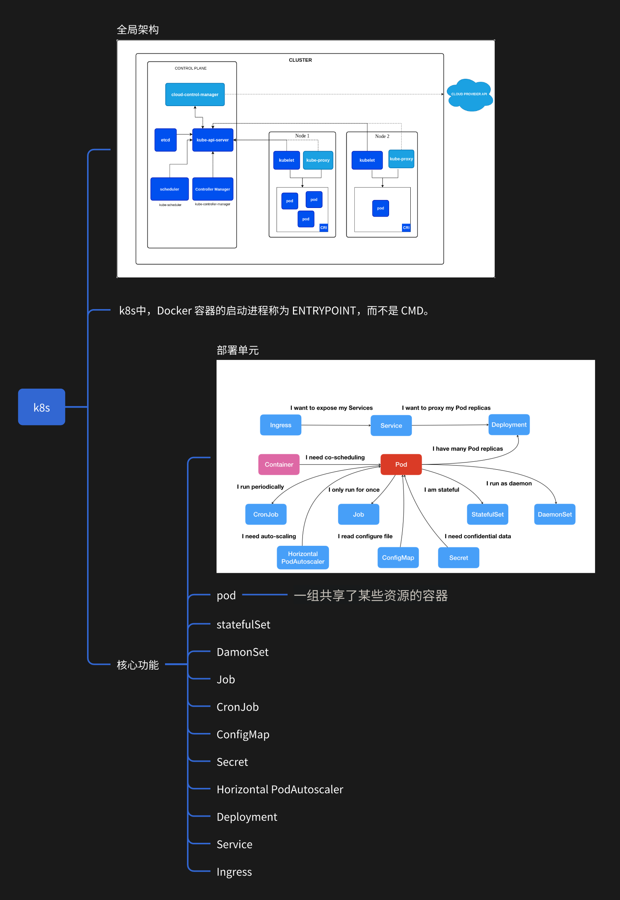

# Kubernetes基本概念集

控制面：
* apiserver：负责提供kubernetes API的服务。
* etcd：高可用键值存储，类似将zk作为配置中心。
* scheduler: 调度组件。负责基于调度策略将pod调度到指定节点。
* controller-manager：负责运行控制器。

节点组件：  
kubelet：kubelet 会在集群中每个节点（node）上运行。保证pod的运行。

pod：是可以在 Kubernetes 中创建和管理的、最小的可部署的计算单元。  
管理一个/多个pod的工作集：
* Deployment
* StatefulSet
* DaemonSet
* cronjob
