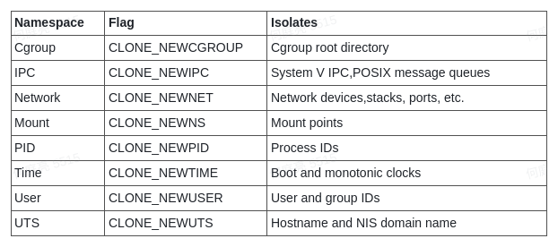
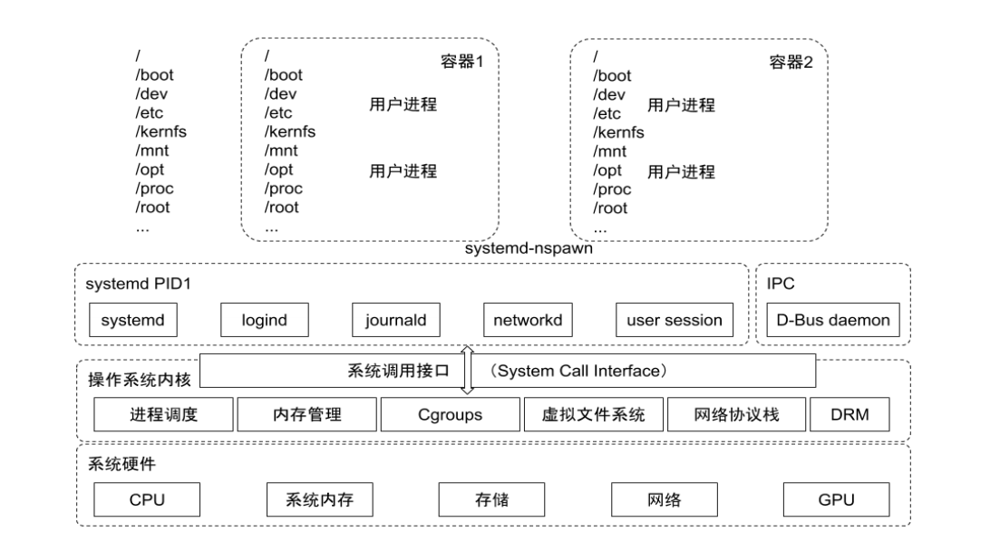
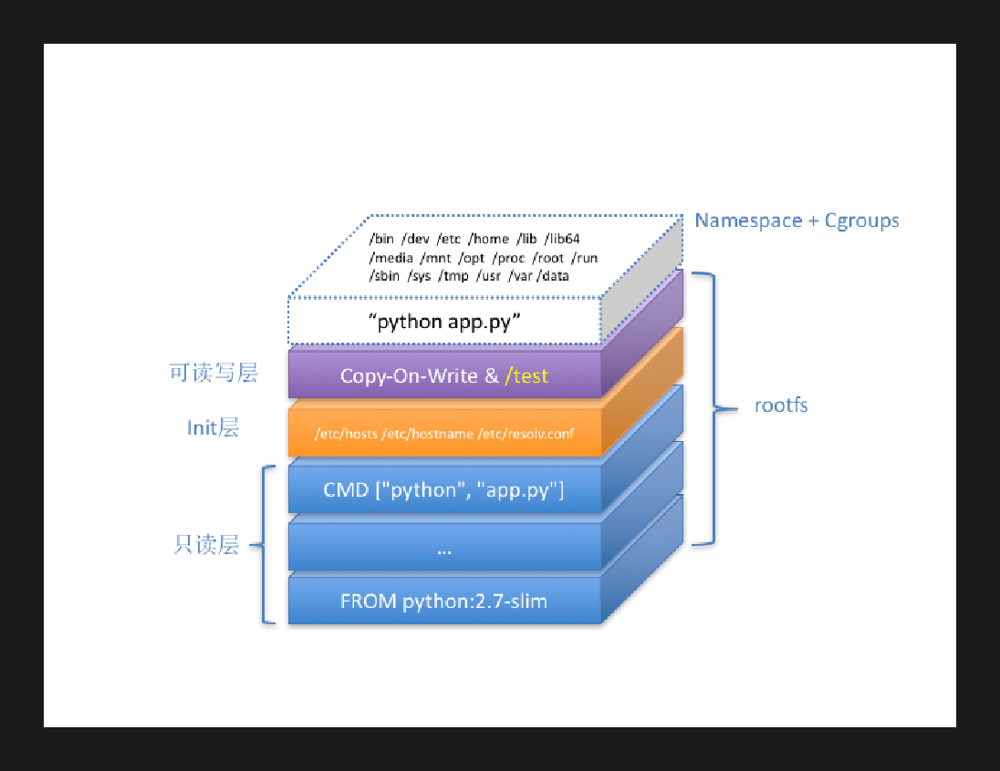
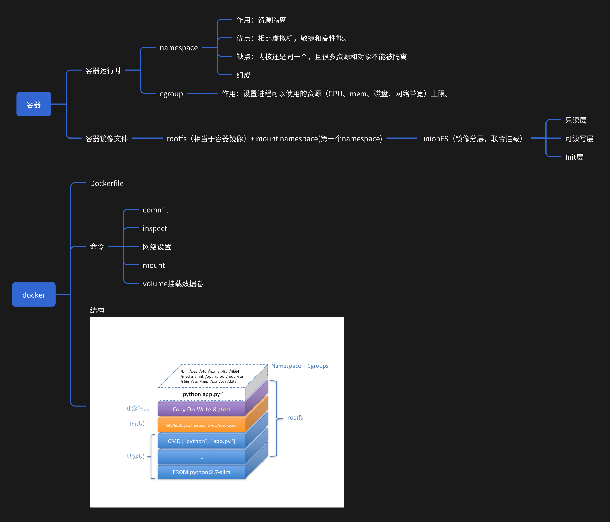
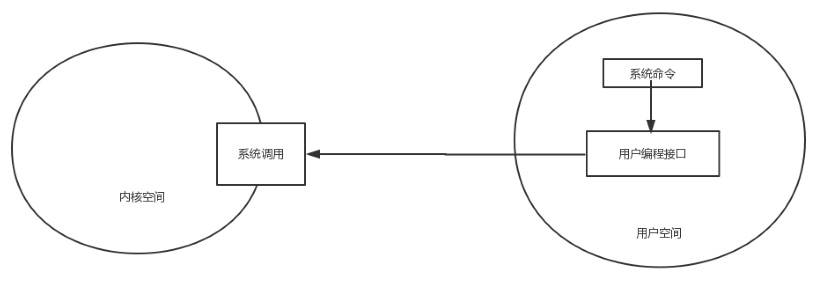

# 容器基本知识和GO实现基本容器原理

## 什么是容器

基于 Linux 内核的 Cgroup，Namespace，以及 Union FS 等技术，对进程进行封装隔离，属于操作系统层面的虚拟化技术，由于隔离的进程独立于宿主和其它的隔离的进程，因此也称其为容器。  
容器的本质是一种特殊的`进程`。

## 为什么用容器

- 更高效地利用系统资源
- 更快速的启动时间
- 一致的运行环境
- 更轻松地迁移
- 更轻松地维护和扩展

下面介绍容器涉及的核心技术。

## Namespace

Linux Namespace 是一种 Linux 内核提供的资源隔离方案：

- 系统可以为进程分配不同的Namespace；
- 并保证不同的Namespace资源独立分配、进程彼此隔离，即不同的 Namespace下的进程互不干扰。
  



内核源码（v5.15.52）的namespace数据结构： `/linux/nsproxy.h`  
https://elixir.bootlin.com/linux/v5.15.52/source/include/linux/nsproxy.h


## cgroup 2

- Cgroups （Control Groups）是 Linux 下用于对一个或一组进程进行资源控制和监控的机制；
- 可以对诸如 CPU 使用时间、内存、磁盘 I/O 等进程所需的资源进行限制；
  [cgroup-v2.txt](https://www.kernel.org/doc/Documentation/cgroup-v2.txt)




## 网络

容器,以docker网络为例子通过：
- 在宿主机建立网桥（docker0）。
- veth-pair建立对宿主机网桥的联通（相当于网线），达到与宿主机内其他容器或者外部通信的能力。

## 镜像分层

我们都看到过容器大小，一般几GB的大小，如果每次发布拉取这么大镜像，一定会造成空间和网络浪费，
而且服务上线和扩缩容时间极长。如何解决这个问题？

通过容器的镜像分层，我们可复用基础的可读层。
我们平常编写的Dockerfile，每条命令就是一层。容器运行时会复用相应可读层，最终将不同层bind到我们的容器进程目录。



## 完整代码示例


````go
/*
*
完整范例版注释版
*/
package main

import (
	"fmt"
	"os"
	"os/exec"
	"path/filepath"
	"strconv"
	"syscall"
)

var cgroups = "/sys/fs/cgroup"
var custom_cgroup = filepath.Join(cgroups, "work")

// go run mainTest.go run <cmd> <args>
func main() {
	switch os.Args[1] {
	case "run":
		run()
		// Removes the instantiated cgroup after container exit
		cgCleanup()
	case "child":
		child()
	default:
		panic("help")
	}
}

func run() {
	fmt.Printf("Running %v \n", os.Args[2:])

	cmd := exec.Command("/proc/self/exe", append([]string{"child"}, os.Args[2:]...)...)
	cmd.Stdin = os.Stdin
	cmd.Stdout = os.Stdout
	cmd.Stderr = os.Stderr
	//Mount namespaces	CLONE_NEWNS
	//UTS namespaces	CLONE_NEWUTS
	//IPC namespaces	CLONE_NEWIPC
	//PID namespaces	CLONE_NEWPID
	//Network namespaces	CLONE_NEWNET
	//User namespaces	CLONE_NEWUSER
	cmd.SysProcAttr = &syscall.SysProcAttr{
		Cloneflags:   syscall.CLONE_NEWUTS | syscall.CLONE_NEWPID | syscall.CLONE_NEWNS,
		Unshareflags: syscall.CLONE_NEWNS,
	}

	must(cmd.Run())
}

func child() {
	fmt.Printf("Running %v \n", os.Args[2:])

	cg()

	cmd := exec.Command(os.Args[2], os.Args[3:]...)
	cmd.Stdin = os.Stdin
	cmd.Stdout = os.Stdout
	cmd.Stderr = os.Stderr

	must(syscall.Sethostname([]byte("container")))
	// cd /tmp/containers-from-scratch
	// skopeo copy docker://ubuntu oci:ubuntu
	// mkdir ubuntufs
	// tar -xf ../ubuntu/blobs/sha256/somesha.... -C ubuntufs && rm -rf ubuntu
	// mkdir ubuntufs/mytemp
	must(syscall.Chroot("/home/work/centosfs/"))
	must(os.Chdir("/"))
	must(syscall.Mount("proc", "proc", "proc", 0, ""))
	//must(syscall.Mount("thing", "mytemp", "tmpfs", 0, ""))
	must(syscall.Mount("tmp", "mytemp", "tmpfs", 0, "size=100M,mode=0755"))

	must(cmd.Run())

	must(syscall.Unmount("/proc", 0))
	must(syscall.Unmount("/mytemp", 0))
}

func cg() {
	os.Mkdir(custom_cgroup, 0755)

	must(os.WriteFile(filepath.Join(custom_cgroup, "pids.max"), []byte("20"), 0644))
	must(os.WriteFile(filepath.Join(custom_cgroup, "cgroup.procs"), []byte(strconv.Itoa(os.Getpid())), 0644))
	must(os.WriteFile(filepath.Join(custom_cgroup, "memory.max"), []byte("50m"), 0644))
	must(os.WriteFile(filepath.Join(custom_cgroup, "cpu.max"), []byte("50000 100000"), 0644))

	//if err := setupVirtualEthOnHost("tea"); err != nil {
	//	log.Fatalf("Unable to setup Veth0 on host: %v", err)
	//}
}

func cgCleanup() error {
	alive, err := os.ReadFile(filepath.Join(custom_cgroup, "pids.current"))
	if err != nil { // or must(err).. but then it'll look weird..
		panic(err)
	}

	if alive[0] != uint8(48) {
		must(os.WriteFile(filepath.Join(custom_cgroup, "cgroup.kill"), []byte("1"), 0644))
	}
	must(os.Remove(custom_cgroup))

	return nil
}

func must(err error) {
	if err != nil {
		panic(err)
	}
}

func mustWithMsg(err error, msg string) {
	if err != nil {
		fmt.Println(msg)
		panic(err)
	}
}


````


## 总结

这是我在工作中的一个团队分享。  
通过写代码并在我的电脑上比对docker命令去演示容器的本质（容器进程、docker shim和进程）和容器的核心原理。

下面是总结的思维导图。



## 附录

### 系统调用

系统命令调用内核的机制：




### proc

在linux的根目录下存在一个/proc目录，/proc文件系统是一种虚拟文件系统,以文件系统目录和文件形式,提供一个指向内核数据结构的接口，通过它能够查看和改变各种系统属性。
proc目录通常情况下是由系统自动挂载在/proc目录下，但是我们也可以自行手动挂载。 `mount -t proc proc /proc/`

