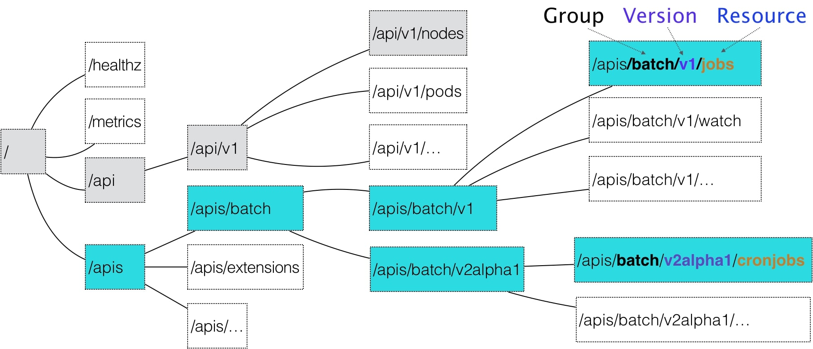

# 拓展Kubernetes

## 自定义声明式API和自定义控制器

自定义API和controller  
https://github.com/resouer/k8s-controller-custom-resource

## Operator工作原理解读

operator相当于一个自定义控制器。

业界有名的Operator：[Etcd Operator](https://github.com/coreos/etcd-operator/tree/master/example)、[Prometheus Operator](https://github.com/prometheus-operator/prometheus-operator)，
可以方便的建立和运维集群。  
Operator和pod、StatefulSet、cronJob可以相互结合使用。

## CNI、CSI、Device Plugin

这几个拓展形式，不在本doc讨论范围，略过。