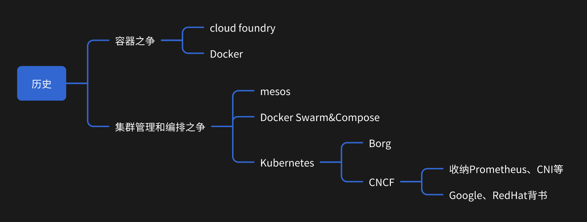
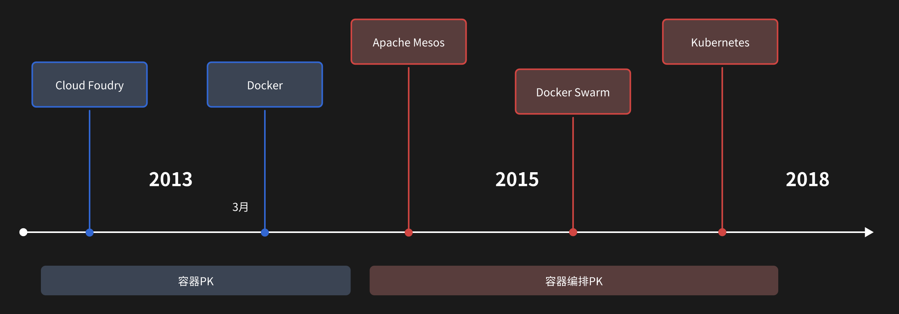

# 容器和k8s历史

## 简介

了解了背景和发展，对理解为什么这么设计其实帮助很大。

## 历史

发展过程中市场有这些技术的抉择，我们一起来对比：

2013-2014的容器的解决方案，最开始Cloud Foundry为代表的Paas，通过cgroup和namespace去做隔离，
但Docker创新的提出”镜像“，我们只需要在任意地方解压这个包含操作系统文件和目录的压缩包，就可以运行程序。

所以，namespace、cgroup这些玩意并不新，Docker创造性在于，缔造了镜像的概念，
并推出了fs layer分层，成功解决了镜像分发效率。

接下来说说，2015-2017的容器编排之争，以及K8s如何脱颖而出。  
以Mesos为例子，其实当时有些有大规模集群管理能力的项目，但是都没有Docker的声势浩大，社区庞大。
Docker乘着自己的用户和社区搞商业化，成立公司搞解决方案，在Docker搞内置Swarm。使得很多人有怨言。
Kubernetes横空出世，我认为做对两件事：
1. 借助Google和Red Hat本身的成熟云经验，一开始就是站在上层做平台。
2. 积极拥抱开源生态（而彼时Docker越发自顾自玩耍）。推出了CNCF，囊括了很多好项目（Prometheus等），
   同时，插件化、API可拓展性让Kubernetes生态百花齐放。

最终K8s做到了最终王座。。
从技术上看，我认为Kubernetes提出的Pod作为最小组织单元都是很领先的，Docker Swarm还是停留在容器的组织上。

## 时间线总结

