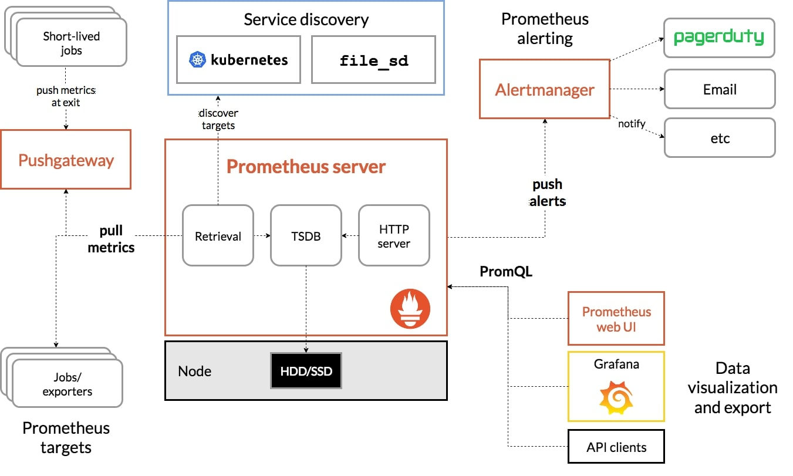

# Prometheus和k8s日志

## Prometheus

Prometheus架构：

k8s监控指标体系
1. 宿主机监控指标。
2. kubernetes的API server、kuberlet等组件的/metrics 指标。
3. kubernetes的核心监控，pod、node、容器、service的指标。

具体的监控指标规划上，建议遵循业界通用的 USE 原则和 RED 原则。

其中，USE 原则指的是，按照如下三个维度来规划资源监控指标：
* 利用率（Utilization），资源被有效利用起来提供服务的平均时间占比
* 饱和度（Saturation），资源拥挤的程度，比如工作队列的长度
* 错误率（Errors），错误的数量。

而 RED 原则指的是，按照如下三个维度来规划服务监控指标：
* 每秒请求数量（Rate）
* 每秒错误数量（Errors）
* 服务响应时间（Duration）

### 优缺点

优点：
* Prometheus已经是业界验证的，各方面（性能、存储优化、可用性）能力做到比较好的指标监控中间件。  
* 背靠CNCF的开源组织优势。

缺点：
* 不适合特别准确和详细的监控。比如广告请求计费这一类。

## custom metrics和auto scaling

利用HorizontalPodAutoscaler（HPA）和Custom Metrics APIServer，通过自定义metric的动态扩缩。

## 日志收集

k8s常用日志收集方法：
1. 收集stdout和stderr，并保存在Node上，在node上部署DaemonSet进行收集分发。
2. 每个pod建立sidecar容器，通过sidecar容器收集日志。
3. 应用容器直接发送给日志存储服务。

