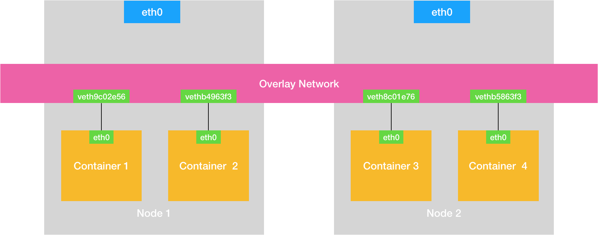
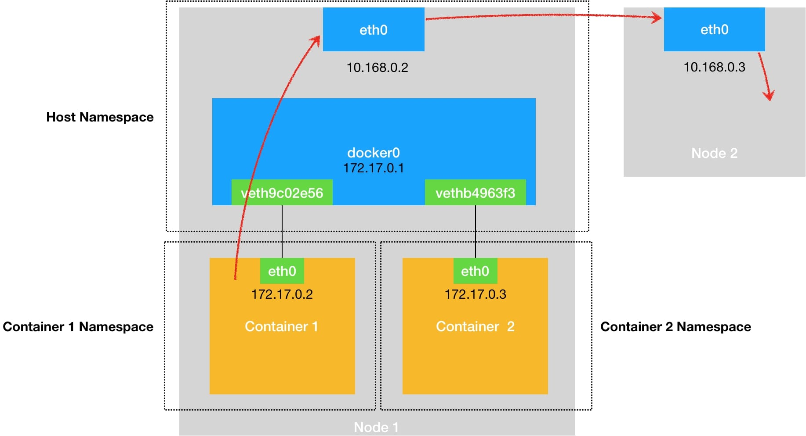

# 容器网络

Network Namespace包含：
1. 网卡（network interface）
2. 回环设备（Loopback Device）
3. 路由表（Routing Table）
4. iptables 规则

* 网桥（Bridge），支持两台主机之间通信。 比如docker0网桥，是容器与外界网络通信的关键。而k8s集群能够相互通信是因为通过软件手段
  构建了整个集群的公共网桥。
* Veth Pair，虚拟网卡对，相当于网线。

我们在进行系统级编程的时候，有一个非常重要的优化原则，就是要减少用户态到内核态的切换次数，并且把核心的处理逻辑都放在内核态进行。

Flannel及其支持的三种模式：
1. VXLAN
2. host-gw
3. UDP

Calico使用BGP（在大规模网络中实现节点路由信息共享的一种协议）分发路由信息。