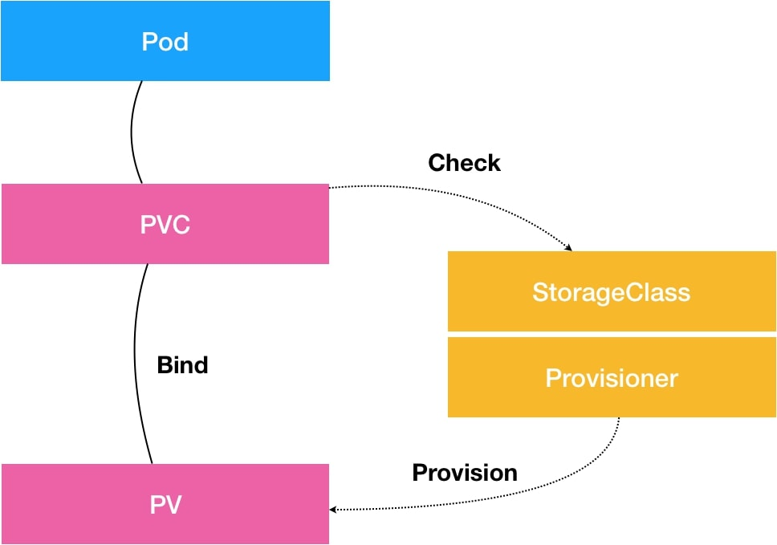

# 容器持久化存储

Persistent Volume（PV）：持久化存储卷。
Persistent Volume Claim（PVC）：Pod 所希望使用的持久化存储的属性。

容器的 Volume，其实就是将一个宿主机上的目录，跟一个容器里的目录绑定挂载在了一起。

分两步：
1. Attach 虚拟机挂载远程磁盘的操作
2. mount 将磁盘设备格式化并挂载到 Volume 宿主机目录的操作（远程文件存储一般只有mount）

k8s自动创建pv的机制：Dynamic Provisioning和StorageClass。

从图中我们可以看到，在这个体系中：
* PVC 描述的，是 Pod 想要使用的持久化存储的属性，比如存储的大小、读写权限等。
* PV 描述的，则是一个具体的 Volume 的属性，比如 Volume 的类型、挂载目录、远程存储服务器地址等。
* 而 StorageClass 的作用，则是充当 PV 的模板。并且，只有同属于一个 StorageClass 的 PV 和 PVC，才可以绑定在一起。
