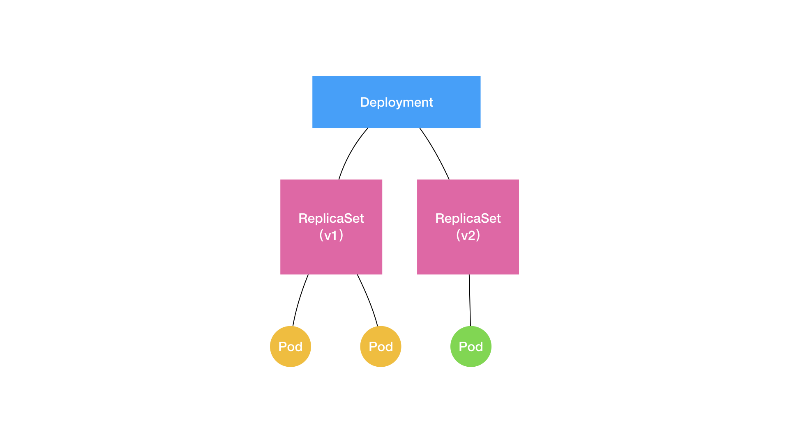

# pod

Pod，其实是一组共享了某些资源的容器。

Pod 里的所有容器，共享的是同一个 Network Namespace，并且可以声明共享同一个Volume

事实上，直到现在，仍有很多人把容器跟虚拟机相提并论，他们把容器当做性能更好的虚拟机，喜欢讨论如何把应用从虚拟机无缝地迁移到容器中。  
但实际上，无论是从具体的实现原理，还是从使用方法、特性、功能等方面，容器与虚拟机几乎没有任何相似的地方；也不存在一种普遍的方法，能够把虚拟机里的应用无缝迁移到容器中。因为，容器的性能优势，必然伴随着相应缺陷，即：它不能像虚拟机那样，完全模拟本地物理机环境中的部署方法。
所以，这个“上云”工作的完成，最终还是要靠深入理解容器的本质，即：进程。


Pod 的本质：Pod，实际上是在扮演传统基础设施里 **“虚拟机”** 的角色；而容器，则是这个虚拟机里运行的用户程序。

pod的yaml配置：（TODO 这里列一个yaml例子）
* NodeSelector：是一个供用户将 Pod 与 Node 进行绑定的字段
* HostAliases 指定pod的/etc/hosts文件内容
* 指定Namespace
* containers： 可指定多个容器。
* Lifecycle： 指定postStart和preStop要执行的东西。

## 生命周期

Pod生命周期状态：（关注非running和非succeeded状态）
* Pending
* Running
* Succeeded
* Failed
* Unknown


## Projected Volume

Kubernetes 支持的 Projected Volume 一共有四种：
1. Secret，比如用来调用k8s api的Service Account Token就是一个secret。
   ~~~~
   //向k8s添加secret
   kubectl create secret generic pass --from-file=./password.txt
   // pod配置使用secret
     volumes:
       - name: xxx
         projected:
         sources:
           - secret:
             name: pass
   
   ~~~~
2. ConfigMap: 类似.properties文件。可以通过多种方式使用configMap [ConfigMap|k8s](https://kubernetes.io/zh-cn/docs/tasks/configure-pod-container/configure-pod-configmap/#define-container-environment-variables-using-configmap-data)
3. Downward API
4. ServiceAccountToken。

## 配置容器健康检查、恢复机制、启动检查

[Configure Liveness, Readiness and Startup Probes](https://kubernetes.io/docs/tasks/configure-pod-container/configure-liveness-readiness-startup-probes/#define-startup-probes)

1. 存活检测：配置容器的存活检测，检测失败则重启容器。
   ````yaml
       livenessProbe:
         exec:
           command:
           - cat
           - /tmp/healthy
         initialDelaySeconds: 5
         periodSeconds: 5
   ````
2. 就绪检测：检测容器就绪状态，是否可接受流量。k8s检测成功则挂到相应Services，可接受kube-proxy的流量。
   ````yaml
   readinessProbe:
     exec:
       command:
       - cat
       - /tmp/healthy
     initialDelaySeconds: 5
     periodSeconds: 5
   
   ````
3. 启动检测：为了给那些启动慢的程序的额外配置。
   ````yaml
   startupProbe:
     httpGet:
       path: /healthz
       port: liveness-port
     failureThreshold: 30
     periodSeconds: 10
   ````

## 控制器

kube-controller-manager

总的来说，k8s通过控制器模式去循环比对不同类型的容器的实际状态和期望状态并执行，达到容器编排能力。


## 部署副本和扩容


* 扩容方式： `kubectl scale deployment ${deployment} --replicas=10`
* 查看deployment的状态和副本： `kubectl get deployments`
  * DESIRED
  * CURRENT
  * UP-TO-DATE
  * AVAILABLE
* 滚动更新
  * 修改deployment会触发滚动更新
  * 滚动更新策略
  ~~~~yaml
    strategy:
    type: RollingUpdate
    rollingUpdate:
      maxSurge: 1
      maxUnavailable: 1
  ~~~~
  * 回滚`kubectl rollout undo`


