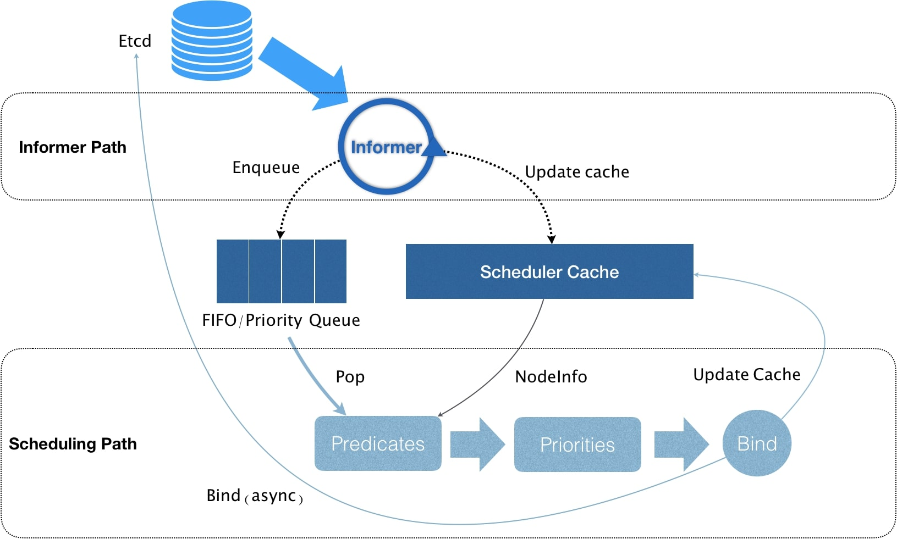

# 调度

资源模型
* 可压缩资源，cpu等
* 不可压缩资源，mem、磁盘空间等

qos模型
* Guaranteed
* Burstable
* BestEffort

在线上服务部署中，通过cpuset方式绑核是比较常见的。  
k8s中，将request和limit设置相同数值即可实现。
````
spec:
  containers:
  - name: nginx
    image: nginx
    resources:
      limits:
        memory: "200Mi"
        cpu: "2"
      requests:
        memory: "200Mi"
        cpu: "2"
````

在 Kubernetes 项目中，默认调度器的主要职责，就是为一个新创建出来的 Pod，寻找一个最合适的节点（Node）。
1. 从集群所有的节点中，根据调度算法挑选出所有可以运行该 Pod 的节点，称为Predicate。
2. 从第一步的结果中，再根据调度算法挑选一个最符合条件的节点作为最终结果，称为Priority。


