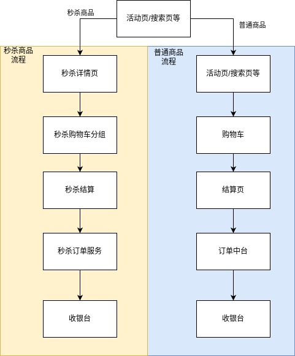
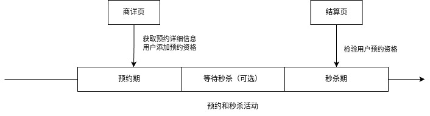
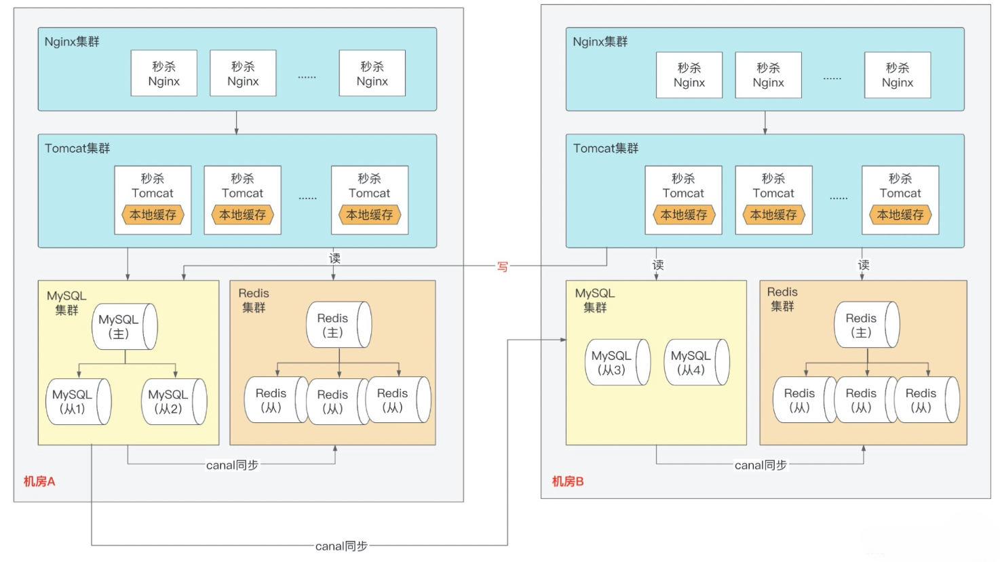

# 秒杀系统架构设计

## 简介

秒杀系统设计的一些原理和注意项。

## 挑战和设计原则

挑战
1. 巨大的瞬时流量
2. 热点数据问题
3. 刷子流量

对于一般平台有上面这些通用模块，有这些需要秒杀来做
1. 提供活动数据
2. 提供结算页
3. 结算页所需数据
4. 提供下单

当然在这中间，还有个隐形的，但却是非常重要的核心能力，那就是做流量的精细化筛选，尽量确保传给下游接口的流量，都是优质请求。

基于DNS-> nginx -> web服务 -> RPC服务链路，有一些设计原则：
1. DNS 做些防攻击措施
2. nginx层，校验前置，userid限流等
3. web层，协同业务的流量筛选和控制
4. rpc服务层，控制逻辑，比如超卖控制等。

## 打造系统高可用

### 秒杀隔离策略

通商品和秒杀商品最本质的区别是什么？
显然是流量不同。

为了让0.01%的商品不影响99.999%的普通商品交易。采用隔离，是控制危险范围最直接的手段。

业务隔离
1. 活动单独提报 一般电商系统会有提报系统。  
   * 商家家或者业务可以根据自己的运营计划在提报系统里进行活动提报，提供参与秒杀的商品编号、活动起止时间、库存量、限购规则、风控规则以及参与活动群体的地域分布、预计人数、会员级别等基本信息。
   * 根据提报系统的信息，可以预估出流量，在系统进行控制和提前预知扩容。

系统隔离
1. 保护普通商品的交易流程
2. 单独域名
3. 实际落地，可能基于成本考虑在商详页点击购买才判断秒杀流量。

数据隔离
1. 单独的缓存处理热点数据
2. 本地缓存来隔离热点
3. 需要在商品系统对SKU打标，通过识别打标，流量路由到秒杀专属域名、专属nginx、专属服务域（专属redis、秒杀相关服务、逻辑处理）。

我们需要重点关注系统和数据的隔离，从 ROI 的角度看，我们需要找出电商交易平台最核心的几个系统进行隔离，
从头部电商平台的实践来看，一般会单独设计和部署秒杀的商详页和结算页系统，以及结算页系统链路下游的购物车和订单系统。

### 流量管控

流程：

预约的好处是
1. 聚人气
2. 防止大流量对系统的冲击。（人太多边际效益低，且客诉多）

### 削峰和限流

限流是一种有损技术削峰；

而引入接口签名、验证码、问答题以及异步化消息队列可以归为无损削峰。

### 降级、热点和容灾处理

常见降级：
1. 写服务降级，牺牲数据一致性获取更高的性能
2. 读服务降级，故障场景下紧急降级快速止损
3. 简化系统功能，干掉一些不必要的流程，舍弃非核心功能

热点数据  
问题分两类：读热点问题和写热点问题

读：
1. 增加热点数据的副本数
2. 让热点数据离用户越近越好

写：
1. 人数统计场景：比如写redis有热点数据，先本地计数再异步更新redis
2. 库存扣减场景：
   1. 把一个热 key 拆解成多个 key 的方式，避免热点问题
   2. redis承压加限流

容灾：

## 不超卖和公平的秒杀系统

### 防刷和风控

1. token防刷，有前后顺序的接口，前一个接口返回token给后一个接口验证。
2. userid限流
3. 黑名单机制

风控：
1. 基于大数据量，建立用户的用户画像和信用体系，进而进行规则/AI模型风控。

### 秒杀的库存和限购

限购基于两个维度：
1. 用户维度
2. 商品维度：商品数量、地域。

库存扣减：  
一般不建议数据库锁和分布式锁。
可以使用redis的EVALSHA，或者自实现原子性操作。

## 性能调优

略。
