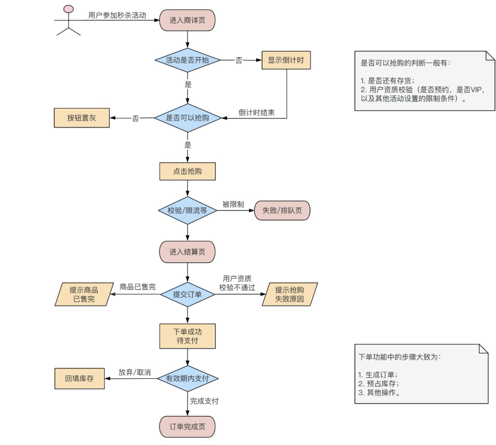

# 秒杀系统架构设计

## 简介

## 挑战和设计原则

挑战
1. 巨大的瞬时流量
2. 热点数据问题
3. 刷子流量

对于一般平台有上面这些通用模块，有这些需要秒杀来做
1. 提供活动数据
2. 提供结算页
3. 结算页所需数据
4. 提供下单

当然在这中间，还有个隐形的，但却是非常重要的核心能力，那就是做流量的精细化筛选，尽量确保传给下游接口的流量，都是优质请求。

基于DNS-> nginx -> web服务 -> RPC服务链路，有一些设计原则：
1. DNS 做些防攻击措施
2. nginx层，校验前置，userid限流等
3. web层，协同业务的流量筛选和控制
4. rpc服务层，控制逻辑，比如超卖控制等。

## 打造系统高可用

### 隔离策略

### 流量管控

### 削峰和限流

### 降级、热点和容灾处理

## 不超卖和公平的秒杀系统

### 防刷和风控

### 秒杀的库存和限购

## 性能调优

## 总结：百万级流量秒杀系统的总结